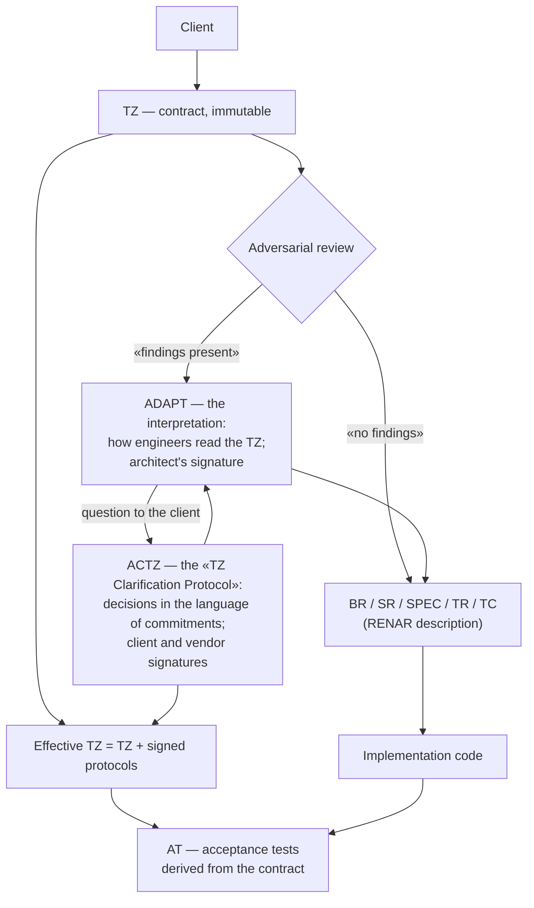

# RENAR Core

**Version:** 1.1 · **Date:** 2026-09-19 · **Site:** renar.tech
**Copyright:** (C) 2026 Vadim Soglaev, Andrey Yumashev. Licensed under [CC BY-SA 4.0](https://creativecommons.org/licenses/by-sa/4.0/).

---

> **What this is.** A conceptual overview of RENAR for the human reader: what the standard is about, why it is needed, and how it works at the top level. Without technical detail, frontmatter, the lifecycle, or normative rules — that is the domain of the full [RENAR Standard](../../standard/en/README.md).
>
> **Reading time:** ≤ 10 minutes.
> **Who it is for:** PMs, lawyers, regulators, and engineers encountering RENAR for the first time. If you are an AI agent, read the [Standard](../../standard/en/README.md) directly — you do not need Core.

---

## What RENAR Is

**RENAR** (*Requirements Engineering & Normative Adaptive Regulation*) is a normative requirements-engineering standard for development with AI agents. The standard governs:

- **The data model** of requirements artifacts: BR (business requirement), SR (system requirement), TR (task), ADAPT (the interpretation of the TZ), ACTZ (the TZ clarification protocol), 12 SPEC types (architecture, API, data, integration, process, UI, AI, security, operations, test environments, delivered documentation), TC (test cases), and AT (acceptance tests derived from the contract).
- **The lifecycle and Quality Gates** (QG-0..QG-4) — artifact states and the conditions for transitions.
- **Substrate capabilities** V1–V6, which the artifact storage system MUST satisfy: immutable history, atomic changes, comparison/review, branching, end-to-end version pinning, author + timestamp.
- **Conformance** — the RENAR-1..RENAR-5 levels, mandatory clauses, the manifest, and assessment procedures.

RENAR is a **specialization of SENAR** (the methodological foundation for development with AI agents) in the area of requirements engineering. A RENAR-conformant implementation is always compatible with SENAR; the reverse does not hold.

---

## Why RENAR Exists

In development with AI agents, requirements live simultaneously across several artifacts: the client's contractual TZ, the engineering BR/SR/SPEC, test cases, the task description, the implementation in code. All of this is written and edited by a mix of humans and AI agents. Without formal contracts between artifacts, **requirements drift** arises — a divergence between what has been recorded, what is verified, and what is actually implemented.

RENAR closes eight normalized classes of drift:

1. **Schema drift** — artifact fields diverge between projects.
2. **Lifecycle drift** — states (draft / approved set version / verified on a build) mean different things to different authors.
3. **Source-of-Truth drift** — one entity is edited in several places at once.
4. **Implementation drift** — code implements a requirement that has already been deleted or renamed.
5. **Terminological drift** — terms mean different things to different people.
6. **Order / provenance drift** — a delta-TZ is applied out of order, or references a non-existent requirement.
7. **TC ↔ requirement provenance drift** — a test verifies obsolete behavior.
8. **Test-fitting drift** — an AI agent weakens a test's criteria instead of fixing the code.

All eight classes are **structural**: they arise from the very fact that an artifact is co-owned by several authors, not from lapses in discipline. They can be closed only normatively — by recording a contract for how artifacts are linked, who writes which field, and which preconditions MUST hold at state transitions.

---

## How RENAR Works (Conceptually)

The full path of a single requirement — from contract to acceptance:

The diagram shows the **dependencies between artifacts** — what is derived from what and what confirms what — not an order of work. The order is set by the organization's production model; the standard governs only preconditions and rules ([standard/01 §1.2.1](../../standard/en/01-scope.md#1.2.1)).

**Key properties:**

- **The TZ is a contractual, immutable artifact.** Once signed by the client, it is not edited. Scope changes are formalized through a delta-TZ; clarifications through protocols (see below).
- **The RENAR description is the Source of Truth about the system's behavior.** Code is a derived implementation artifact, not the authoritative definition of behavior. If the code does X but the SR says Y, that is a defect in the code, not "the actual requirement has changed."
- **Adversarial review.** A separate AI agent on a different model deliberately looks for what the primary agent missed: unasked questions to the client, weakened test criteria, hidden assumptions. This is a compensating mechanism against self-consistent but semantically incorrect AI outputs.
- **Positive/negative pairing of tests.** Every verifiable assertion of a requirement has at least one positive and one negative test case. AI agents readily cover the happy path and skip negative scenarios — RENAR makes pairing normative.
- **The test is not written by whoever writes the code, and a test MUST have been red at least once.** A test composed alongside the implementation checks what was written, not what was required. And a test that has never failed has proved nothing — it may simply be empty.

---

## Two Documents: Interpretation and Commitment

The most common mistake in contract development is to merge into one document **how the engineers understood the TZ** and **what was agreed with the client**. The merger looks economical, but it breaks both functions at once: the client signs an engineering text they never read and cannot assess, while the engineer is afraid to write down an honest reading, because it will be carried off for signature.

RENAR separates these two documents, and the boundary is drawn **by audience**, not by content:

> **Everything shown to the client and approved is a commitment. Everything not shown is interpretation.**

| | **ADAPT** — interpretation | **ACTZ** — commitment |
|---|---|---|
| What is inside | How the TZ was read: translation into engineering language, term mapping, completed scenarios, the gaps and contradictions found | The questions and decisions put to the client. In the language of commitments: "the button is called this", "the deadline is that" |
| Who reads it | The engineer, the AI agent, the reviewer, the verifier | The client and the parties to the contract |
| Who signs it | Only the architect on the vendor's side | **Both parties**: the client and the vendor |
| Weight | An internal working document | **Contractual** |

ACTZ is precisely the "**TZ Clarification Protocol No. N**" that already exists in contract practice. RENAR merely makes it the mandatory home for the client's decisions, and links the two: every finding in the interpretation that required the client's word MUST cite the clause of a **signed** protocol in which that word is recorded. No reading may rest on a decision the client never made; and no signed decision may go unreflected in the requirements.

The gain is simple and machine-checkable: the argument "is this a clarification or already a scope change?" disappears. The question is now binary — **was the decision put to the client, and is it signed?**

---

## Acceptance — Against the Contract, Not the Interpretation

From this follows the **effective TZ**:

> **Effective TZ = the initial TZ (with its annexes) + all signed clarification protocols.**

That is the benchmark for delivery and acceptance. The internal interpretation is **not part of it**: the client answers only for what they signed and understood. Acceptance becomes legally clean.

But there is an engineering consequence too, and it is the whole point. Ordinary tests are derived from requirements, and requirements from the interpretation. So if the interpretation is wrong, every test may be green: the system flawlessly matches a **wrong** reading of the TZ — and fails acceptance at the client. To check a system with the same understanding that built it is to guarantee that the error of understanding stays invisible.

RENAR therefore introduces a second, independent layer of checking — **acceptance tests (AT)**:

- they are written by an **isolated** agent given **only the effective TZ** as input: no interpretation, no requirements, no specifications, no code;
- that agent's model differs from the primary agent's — otherwise it reproduces the same reading, and acceptance degenerates into self-confirmation;
- before every trial run the tests are regenerated from the **current** revision of the effective TZ: otherwise a long engagement is delivered against a year-old contract;
- the product is not presented for delivery until all acceptance tests are green.

A divergence between the two layers is not noise but a diagnosis. **An acceptance test red while the ordinary tests are green is an error of interpretation**: the system is built correctly, but it is the wrong system. No quantity of ordinary tests catches that defect — which is the entire reason for the second layer.

The full lifecycle is governed through **Quality Gates**: QG-0 (approval of a description set version, of a task, of an ADAPT), QG-1 (admission of a TC implementation), QG-2 (verification of a set version on a product version) are mandatory; QG-3 (architecture) and QG-4 (business outcome) are optional. Separate from them stands the release acceptance gate: conformance to the contract is proven before the product is presented.

---

## The Default Executor — the AI Agent

RENAR artifacts are **by default** created and maintained by an AI agent on assignment from an engineer. The human acts as verifier and approver: reviewing the result, clarifying the task when needed, and approving lifecycle transitions.

Two things follow from this positioning that are unfamiliar when reading the standard for the first time:

- **Artifacts look dense** (dozens of frontmatter fields, lifecycle transitions, graph links) — because the primary reader is machine. The density is not bureaucracy but a requirement for "code in natural language" that the AI agent executes in subsequent steps.
- **The process overhead of maintenance is machine, not human.** An AI agent does not tire of filling in frontmatter; the volume of work is linear. To a human this overhead seems unbearable — but it is precisely this overhead that need not be borne by hand.

At the same time, **the human remains the source of decisions** wherever a commitment arises: signing the clarification protocol (client and vendor), signing the interpretation (the architect), QG-0 approval, the spot-check of tests, acceptance of the result. The AI agent executes; the human answers for the result. The client never talks to the agent directly: questions are aggregated and reworded by the architect.

---

## Who Will Find RENAR Useful

RENAR is built for **contract-oriented development**: projects with an explicit contractual TZ and an identifiable client party answerable for that TZ. Typical contexts:

- **Custom development** — an independent vendor + a client with a signed TZ and acceptance criteria.
- **Regulated industries** (healthcare, finance, the public sector) — where a compliance audit is mandatory by regulation.
- **Enterprise consulting** — a third party implements against a corporate client's TZ with approval from several stakeholders.
- **Public-sector / government IT** — tender TZs, formal acceptance, multi-year contracts.
- **Long-lived products** — where the Product Owner plays the role of the Client's representative for internal feature TZs.

RENAR is **not applicable** to lean startup discovery, pure R&D without a defined scope, hackathon proofs-of-concept, and other contexts without an immutable TZ and an identifiable Stakeholder.

---

## Routes by Role

| Role | Where to start |
|---|---|
| **PM / RTE** | [guide/05](../../guide/en/05-safe-comparison.md) — RENAR vs SAFe; then [guide/09 §E3](../../guide/en/09-worked-examples.md) — a practical example |
| **Legal / Compliance** | [guide/09 §E3](../../guide/en/09-worked-examples.md) → [guide/06](../../guide/en/06-compliance.md) → [reference/07](../../reference/en/07-iso29148-trace-matrix.md) — ISO 29148 mapping |
| **Regulator / Auditor** | [reference/07](../../reference/en/07-iso29148-trace-matrix.md) → [reference/08](../../reference/en/08-conformance-self-assessment.md) → [standard/13](../../standard/en/13-conformance.md) — conformance manifest |
| **RE engineer / Architect** | [guide/00 Quickstart](../../guide/en/00-quickstart.md) → [standard/06](../../standard/en/06-requirements-hierarchy.md) → [standard/10](../../standard/en/10-lifecycle-qg.md) |

---

## Where to Read Next

| Document | Purpose |
|---|---|
| [standard/](../../standard/en/README.md) — 15 normative chapters | The complete normative description; required reading for the AI agent and the assessor |
| [guide/00-quickstart](../../guide/en/00-quickstart.md) | A 30-minute practical end-to-end example: TZ → ADAPT → SR → SPEC → TC |
| [guide/01-walkthrough](../../guide/en/01-walkthrough.md) | An extended example on a full-scale scenario |
| [guide/06-compliance](../../guide/en/06-compliance.md) | GDPR, FZ-152, AI Act mapping |
| [reference/01-glossary](../../reference/en/01-glossary.md) | The canonical glossary + mapping to ISO 29148, BABOK, SAFe, NIST AI RMF |
| [reference/02-schemas](../../reference/en/02-schemas.md) | Machine-readable artifact schemas (JSON Schema), validation rules |
| [reference/03-ai-risk-register](../../reference/en/03-ai-risk-register.md) | 14 AI risks per ISO/IEC 23894 + NIST AI RMF |

---

*RENAR Core 1.1 — renar.tech*
*Copyright (C) 2026 Vadim Soglaev, Andrey Yumashev. Licensed under CC BY-SA 4.0.*
