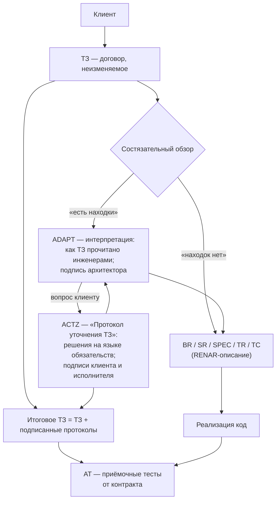

# RENAR Core

**Версия:** 1.1 · **Дата:** 2026-09-19 · **Сайт:** renar.tech
**Авторские права:** (C) 2026 Vadim Soglaev, Andrey Yumashev. Лицензия [CC BY-SA 4.0](https://creativecommons.org/licenses/by-sa/4.0/).

---

> **Что это.** Концептуальный обзор RENAR для человека-читателя: о чём стандарт, зачем нужен, как работает на верхнем уровне. Без технических подробностей, frontmatter, жизненного цикла и нормативных правил — это область полного [RENAR Standard](../standard/README.md).
>
> **Время чтения:** ≤ 10 минут.
> **Для кого:** PM, юристы, regulators, инженеры, впервые сталкивающиеся с RENAR. Если вы AI-агент — читайте напрямую [Standard](../standard/README.md), Core вам не нужен.

---

## Что такое RENAR

**RENAR** (*Requirements Engineering & Normative Adaptive Regulation*) — нормативный стандарт инженерии требований для разработки с AI-агентами. Стандарт нормирует:

- **Модель данных** артефактов требований: BR (бизнес-требование), SR (системное требование), TR (задача), ADAPT (интерпретация ТЗ), ACTZ (протокол уточнения ТЗ), 12 типов SPEC (архитектура, API, данные, интеграция, процесс, UI, AI, безопасность, эксплуатация, тестовые стенды, поставляемая документация), TC (контрольные примеры) и AT (приёмочные тесты от контракта).
- **Жизненный цикл и контрольные точки качества** (Quality Gates QG-0..QG-4) — состояния артефактов и условия переходов.
- **Возможности носителя** V1–V6, которым должна удовлетворять система хранения артефактов: неизменяемая история, атомарные изменения, сравнение/рецензирование, ветвление, сквозная фиксация версий, автор + отметка времени.
- **Соответствие** — уровни RENAR-1..RENAR-5, обязательные положения, манифест, процедуры оценки.

RENAR — **специализация SENAR** (методологическая база разработки с AI-агентами) в области инженерии требований. Реализация, соответствующая RENAR, всегда совместима с SENAR; обратное — не обязательно.

---

## Зачем существует RENAR

В разработке с AI-агентами требования живут одновременно в нескольких артефактах: договорное ТЗ клиента, инженерные BR/SR/SPEC, тест-кейсы, описание задачи, реализация в коде. Всё это пишет и правит смесь людей и AI-агентов. Без формальных контрактов между артефактами возникает **дрейф требований** — расхождение между тем, что зафиксировано, что верифицируется, и что фактически реализовано.

RENAR закрывает восемь нормированных классов дрейфа:

1. **Схемный дрейф** (schema drift) — поля артефактов расходятся между проектами.
2. **Дрейф жизненного цикла** (lifecycle drift) — состояния (черновик / утверждённая версия комплекта / верифицирована на сборке) значат разное у разных авторов.
3. **Source-of-truth drift** — одна сущность правится одновременно в нескольких местах.
4. **Implementation drift** — код реализует требование, которое уже удалено или переименовано.
5. **Terminological drift** — термины значат разное у разных людей.
6. **Order / provenance drift** — delta-ТЗ применяется не в порядке, ссылается на несуществующее требование.
7. **TC ↔ requirement provenance drift** — тест верифицирует устаревшее поведение.
8. **Test-fitting drift** — AI-агент ослабляет критерии теста вместо исправления кода.

Все восемь классов — **структурные**: они возникают из самого факта совместного владения артефактом несколькими авторами, а не из ошибок дисциплины. Закрыть их можно только нормативно — фиксацией контракта о том, как артефакты связаны, кто пишет какое поле, и какие предусловия обязаны выполняться при переходах состояний.

---

## Как работает RENAR (концептуально)

Полный путь одного требования — от договора до приёмки:

Схема показывает **зависимости артефактов** — что из чего выводится и что чем подтверждается, — а не порядок работ. Порядок задаёт производственная модель организации; стандарт нормирует только предусловия и правила ([standard/01 §1.2.1](../standard/01-scope.md#1.2.1)).

**Ключевые свойства:**

- **ТЗ — договорной неизменяемый артефакт.** После подписания клиентом оно не редактируется. Изменения объёма работ формализуются через delta-ТЗ; уточнения — через протоколы (см. ниже).
- **RENAR-описание — источник истины (Source of Truth) о поведении системы.** Код — производный артефакт реализации, не авторитетное определение поведения. Если код делает X, а SR говорит Y — это дефект кода, не «фактическое требование изменилось».
- **Состязательный обзор.** Отдельный AI-агент с другой моделью специально ищет, что первичный агент пропустил: недостающие вопросы к клиенту, ослабленные критерии тестов, скрытые допущения. Это компенсирующий механизм против самосогласованных, но семантически неверных AI-выводов.
- **Парность тестов.** Каждое проверяемое утверждение требования имеет минимум один положительный и один отрицательный тест-кейс. AI-агенты охотно покрывают благополучный сценарий и обходят отрицательные — RENAR делает парность нормативной.
- **Тест пишет не тот, кто пишет код, и тест обязан хоть раз побывать красным.** Тест, сочинённый вместе с реализацией, проверяет то, что написано, а не то, что требовалось. А тест, никогда не падавший, не доказал ничего: возможно, он просто пуст.

---

## Два документа: интерпретация и утверждение

Самая частая ошибка в договорной разработке — смешать в одном документе то, **как инженеры поняли ТЗ**, и то, **о чём договорились с клиентом**. Смешение выглядит экономным, но ломает обе функции сразу: клиент подписывает инженерный текст, который не читал и не в состоянии оценить, а инженер боится записать честную трактовку, потому что её понесут на подпись.

RENAR разводит эти два документа, и граница проводится **по аудитории**, а не по содержанию:

> **Всё, что показано клиенту и утверждено, — обязательство. Всё, что не показано, — интерпретация.**

| | **ADAPT** — интерпретация | **ACTZ** — утверждение |
|---|---|---|
| Что внутри | Как ТЗ прочитано: перевод на инженерный язык, сопоставление терминов, достроенные сценарии, найденные пробелы и противоречия | Вопросы и решения, вынесенные клиенту. На языке обязательств: «кнопка называется так», «срок — такой» |
| Кто читает | Инженер, AI-агент, рецензент, верификатор | Клиент и стороны договора |
| Кто подписывает | Только архитектор со стороны исполнителя | **Обе стороны**: клиент и исполнитель |
| Вес | Внутренний рабочий документ | **Договорной** |

ACTZ — тот самый «**Протокол уточнения ТЗ № N**», который в договорной практике и так существует. RENAR лишь делает его обязательным местом, где живут решения клиента, и связывает: каждая находка в интерпретации, потребовавшая слова клиента, обязана указывать пункт **подписанного** протокола, в котором это слово записано. Ни одна трактовка не может опираться на решение, которого клиент не принимал; и ни одно подписанное решение не может остаться неотражённым в требованиях.

Выигрыш прост и проверяем машиной: спор «это уточнение или уже изменение объёма?» исчезает. Вопрос теперь бинарный — **выносилось ли решение клиенту и подписано ли оно**.

---

## Приёмка — от контракта, а не от интерпретации

Отсюда следует **итоговое ТЗ**:

> **Итоговое ТЗ = начальное ТЗ (с приложениями) + все подписанные протоколы уточнения.**

Именно оно — эталон сдачи-приёмки. Внутренняя интерпретация в эталон **не входит**: клиент отвечает только за то, что подписывал и понимал. Приёмка становится юридически чистой.

Но у этого есть и инженерное следствие, ради которого всё и затевалось. Обычные тесты выведены из требований, а требования — из интерпретации. Значит, если интерпретация неверна, все тесты могут быть зелёными: система безупречно соответствует **неверному** пониманию ТЗ — и проваливает приёмку у заказчика. Проверять систему тем же пониманием, которое её построило, — значит гарантированно не увидеть ошибку понимания.

Поэтому RENAR вводит второй, независимый слой проверки — **приёмочные тесты (AT)**:

- их пишет **изолированный** агент, которому на вход дают **только итоговое ТЗ**: ни интерпретации, ни требований, ни спецификаций, ни кода;
- модель этого агента отличается от модели основного — иначе он воспроизведёт ту же трактовку, и приёмка выродится в самоподтверждение;
- перед каждыми испытаниями тесты пересобираются от **действующей** редакции итогового ТЗ: длинный заказ иначе сдаётся против контракта годичной давности;
- продукт не предъявляется к сдаче, пока все приёмочные тесты не зелёные.

Расхождение двух слоёв — не шум, а диагноз. **Приёмочный тест красный, а обычные зелёные — это ошибка интерпретации**: система сделана правильно, но не то. Такой дефект не ловится никаким количеством обычных тестов, и в этом весь смысл второго слоя.

Полный жизненный цикл нормирован через **контрольные точки качества**: QG-0 (утверждение версии комплекта описания, задачи, ADAPT), QG-1 (допуск реализации TC), QG-2 (верификация версии комплекта на версии продукта) обязательны; QG-3 (архитектура) и QG-4 (бизнес-результат) опциональны. Отдельно от них стоит релизный гейт приёмки: соответствие контракту доказывается до предъявления продукта.

---

## Штатный исполнитель — AI-агент

RENAR-артефакты **штатно** создаются и поддерживаются AI-агентом по заданию инженера. Человек выполняет роль проверяющего и утверждающего: просматривает результат, уточняет задачу при необходимости, утверждает переходы жизненного цикла.

Из этого позиционирования следуют две вещи, которые непривычны при чтении стандарта в первый раз:

- **Артефакты выглядят плотно** (десятки полей frontmatter, переходы жизненного цикла, графовые связи) — потому что основной читатель машинный. Плотность — не бюрократия, а требование к «коду на естественном языке», который AI-агент исполняет на последующих шагах.
- **Процессные издержки на ведение — машинные, не человеческие.** AI-агент не устаёт заполнять frontmatter; объём работы линейный. Для человека эти издержки кажутся неподъёмными — но именно их и не нужно нести вручную.

При этом **человек остаётся источником решений** там, где возникает обязательство: подпись протокола уточнения (клиент и исполнитель), подпись интерпретации (архитектор), утверждение QG-0, выборочная проверка тестов, приёмка результата. AI-агент исполняет; человек отвечает за результат. Клиент при этом не общается с агентом напрямую: вопросы агрегирует и переформулирует архитектор.

---

## Кому пригодится RENAR

RENAR создан для **контракт-ориентированной разработки**: проектов с явным договорным ТЗ и идентифицируемой стороной клиента, перед которой за ТЗ отвечают. Типичные контексты:

- **Заказная разработка** — независимый исполнитель + клиент с подписанным ТЗ и критериями приёмки.
- **Регулируемые отрасли** (медицина, финансы, госсектор) — где compliance audit обязателен по нормативу.
- **Enterprise консалтинг** — третья сторона реализует по ТЗ корпоративного клиента с утверждением несколькими заинтересованными сторонами.
- **Public-sector / государственный IT** — тендерные ТЗ, формальная приёмка, multi-year contracts.
- **Long-lived продукты** — где Владелец продукта играет роль представителя Клиента для внутренних feature-ТЗ.

RENAR **не применим** для lean startup discovery, pure R&D без определённого scope, hackathon proofs-of-concept и других контекстов без неизменяемого ТЗ и идентифицируемой Заинтересованной стороны.

---

## Маршруты по ролям

| Роль | Где начать |
|---|---|
| **PM / RTE** | [guide/05](../guide/05-safe-comparison.md) — RENAR vs SAFe; затем [guide/09 §E3](../guide/09-worked-examples.md) — практический пример |
| **Legal / Compliance** | [guide/09 §E3](../guide/09-worked-examples.md) → [guide/06](../guide/06-compliance.md) → [reference/07](../reference/07-iso29148-trace-matrix.md) — ISO 29148 mapping |
| **Regulator / Auditor** | [reference/07](../reference/07-iso29148-trace-matrix.md) → [reference/08](../reference/08-conformance-self-assessment.md) → [standard/13](../standard/13-conformance.md) — манифест соответствия |
| **RE-инженер / Архитектор** | [guide/00 Быстрый старт](../guide/00-quickstart.md) → [standard/06](../standard/06-requirements-hierarchy.md) → [standard/10](../standard/10-lifecycle-qg.md) |

---

## Где читать дальше

| Документ | Назначение |
|---|---|
| [standard/](../standard/README.md) — 15 нормативных глав | Полное нормативное описание; обязательное чтение для AI-агента и assessor-а |
| [guide/00-quickstart](../guide/00-quickstart.md) | 30-минутный практический сквозной пример: ТЗ → ADAPT → SR → SPEC → TC |
| [guide/01-walkthrough](../guide/01-walkthrough.md) | Расширенный пример на полномасштабном сценарии |
| [guide/06-compliance](../guide/06-compliance.md) | GDPR, ФЗ-152, AI Act mapping |
| [reference/01-glossary](../reference/01-glossary.md) | Канонический глоссарий + mapping на ISO 29148, BABOK, SAFe, NIST AI RMF |
| [reference/02-schemas](../reference/02-schemas.md) | Машино-читаемые схемы артефактов (JSON Schema), правила валидации |
| [reference/03-ai-risk-register](../reference/03-ai-risk-register.md) | 14 AI-рисков по ISO/IEC 23894 + NIST AI RMF |

---

*RENAR Core 1.1 — renar.tech*
*Copyright (C) 2026 Vadim Soglaev, Andrey Yumashev. Лицензия CC BY-SA 4.0.*
