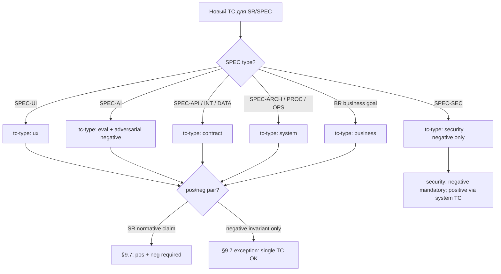

# 09. Тест-кейсы

> **Часть RENAR Standard v1.1** · [← Оглавление](README.md)

## 9.1 Тест-кейс — полноценный артефакт

Тест в RENAR — не приписка в конце кода, а полноценный документ: у него своя версия, статус и место в цепочке прослеживаемости, как у требования, которое он проверяет. Причина проста: тесты пишет AI-агент, а AI охотно покрывает «счастливый путь» («ввели верный пароль — пустило») и тихо обходит неприятное («ввели чужой — не должно пустить, не должно подсказать, какое поле неверно, не должно записать пароль в лог»). Именно в необработанных негативных случаях и живут дефекты.

Поэтому RENAR делает нормативными два требования. **Парность pos/neg**: на каждое проверяемое утверждение — минимум один позитивный тест-кейс и один негативный (что должно произойти и что произойти не должно). **Изоляция судьи**: если результат оценивает другая AI-модель (для типов `ux`, `eval`), она обязана отличаться от той, что породила оцениваемое, — модель не проверяет сама себя. TC ([Test Case](04-terms.md#451-tc--test-case)) замыкает цепочку прослеживаемости ТЗ → [ADAPT](07-adapt.md) → BR / SR / [SPEC](08-specifications.md) → TR → TC (см. [§2.3](02-methodology-positioning.md#2.3)): от провала теста можно дойти до раздела ТЗ, который он в конечном счёте проверяет.

Глава опирается на ISO/IEC/IEEE 29119 «Software testing» в части концепций test design, test execution, test result reporting и pos/neg coverage, но фиксирует закрытый список типов TC, обязательную pos/neg-парность и judge ≠ production isolation как нормативные требования v1.0, не присутствующие в ISO 29119 в формализованном виде.

От практик Specification by Example (Adzic) и BDD / Gherkin — где исполняемые примеры также служат спецификацией — RENAR отличается тем, что переводит pos/neg-парность ([§9.7](#9.7)), judge ≠ production isolation ([§9.13](#9.13)) и version-pin TC к версии требования (V5, [§3.3.5](03-substrate-versioning.md#3.3.5)) из рекомендации в блокирующие нормативные положения ([§14.5.2](14-normative-refs.md#14.5.2)).

Положения главы являются нормативными. Закрытые списки (принципы, типы TC, обязательные виды TC по типу SPEC) — обязательные положения соответствия RENAR ([глава 13](13-conformance.md)); расширение — только через формальную процедуру изменения стандарта.

> **Плотная глава:** [reference/09](../reference/09-pedagogical-density.md) · decision tree ниже — informative routing.

### 9.1.1 Дерево решений: выбор `tc-type` (informative)



Процедура состязательного обзора TC — [guide/07 §3.5](../guide/07-failure-modes.md#35-adversarial-review-процедура); панель агентов (informative) — там же §4.5.

---

## 9.2 Закрытый список нормативных принципов TC

| # | Принцип | Нормативная формулировка |
|---|---|---|
| P1 | Полноценный артефакт (TC) | TC — самостоятельный артефакт стандарта, по жизненному циклу и версионированию равный требованию. Хранится отдельным файлом в подпапке `tests/` носителя требований ([§9.17](#9.17)). |
| P2 | Документ ≠ реализация | TC описывает **что и как проверяется** (отвязан от реализации). Реализация (код) адресуется полем `automation.location` и хранится в носителе кода. Один TC — одна реализация. |
| P3 | AI-generated | TC создаются и редактируются AI-агентом по заданию инженера; инженер не пишет TC вручную (см. [глава 11 §11.N](11-maturity-model.md)). |
| P4 | AI-executed | Все допущенные реализации TC (QG-1) — автоматизированы. Прогон выполняет автоматический runner (CI / AI-runner / specialized executor). Результаты в `last-run` записывает только runner (bot-managed участник) по факту прогона. |
| P5 | Pos/neg pairing | На каждое утверждение требования (BR / SR / SPEC) создаётся минимум одна пара positive + negative TC ([§9.7](#9.7)). |
| P6 | `last-run` — bot-managed | Поле `last-run` (date / result / runner-id / set-version / judge-report) заполняет только автоматический runner. Ручное редактирование `last-run` любым участником запрещено стандартом ([§9.12](#9.12)). |
| P7 | Judge ≠ production isolation | Для типов TC, использующих LLM-as-judge (ux, eval), judge-модель **не должна совпадать** с production-моделью, генерирующей оцениваемый артефакт. Совпадение блокирует hook носителя ([§9.6.2](#9.6.2)). |
| P8 | Изоляция авторства теста | Тест отделён от реализации по трём осям: **время** — TC-норма утверждена в версии и реализация допущена (QG-1) до начала реализации, которую он проверяет; **автор** — агент, пишущий тест, не совпадает с агентом, пишущим реализацию ([§9.18](#9.18)); **изменение** — правка критериев замороженного теста только через `[test-spec-change]` с утверждением инженера ([§9.13](#9.13)). |
| P9 | Красная история | Тест, ни разу не наблюдавшийся красным, **не является доказательством**. Фиксирующий прогон выполняется до реализации: тест обязан быть красным; переход «красный → зелёный» записывается ([§9.18](#9.18)). |

Список закрыт. Новые принципы добавляются только через формальную процедуру изменения стандарта ([глава 13](13-conformance.md)).

**Зачем P9, если есть P8.** Изоляция авторства гарантирует, что тест написан **до** кода и **не тем**, кто пишет код. Но она не гарантирует, что тест **что-то проверяет**: пустой тест, честно написанный изолированным агентом по ошибке, формально безупречен и зелен с рождения — он проходит все три оси P8. Красная история закрывает ровно этот остаток, и больше ничто его не закрывает.

---

## 9.3 Общая схема TC (frontmatter)

Все типы TC делят общий набор frontmatter-полей. Type-specific поля добавляются как extensions поверх (§9.6). Полная machine-readable схема — в [reference/02-schemas.md](../reference/02-schemas.md).

```yaml
---
# === Identity (mandatory) ===
id: TC-NN                            # immutable; NN sequential в рамках scope
title: "<short, descriptive>"
type: TC
slug: "<kebab-case>"                 # auto-derived

# === Classification (mandatory) ===
tc-type: business | ux | system | contract | eval | security
negative: boolean                    # true для парного негативного TC

# === Scope (mandatory) ===
level: system | subsystem | module
scope:
  system: "<system-id>"
  subsystem: "<subsystem-id>"        # null если level=system
  module: "<module-id>"              # null если level ≠ module

# Собственного статуса у TC-нормы нет: она пункт комплекта описания ([§10.7](10-lifecycle-qg.md#10.7)).
# Состояния реализации и прогона — automation.* и last-run.* ([§10.9](10-lifecycle-qg.md#10.9)).

# === Verification target (mandatory; хотя бы один из) ===
verifies:
  - id: SR-NN | BR-NN | SPEC-<TYPE>-NN   # версия описания указывается один раз — automation.set-version
    statement: 5                    # адрес утверждения <id>#n (§15.1.1); обязательно, если у артефакта более одного утверждения
  - id: ...

# === Pair link (mandatory если negative=false и существует парный) ===
paired-with:                         # ID парного TC (positive ↔ negative)
  - TC-NN

# === Task binding (optional; §9.19.7) ===
verifies-tr: TR-NN                   # задача, к объёму которой сужен тест
verifies-claims: []                  # подмножество утверждений родительского SR, покрываемое в объёме TR

# === Красная история (mandatory для засчёта TC как доказательства; §9.18.2) ===
red-history:
  fixing-run: { date: "<ISO-8601>", result: fail }     # фиксирующий прогон ДО реализации — обязан быть красным
  green-transition: "<ISO-8601>"                        # момент перехода красный → зелёный (ведёт runner)
  inherited-from: TC-NN                                 # conditional: задача без изменения поведения (рефакторинг)
  not-applicable-reason: implementation-originated      # conditional: класс §6.13; требует mutation-check ниже
mutation-check:                                         # mandatory если not-applicable-reason задан (§6.13.3)
  mutants-killed: integer                               # обязан быть ≥ 1

# === Стенд и данные (conditional; §8.5.10) ===
environment-ref: SPEC-TEST-NN        # mandatory если automation.kind: dynamic — стенд и датасет,
                                     # против которых TC валиден. Для static (док-линт §9.8,
                                     # структурный TC §9.8.1) не применяется: анализатор работает
                                     # по артефактам, а не против стенда

# === Automation (mandatory) ===
automation:
  status: automated | manual-pending
  set-version: "N.M"                 # версия комплекта, против которой написана реализация (QG-1, §10.9.2; V5)
  kind: dynamic | static             # mandatory; static — runner является статическим анализатором (§9.8.1)
  location: "<нативный для носителя pointer to implementation>"  # mandatory если automated
  manual-pending-until: "<ISO date>"                        # mandatory если manual-pending
  manual-pending-reason: "<text>"                            # mandatory если manual-pending

# === Execution (mandatory если type=ux | eval) ===
judge:
  vendor: "<provider>"               # mandatory; см. P7 isolation
  model: "<model-id>"
  prompt-template: "<template-path>@<version>"

baseline:                            # mandatory для ux | eval
  artifact: "<нативный для носителя pointer>"
  perceptual-diff-threshold: float   # для ux
  metric-thresholds: {}              # для eval

# === Last run (auto-managed; bot-only) ===
last-run:
  date: "<ISO-datetime>"
  result: pass | fail | skipped | n/a
  runner-id: "<runner-name@version>"
  run-ref: "<нативная для носителя ссылка>"
  set-version: "N.M"                 # версия комплекта, на которой выполнен прогон
  judge-report: "<inline or pointer>"

# === AI provenance (обязательно на RENAR-4+; canonical schema — §4.10.1) ===
ai-provenance:
  generated-by: "<vendor>-<model>-<version>@<date>"
  generated-at: "<ISO-8601>"
  prompt-template: "<template-path>@<version>"
  context-tokens: integer
  output-tokens: integer
  human-edits: boolean
  # optional на RENAR-4, обязательно на RENAR-5 (см. §4.10.1):
  # cost-budget, cost-actual, generation-time-ms

# === Замена (mandatory если применимо) ===
replaces: "<old-id>"                 # исключение прежней TC-нормы и replaced-by — в записи версии комплекта (§10.5.3)
---
```

`verifies[]` — закрытый список ссылок на верифицируемые артефакты (BR / SR / SPEC). TR прямо не указывается в `verifies` — TR верифицируется через свой родительский SR (см. [§6.7](06-requirements-hierarchy.md#6.7)). Версия описания указывается один раз на реализацию — `automation.set-version`: версия комплекта, против которой написана реализация (V5, [глава 3 §3.3.5](03-substrate-versioning.md#3.3.5); [§10.5.4](10-lifecycle-qg.md#10.5.4)). QG-2 версии ([§9.10](#9.10)) требует `last-run.set-version`, равной верифицируемой версии комплекта.

`automation.status` принимает ровно два значения. `manual-pending` — временная заглушка: обязательные `manual-pending-until` / `manual-pending-reason` и потолок срока ([§10.9.2](10-lifecycle-qg.md#10.9.2)) относятся именно к ней; постоянно ручной прогон как третий статус не предусмотрен. Способ фиксации доказательства прогона — автоматического или ручного — стандарт не нормирует: конкретные test runners исключены из нормативной области ([§1.3](01-scope.md#1.3), п. 5); нормируется только обязательность указателей `automation.location` и `last-run.run-ref` ([§9.12](#9.12)).

---

## 9.4 Body разделы TC

Тело любого TC обязательно содержит следующие разделы (независимо от носителя):

| Раздел | Обязательность | Содержание |
|---|---|---|
| Контекст | обязательно | На какой пункт верифицируемого артефакта ссылается TC; цитата или пересказ утверждения. |
| Предусловия | обязательно | Состояние системы и данных, требуемое для прогона; обеспечивается seed-механизмом. |
| Шаги | обязательно | Действия runner; для `tc-type: ux` — намерения, не селекторы (см. [§9.6.1](#9.6.1)). |
| Pass-критерий | обязательно | Бинарный, наблюдаемый, воспроизводимый (см. [§9.11](#9.11)). |
| Fail-критерий | обязательно | Перечень наблюдаемых признаков нарушения (не отрицание Pass); включает утечки, side-effects, race conditions. |
| Постусловия | обязательно | Какое состояние ожидается после прогона; cleanup-механизм. |
| Out of scope | обязательно | Что **намеренно** не проверяется, с указанием парного TC, где это покрыто. |
| Связанные TC | optional | Ссылки на семантически связанные TC. |

Раздел «Out of scope» — нормативно обязательный: защищает от ложного ощущения покрытия. Отсутствие раздела — нарушение структурной полноты: версия комплекта не утверждается ([§10.7.2](10-lifecycle-qg.md#10.7.2)).

Имена секций тела — machine-detectable заголовки уровня `##`. Канонические идентификаторы секций критериев — `## Pass-критерий` и `## Fail-критерий`; именно их детектирует хук контроля change-of-criteria ([§10.11.3](10-lifecycle-qg.md#10.11.3)), поэтому имена этих секций фиксированы и не подлежат локальной замене.

Тройка «Дано — Когда — Тогда» — чтение трёх из семи разделов (предусловия, шаги, Pass-критерий), а не их замена; язык критериев и шагов — [глава 15](15-description-language.md), соответствие — [§15.6.3](15-description-language.md#15.6.3).

---

## 9.5 Закрытый список типов TC

```text
tc-type ∈ { business, ux, system, contract, eval, security }
```

| Тип | Что проверяет | Применяется к | runner-семейство |
|---|---|---|---|
| `business` | Достигнута ли бизнес-цель? | BR | E2E + AI-валидатор |
| `ux` | Соответствует ли UX заявленному опыту? | SPEC-UI | AI-driver + VLM-judge |
| `system` | Ведёт ли система себя как описано? | SR, SPEC-PROC, SPEC-ARCH | xUnit-семейство |
| `contract` | Соблюдён ли контракт? | SPEC-API, SPEC-INT, SPEC-DATA | Contract-testing framework |
| `eval` | Достигнуто ли качество AI-компонент? | SPEC-AI | Eval-runner с эталонным набором данных |
| `security` | Соблюдены ли security-инварианты? | SPEC-SEC | Authz/threat-test framework |

Список закрыт. Новые типы добавляются только через формальную процедуру изменения стандарта ([глава 13](13-conformance.md)). Конкретные технологии runner специфичны для носителя и фиксируются в манифесте соответствия реализации.

**Почему `business`, а не `acceptance`.** Приёмок в RENAR две, по разные стороны развязки контуров: `business`-TC проверяет достижение бизнес-цели BR (внутренний контур), **AT** ([§9.19](#9.19)) — соответствие контракту, то есть итоговому ТЗ. Одно имя на два разных предмета — прямой источник путаницы; имена разведены.

---

## 9.6 Type-specific extensions

### 9.6.1 `tc-type: ux` — UX тесты на основе SPEC-UI

UX-тест нормативно построен как двухслойная структура:

| Слой | Содержание | Исполнитель |
|---|---|---|
| Сценарий (намерение) | «<участник> хочет <результат> после <условие>» | AI-driver: переводит намерение в действия, находит элементы по семантике (без жёстких селекторов) |
| Перцептивная проверка | «На отрисованном состоянии видно <критерий>» | Perceptual judge (VLM): принимает рендер + критерий, возвращает pass/fail с обоснованием |

**Обязательное расширение frontmatter:** `judge.vendor`, `judge.model`, `baseline.artifact`, `baseline.perceptual-diff-threshold`.

**Обязательные секции тела дополнительно к §9.4:** Сценарий (намерение, не селекторы); Перцептивный критерий (что должен увидеть judge); Парный негативный (пустое состояние / ошибка / отсутствие прав).

**Регрессия по визуалу.** Дополнительно к VLM-judge — perceptual diff против `baseline.artifact` с порогом `perceptual-diff-threshold`. Превышение порога блокирует переход TC в `passing`.

**Обновление эталона.** Изменение `baseline.artifact` требует нативного для носителя approval-механизма с тегом `[baseline-update]` (см. [§9.13](#9.13)); автоматическое обновление запрещено.

### 9.6.2 `tc-type: eval` — Eval-тесты на основе SPEC-AI

Eval-тест нормативно проверяет качество AI-компонент через dataset с метриками и порогами.

**Обязательное расширение frontmatter:** `judge.vendor`, `judge.model`, `baseline.artifact` (versionable dataset), `baseline.metric-thresholds`.

**Обязательные секции тела:** происхождение dataset (как собран, какая разметка); метрика-кластер (одна eval-TC = одна семантически связная группа метрик; разные семейства — разные TC); regression rule (что считается провалом — выход за threshold или регрессия ≥ N% против эталона).

**Judge ≠ production isolation (нормативно).** Поле `judge.vendor` + `judge.model` обязано отличаться от `production-model` спецификации SPEC-AI, нормирующей оцениваемое поведение. Нативный для носителя hook ([глава 3 §3.3.3](03-substrate-versioning.md#3.3.3)) обязан блокировать merge change unit при совпадении.

**Версионирование dataset.** Eval-dataset — управляемый носителем versionable artifact: каждое изменение фиксируется как atomic change unit с описанием (что добавлено / убрано / переразмечено) и авторством (генератор-агент / критик-агент / human выборочная проверка).

**Ограничение по стоимости.** Eval не запускается на каждое изменение реализации (cost): runner запускается при изменении SPEC-AI, production-model, или dataset, либо по расписанию. Триггеры фиксируются в нативной для носителя runner-configuration.

**Двухступенчатая разметка dataset.** Generator-agent создаёт кандидатов; critic-agent проверяет по чек-листу; инженер делает выборочную проверку ≥ 10% случайных примеров до merge dataset.

### 9.6.3 `tc-type: contract` — Контрактные тесты на основе SPEC-API / SPEC-INT / SPEC-DATA

**Обязательные секции тела:** machine-readable контракт (ссылка на OpenAPI / GraphQL SDL / Protobuf / JSON Schema из SPEC); сторона генератор / сторона потребитель; мок counterparty (для SPEC-INT — sandbox / реальная среда отдельным TC).

**Обязательное расширение для SPEC-INT.** Контрактные TC обязательно сочетаются с интеграционным TC (`tc-type: contract`, `level: subsystem | system`) против реальной или sandbox-counterparty — мокированного контракта недостаточно для верификации SPEC-INT.

### 9.6.4 `tc-type: security` — Security-тесты на основе SPEC-SEC

**Обязательные секции тела:** атрибуты модели угроз (STRIDE-категория или эквивалент); subject под тестом (authn / authz / data classification / secrets / audit / encryption); negative scenarios (попытка обхода, неавторизованный доступ, leakage); ожидаемое поведение системы при нарушении.

Security-TC нормативно содержит **только negative scenarios** (попытка обхода защиты). Positive «дать корректный доступ корректному участнику» покрывается `tc-type: system` с областью охвата SPEC-SEC.

---

## 9.7 Pos/neg pairing — нормативное требование

**На каждое утверждение требования (BR / SR / SPEC), описывающее наблюдаемое поведение, создаётся минимум одна пара positive + negative TC.**

| Положительный TC | Парный отрицательный TC |
|---|---|
| `negative: false` | `negative: true` |
| Описывает happy path / success behavior | Описывает граничные условия, нарушения, обходы |
| `paired-with: [TC-<neg-id>]` | `paired-with: [TC-<pos-id>]` |

Negative TC нормативно описывает наблюдаемые признаки нарушения (что **не должно** произойти), а не отрицание Pass-критерия позитивного TC. Примеры:

| Утверждение | Pos TC | Neg TC |
|---|---|---|
| «Аутентификация по email + password» | Корректные credentials → 200 + JWT | Неверный пароль → 401 без раскрытия, какое поле неверно; отсутствие записи в session-store; rate-limit после N попыток |
| «Создание заказа» | Валидный payload → 201 + order-id | Невалидный price < 0 → 422 с явной ошибкой; отсутствие записи в БД; отсутствие side-effect (уведомление, начисление) |

QG-0 комплекта ([§10.5.2](10-lifecycle-qg.md#10.5.2)) обязан блокировать утверждение версии, в которой хотя бы одно нормативное утверждение не покрыто вовсе или покрыто только положительной TC-нормой; наличие покрытия проверяет точка контроля `coverage-presence` ([§10.11.1](10-lifecycle-qg.md#10.11.1)) — обязательное положение [§13.3.5](13-conformance.md#13.3.5).

Single-TC-coverage допускается **только** в одном случае: артефакт описывает запрет / negative invariant сам по себе (например, security-TC по STRIDE-категории — он негативный по природе).

---

## 9.8 Spec-specific TC — обязательные виды по типу SPEC

Закрытая нормативная таблица: каждый тип SPEC обязан иметь минимум по одной TC-норме каждого «обязательного вида» — наличие проверяется при утверждении версии комплекта (QG-0, [§10.5.2](10-lifecycle-qg.md#10.5.2)), прохождение — при верификации версии (QG-2, [глава 8 §8.8](08-specifications.md#8.8)).

| Тип SPEC | Обязательные виды TC | Дополнительные виды TC |
|---|---|---|
| SPEC-ARCH | Соответствие (zoning / dependency rules) | Эталонные значения атрибутов качества (latency / throughput / availability) |
| SPEC-API | Contract (по контракту из `contract-file`) | Auth negative; rate-limit; versioning compatibility |
| SPEC-DATA | Constraint (FK / NOT NULL / unique); Migration (прямой проход + откат) | PII handling; retention; index regression |
| SPEC-INT | Contract (mocked counterparty); контрактный TC `tc-type: contract` (real / sandbox counterparty) | Failure injection; idempotency; observability (correlation IDs) |
| SPEC-PROC | Happy path E2E; Alternative paths E2E | Compensation (для saga); SLA end-to-end |
| SPEC-UI | VLM-judge с эталоном (judge ≠ production); Accessibility (WCAG-AA минимум) | i18n (string overflow / RTL); Journey E2E |
| SPEC-AI | Eval против эталонного набора данных (judge isolated) | Состязательный (prompt injection как negative TC); Cost regression; Hallucination tests |
| SPEC-SEC | Authz / RBAC matrix; Threat-test per STRIDE-категории | Журнал аудита; Secrets leakage; Encryption invariants |
| SPEC-OPS | Smoke after deploy; SLO regression (load test) | Failover / DR drill; Observability (alert firing correctness) |
| SPEC-TEST | Воспроизводимость (повторный прогон на том же стенде даёт тот же результат); Валидность counterparty (sandbox отвечает как реальная система); Целостность датасета (данные соответствуют объявленной схеме и объёму) | Дрейф стенда (конфигурация не разошлась с объявленной); Полнота анонимизации |
| SPEC-DOC | **Док-линт** (`automation.kind: static`): наличие обязательных разделов; покрытие всех ролей и сценариев из связанных BR / SR; совпадение версии документа с версией системы; язык и формат | Содержательное соответствие реализованному поведению — judge-агентом через P7 / `eval` |
| SPEC-UC | `role: human` — `ux`-TC на каждый шаг + сквозной journey E2E; `role: agent` — `system` / `contract` на каждый шаг по каналу | Негативные ветви как отдельные TC (обязательны, §9.7); SLA сквозного пути |

Точка контроля утверждения версии комплекта ([§10.11.1](10-lifecycle-qg.md#10.11.1), `coverage-presence`) обязана проверять наличие минимум по одной TC-норме каждого обязательного вида и блокировать утверждение при отсутствии; прохождение этих TC — предмет QG-2 версии ([§10.3.3](10-lifecycle-qg.md#10.3.3)).

**Самореференция SPEC-TEST.** TC, верифицирующие сам `SPEC-TEST` (воспроизводимость, валидность counterparty, целостность датасета), прогоняются **на том же стенде**, который они описывают, и потому несут `environment-ref` на него же. Круг допустим и является нормой: стенд доказывает собственную пригодность единственным доступным способом — работая. Инвалидация при этом остаётся корректной: смена стенда инкрементит его версию и обесценивает в том числе его собственные TC — что и требуется.

Таблица закрыта; строка SPEC-UC добавлена в v1.1 по процедуре [§13.9](13-conformance.md#13.9). Расширение — только через формальную процедуру изменения стандарта ([глава 13](13-conformance.md)).

**Тип покрывающего TC для интерфейса (обязательно).** Каждое утверждение SPEC-UI, описывающее доступное через интерфейс действие (экран, элемент, шаг user journey), и каждый шаг SPEC-UC с `role: human` обязаны быть покрыты хотя бы одним TC типа `ux` ([§9.6.1](#9.6.1)). `system`-TC, проверяющий то же поведение в обход интерфейса, такое утверждение **не закрывает**: зелёный прогон в обход интерфейса при неработоспособном интерфейсе — наблюдавшийся отказ, ради которого правило введено. Для шага SPEC-UC с `role: agent` покрывающий TC — `system` или `contract` по каналу шага. Правило не расширяет §13.3 ([§13.3.5](13-conformance.md#13.3.5) нормирует наличие и парность покрытия, не его тип) и не вводит нового вида TC.

**SPEC-DOC — док-линт (обязателен).** Проверяемые утверждения поставляемой документации ([§8.5.11](08-specifications.md#8.5)): наличие обязательных разделов; покрытие всех ролей и сценариев, заявленных в связанных BR / SR; совпадение версии документа с версией системы; язык и формат поставки. Runner — статический анализатор (`automation.kind: static`). Содержательное соответствие реализованному поведению проверяется опционально judge-агентом через P7 / `eval` — отдельного механизма не вводится.

Без док-линта SPEC-DOC неверифицируем: QG-2 требует покрытия каждого нормативного утверждения ([§9.7](#9.7)), и такой SPEC либо заблокировал бы поставку, либо вынудил ослабить MVR-5 ради одного типа.

**SPEC-TEST — воспроизводимость, валидность counterparty, целостность датасета** ([§8.5.10](08-specifications.md#8.5)). Валидность counterparty — не формальность: sandbox, отвечающий не как реальная система, превращает доказательство в фикцию.

### 9.8.1 Структурный TC — вырожденная нормативная часть

Для SPEC-ARCH и SPEC-DATA обязательный вид TC — соответствие структуры (правила зонирования и зависимостей, соответствие схем). Его runner — **статический анализатор**, а не прогон системы; это фиксируется полем `automation.kind: static` ([§9.3](#9.3)). Отдельного типа TC для структурных проверок **не вводится**: проверка уже обязательна, недоставало лишь признания природы её runner'а.

> У структурного TC нормативная часть **вырождена**: утверждение уже записано в SPEC-ARCH / SPEC-DATA; нормативная часть теста лишь указывает, какое положение спецификации подлежит автоматической проверке.

Из вырожденности следует **маршрут разбора провала** — иначе неизбежен спор «что чинить: код, тест или спецификацию?»:

| Причина провала | Что меняется |
|---|---|
| Код нарушает правило, записанное в SPEC | **Код** |
| Правило признано неверным либо требует ужесточения | **SPEC** — новая версия (не правка теста!) |
| Анализатор даёт ложный результат | **Инструмент**; эталон не тронут |

Правка структурного TC ради «зеленения» провала — подгонка теста под код в чистом виде: эталон живёт в SPEC, и менять надо его.

---

## 9.9 Жизненный цикл TC

### 9.9.1 Норма и реализация — два разных объекта

Нормативная часть TC (frontmatter и тело по [§9.4](#9.4)) — пункт комплекта описания: собственного статуса не имеет, утверждается в составе версии комплекта и исключается из него по [§10.5.3](10-lifecycle-qg.md#10.5.3). Собственный цикл есть у **реализации** — кода проверки ([§10.9](10-lifecycle-qg.md#10.9)):

```text
не допущена  ──[QG-1]──▶  допущена  ──[runner pass]──▶  pass
                              │                           │
                              │ [runner fail]             │ [норма изменена в версии N.M+1]
                              └───────────▶ fail          ▼
                                              │       устарела  (норма изменена позже set-version)
                                              └──────────┘
```

| Состояние реализации | Смысл | Как фиксируется |
|---|---|---|
| не допущена | Реализация отсутствует или не прошла QG-1 | `automation.status` не подтверждён сухим прогоном |
| допущена | Сухой прогон прошёл; красная история записана; `automation.set-version` указывает на утверждённую версию нормы | QG-1 ([§9.10](#9.10)) |
| `pass` / `fail` | Результат последнего прогона на `last-run.set-version` | Bot-managed по факту прогона ([§9.12](#9.12)) |
| устарела | Норма изменена в более поздней версии комплекта; прогон против прежней нормы доказательством не является | Норма изменена в версии позже `automation.set-version` ([§10.9.4](10-lifecycle-qg.md#10.9.4)) |

Исключённая TC-норма сохраняется в истории носителя как след (V1): реализация носителя **должна** обеспечивать неизменность идентификатора TC и **не должна** допускать его переиспользование для новой TC-нормы ([глава 3 §3.3.1](03-substrate-versioning.md#3.3.1)).

### 9.9.2 Связь с верификацией версии комплекта

«Верифицирован» — свойство не BR / SR / SPEC, а пары (версия комплекта, версия продукта) ([§10.3.3](10-lifecycle-qg.md#10.3.3)): все TC-нормы версии `N.M` имеют допущенную реализацию с `last-run.result = pass` и `last-run.set-version = N.M`. Запись верификации ведёт runner в записи версии комплекта ([§10.5.4](10-lifecycle-qg.md#10.5.4)).

---

## 9.10 Контрольные точки качества для TC

Канонические определения Quality Gates — в [главе 10 §10.3](10-lifecycle-qg.md#10.3). Эта секция — TC-локальная сводка gates, применимых к TC напрямую (QG-0, QG-1) или использующих TC как доказательную базу (QG-2). Нумерация и семантика обязаны совпадать с канонической §10.3; локальное переопределение на уровне проекта запрещено ([§10.10.2](10-lifecycle-qg.md#10.10.2)).

| Gate (канонический) | Роль TC | Предусловие (кратко; полная формулировка — гл. 10) | Постусловие |
|---|---|---|---|
| QG-0 — утверждение ([§10.3.1](10-lifecycle-qg.md#10.3.1)) | TC-норма — пункт утверждаемой версии комплекта | На каждое нормативное утверждение версии — пара TC-норм ([§9.7](#9.7)); `verifies[]` указывает на артефакты той же версии; обязательные секции тела ([§9.4](#9.4)) заполнены; решение утверждающего зафиксировано нативно для носителя (V3 + V6) | TC-норма входит в версию `N.M`; допускается реализация против неё |
| QG-1 — реализация проверки ([§10.3.2](10-lifecycle-qg.md#10.3.2)) | Реализация TC — допуск к прогону | `automation.set-version` = утверждённая версия комплекта, содержащая норму; `automation.status = automated` (или `manual-pending` с дедлайном и причиной); сухой прогон runner прошёл; красная история ([§9.18.2](#9.18)) | Реализация допущена; разрешён production-прогон |
| QG-2 — верификация ([§10.3.3](10-lifecycle-qg.md#10.3.3)) | Реализации TC — доказательная база версии комплекта | Все TC-нормы версии имеют допущенную реализацию с `last-run.result = pass` и `last-run.set-version = N.M`; обе TC каждой пары прошли; обязательные виды TC по типам SPEC ([§9.8](#9.8)) прошли | Запись верификации в записи версии ([§10.5.4](10-lifecycle-qg.md#10.5.4)); для задачи — TR `done` |

Проверка совпадения `last-run.set-version` с версией комплекта, для которой ведётся верификация, при каждом последующем прогоне — runner-managed consistency check ([§10.9.3](10-lifecycle-qg.md#10.9.3)), **не** отдельный Quality Gate.

Нативные для носителя hooks ([глава 3 §3.3](03-substrate-versioning.md#3.3)) обязаны блокировать gate-переходы, нарушающие предусловие.

---

## 9.11 Pass / Fail / Out of scope — нормативные критерии

### 9.11.1 Pass-критерий

Pass-критерий обязан быть:

- **Бинарным** — да или нет, без интерпретации.
- **Наблюдаемым** — фиксируется без доступа к внутренним структурам системы.
- **Воспроизводимым** — повторный прогон в тех же условиях даёт тот же результат.

| Плохо | Хорошо |
|---|---|
| «Логин работает корректно» | «`POST /auth/login` с верными credentials возвращает 200 и JWT с `exp = now + 24h ± 1м`» |
| «Производительность приемлемая» | «p95 latency < 200 мс при 100 RPS на `/search` в течение 5 минут» |
| «Ошибка обрабатывается» | «При невалидном email возвращается 422 с телом `{"field":"email","code":"invalid_format"}`» |

### 9.11.2 Fail-критерий

Fail-критерий — **не отрицание** Pass. Перечисляет наблюдаемые признаки нарушения, в том числе те, которые Pass-критерий явно не покрывает:

- Какой ответ / состояние / событие признаётся отказом.
- Утечки информации (например, в 401 не должно быть указано, какое именно поле credentials неверно).
- Side-effects, которых не должно быть — запись в лог, отправка письма, мутация других записей.
- Race conditions: одновременные запросы не приводят к нарушению инвариантов.

### 9.11.3 Out of scope

Каждый TC обязательно содержит секцию «Out of scope» с явным перечислением:

- Что намеренно не проверяется этим TC;
- Где это покрыто (ссылка на парный TC или другой TC).

Раздел защищает от ложного ощущения покрытия (см. также [глава 11](11-maturity-model.md) — coverage matrix). Отсутствие явного «Out of scope» нормативно блокирует QG-0 ([§9.10](#9.10)).

---

## 9.12 `last-run` — bot-managed only

Поле `last-run` (date / result / runner-id / run-ref / set-version / judge-report) заполняет **только** автоматический runner (CI-bot / AI-runner / specialized executor). Ручное редактирование `last-run` любым человеком — нарушение стандарта; hook носителя ([глава 3 §3.3.6](03-substrate-versioning.md#3.3.6)) обязан блокировать change unit, изменяющий `last-run` от автора, не являющегося ботом.

Состав `last-run`:

| Поле | Обязательно | Содержание |
|---|---|---|
| `date` | да | ISO-datetime прогона |
| `result` | да | `pass \| fail \| skipped \| n/a` |
| `runner-id` | да | Идентификатор runner + версия |
| `run-ref` | да | нативный для носителя pointer на полный лог прогона |
| `set-version` | да | Версия комплекта описания, на которой выполнен прогон (V5, [§10.5.4](10-lifecycle-qg.md#10.5.4)) |
| `judge-report` | да для `ux \| eval` | Inline или pointer на отчёт VLM/eval-judge |

---

## 9.13 Защита от подгонки тестов

### 9.13.1 Нормативное правило

**AI-агент не может одновременно изменить implementation-код и Pass / Fail-критерии существующего TC в одном change unit так, чтобы `failing` TC становился `passing`, без явного approval инженером на изменение TC.**

Без этого правила AI-агент имеет тривиальный путь к зелёному прогону — ослабить критерий вместо исправления кода.

### 9.13.2 Механизм `[test-spec-change]`

| Класс изменения | Тег | Утверждение |
|---|---|---|
| Изменение Pass / Fail-критериев существующего TC | `[test-spec-change]` | Обязательно: явный approval инженером change unit отдельно от любого изменения implementation-кода |
| Изменение `automation.location` (перенос реализации без изменения проверяемого поведения) | — | Без отдельного approval |
| Изменение implementation-кода без правок TC | — | Standard workflow |
| Обновление `baseline.artifact` / dataset / `mockup-baseline` | `[baseline-update]` | Обязательно: явный approval инженером |
| Создание нового TC | — | QG-0 ([§9.10](#9.10)) |

Нативная для носителя реализация тегов специфична для носителя (см. [guide/03](../guide/03-tool-guide-git.md), [guide/04](../guide/04-document-store-substrate.md)); нормативное требование — атомарность change unit, явное обозначение класса изменения, и опциональная (но рекомендуемая) изоляция таких изменений в отдельный change unit от изменений implementation-кода.

### 9.13.3 Аудит

Все change units с тегом `[test-spec-change]` агрегируются в нативный для носителя audit-feed для архитектора. Цель — отследить паттерн: если AI-агент часто запрашивает изменение критериев, это сигнал о проблеме формулировок исходного требования ([глава 7 ADAPT](07-adapt.md), категории обратных находок `terminology` или `gap`).

### 9.13.4 Judge isolation (P7) — частный случай защиты

`judge.vendor` + `judge.model` обязательно отличается от production-модели верифицируемого SPEC-AI ([§9.6.2](#9.6.2)). Совпадение блокирует hook носителя.

---

## 9.14 Спот-чек инженера

### 9.14.1 Нормативная процедура

Раз в итерацию (по умолчанию — регулярный цикл реализации; конкретный интервал фиксируется в манифесте соответствия проекта) инженер выполняет спот-чек 5 случайных TC в статусе `passing`. Цель — поймать ситуацию, когда AI-агент сгенерировал «зелёный» TC, который ничего значимого не проверяет (`assert True`-эквивалент; VLM-prompt, проходящий на пустом экране; eval-критерий, всегда возвращающий pass на эталоне).

### 9.14.2 Sampling

Выборка **наводится машинными сигналами**, а не берётся случайно. После введения красной истории ([§9.18.2](#9.18)) слепая выборка избыточна: носитель знает, какие тесты подозрительны.

| Параметр | Нормативное требование |
|---|---|
| Размер выборки | 5 TC (по умолчанию); может быть увеличено в манифесте соответствия проекта |
| **Приоритет отбора** | 1) TC **без красной истории** (фиксирующий прогон не наблюдался красным); 2) TC, **переживший мутанта** (мутационная проверка не убила ни одного мутанта), если носитель её выполняет; 3) TC класса `implementation-originated` ([§9.18.2](#9.18)); 4) остальные — случайным добором до размера выборки |
| Распределение по типам | Равномерное по `tc-type` в пределах случайного добора |
| Статус | Только `passing` |
| Кто выбирает | AI-агент по приоритету выше; случайный добор — нативной для носителя случайностью (seed фиксируется в audit-feed) |

Случайная выборка ловит слабый тест с вероятностью, обратной размеру набора; направляемая — предъявляет инженеру ровно те тесты, у которых **машина уже нашла признак незубастости**. Дешевле и точнее.

### 9.14.3 Что инженер проверяет

1. Соответствует ли Pass / Fail-критерий заявленному поведению в верифицируемом артефакте?
2. Не слишком ли мягкий критерий VLM-judge или eval-judge?
3. Реальны ли предусловия (не подменены ли через seed, маскирующий bug)?
4. Покрывает ли Out-of-scope именно то, что должен покрывать парный TC?

### 9.14.4 Фиксация результата

Результат спот-чека фиксируется нативно для носителя:

```yaml
last-spot-check:
  date: "<ISO-date>"
  by: "<engineer-id>"
  sampled-tests: [TC-NN, TC-NN, ...]
  issues-found: integer
  issues:
    - test: "TC-NN"
      issue: "<краткое описание>"
```

### 9.14.5 Реакция на находки

При `issues-found > 0`:

- Архитектор регистрирует change unit на исправление найденных TC.
- AI-агент обязан учесть выявленный паттерн в следующих генерациях TC; паттерн добавляется в system prompt агента или в meta-style guide.
- При повторном обнаружении того же паттерна — эскалация на пересмотр шаблона генерации TC.

---

## 9.15 Матрица покрытия (auto-generated)

### 9.15.1 COVERAGE-artifact

`COVERAGE.md` (нативное для носителя имя artifact) — auto-generated сводный отчёт покрытия требований и спецификаций тест-кейсами на уровне носителя требований. Помечается нативным для носителя флагом auto-generated.

### 9.15.2 Обязательные метрики

| Метрика | Цель | Действие при нарушении |
|---|---|---|
| `coverage-percent` (TC-нормы версии с реализацией `pass` на `set-version` / все TC-нормы версии) | Целевой порог фиксируется в манифесте соответствия | нативный для носителя gate блокирует промоушн |
| TC-нормы версии без допущенной реализации | 0 перед верификацией версии | Бэклог AI-агента на следующую итерацию |
| Покрытие парным negative TC | 100% утверждений | AI-агент создаёт change unit с парным негативом |
| `passing-tests / total-tests` | 100% перед промоушн change unit | Блокирует QG-2 ([§9.10](#9.10)) |
| `manual-pending` overdue | 0 | Уведомление архитектору; блокировка затронутых артефактов |
| Устаревшие реализации (норма изменена в версии позже `automation.set-version`) | 0 | AI-агент пересоздаёт реализацию против новой нормы |

Две метрики покрытия считаются в **разных единицах**, и подменять одну другой запрещено. `coverage-percent` измеряет **продвижение верификации** (какая доля TC-норм версии имеет реализацию с `pass` на её `set-version`) — единица счёта — TC-норма. Норма pos/neg-парности ([§9.7](#9.7), MVR-5) измеряет **полноту верификации** — единица счёта — нормативное утверждение, и цель здесь всегда 100%, без порога в манифесте. Артефакт с зелёным `coverage-percent` может содержать утверждение, покрытое только положительным TC; поэтому QG-0 комплекта блокирует утверждение версии по утверждениям (`coverage-presence`, [§10.5.2](10-lifecycle-qg.md#10.5.2)), а не по факту наличия одного негативного TC на артефакт.

### 9.15.3 Триггеры перегенерации

`COVERAGE.md` перегенерируется автоматически при:

- Завершении change unit с изменением артефактов требований / SPEC / TC;
- Промоушн change unit в основную линию носителя;
- Каждом успешном прогоне runner (обновление `last-run`);
- По расписанию (нативный для носителя scheduler).

---

## 9.16 Delta-ТЗ и TC

### 9.16.1 Impact analysis по тестам

При delta-ТЗ ([глава 7 §7.6](07-adapt.md#7.6)) AI-агент выполняет impact analysis по TC одновременно с impact analysis по требованиям — в том же черновике комплекта, который завершится версией `N.M+1` ([§10.5.1](10-lifecycle-qg.md#10.5.1)):

1. Находит все TC-нормы, чьи `verifies[]` указывают на изменяемые в черновике артефакты.
2. Формирует таблицу затронутых TC в frontmatter delta-ADAPT или связанном change unit:

   | TC | Verifies | Действие в `N.M+1` |
   |---|---|---|
   | TC-NN | SR-NN | Норма изменена (новый шаг) — реализация устареет ([§10.9.4](10-lifecycle-qg.md#10.9.4)) |
   | TC-NN | SR-NN | Без изменений (актуальна) |
   | TC-NN | BR-NN | BR исключён — TC-норма исключается вместе с ним ([§10.5.3](10-lifecycle-qg.md#10.5.3)) |

3. Вносит обновлённые TC-нормы в тот же черновик, что и производные delta-ADAPT артефакты; версия утверждается одним QG-0 с покрытием каждого утверждения ([§9.7](#9.7)).
4. После утверждения `N.M+1` реализации изменённых TC-норм создаются заново против новой нормы (`automation.set-version = N.M+1`), проходят QG-1 и прогон; прежние реализации остаются в истории.

### 9.16.2 Исключение TC-нормы из комплекта

TC-норма исключается из очередной версии ([§10.5.3](10-lifecycle-qg.md#10.5.3)), если:

- Верифицируемый артефакт (BR / SR / SPEC) исключён без замены;
- Верифицируемый артефакт заменён новым (`replaced-by`), для которого написан новый набор TC-норм, **и** старый набор не покрывает поведения нового артефакта;
- Поведение, покрываемое TC, в новой версии больше не существует.

Исключённая TC-норма и её реализация неизменяемы и не удаляются (V1; см. [глава 3 §3.3.1](03-substrate-versioning.md#3.3.1)).

---

## 9.17 Схема хранения

Тест-кейсы хранятся в подпапке `tests/` носителя требований. Нативная для носителя реализация хранения специфична для носителя (см. [guide/03](../guide/03-tool-guide-git.md) для distributed VCS; [guide/04](../guide/04-document-store-substrate.md) для document-oriented store).

### 9.17.1 На уровне системы / подсистемы

```text
[requirements-substrate]/      # system или subsystem scope (глава 6 §6.11)
  br/   sr/   tr/                # глава 6
  specs/                          # глава 8
  adapt/                          # глава 7
  tests/
    business/    TC-NN-*.md
    system/      TC-NN-*.md
    ux/          TC-NN-*.md
    contract/    TC-NN-*.md
    eval/        TC-NN-*.md
    security/    TC-NN-*.md
    baselines/                    # для ux / eval
      <baseline-artifact>.png
      <eval-dataset>.jsonl
  COVERAGE.md                     # auto-generated (см. §9.15)
```

### 9.17.2 Реализация в субстрате кода

Реализация TC (код) живёт в носителе кода отдельно от носителя требований; адресуется полем `automation.location` (нативный для носителя pointer). Связь TC↔implementation: 1:1.

---

## 9.18 Изоляция авторства теста и красная история

### 9.18.1 Три оси изоляции (P8)

Тест, созданный в процессе написания кода, агент подстроит **под код**, а не под требование: он честно проверит то, что написано, — но не то, что требовалось. Существующая защита ([§9.13](#9.13)) запрещает менять код и критерии **существующего** TC в одной атомарной единице изменения, но не запрещает написать **новый** TC после кода. Изоляция закрывает это на трёх осях.

| Ось | Нормативное требование | Проверка |
|---|---|---|
| **Время** | TC-норма утверждена в версии комплекта, а реализация допущена к прогону (QG-1) **до** начала реализации поведения, которое она проверяет. TR не переходит в работу, пока реализации связанных с ним TC не допущены | hook носителя блокирует старт TR |
| **Автор** | Агент, создающий TC, **не совпадает** с агентом, создающим реализацию (разные сессии или модели). Расширение P7 с `ux` / `eval` на все типы TC | Провенанс TC (`ai-provenance.generated-by`) сверяется с провенансом change unit реализации |
| **Изменение** | Правка Pass/Fail-критериев замороженного теста — только через `[test-spec-change]` с утверждением инженера ([§9.13.2](#9.13)) | hook носителя |

### 9.18.2 Красная история (P9)

> **Тест, ни разу не наблюдавшийся красным, не является доказательством.**

**Фиксирующий прогон** выполняется **до** реализации: тест обязан быть **красным** — проверяемой функциональности ещё нет. Переход «красный → зелёный» записывается носителем как часть истории прогонов и является **условием**, при котором TC засчитывается как доказательство при QG-2.

Зелёный результат на фиксирующем прогоне — **сигнал разбора**, а не успех: либо тест ничего не проверяет, либо проверяемая функциональность уже существует. Оба случая требуют разбора инженером, и ни один не позволяет считать тест доказательством.

**Наследование.** У задач, не меняющих наблюдаемое поведение (рефакторинг, пересборка, миграция без изменения контракта), красная история **наследуется** от TC того же утверждения: требовать нового красного прогона там бессмысленно — поведение не менялось.

**Исключение — тесты класса `implementation-originated`** ([§6.13](06-requirements-hierarchy.md#6.13)). Такой тест пишется **после** кода и рождается зелёным: красной истории у него быть не может по построению. Компенсация обязательна: для этого класса TC **мутационная проверка обязательна** — тест, рождённый зелёным, доказывает свою работоспособность **убитым мутантом**. Без убитого мутанта такой TC доказательством не является.

### 9.18.3 Машинный сигнал ослабления нормы

> Если после правки теста **падает ранее зелёная система** — норма изменилась **по факту**, как бы правку ни классифицировали.

Сигнал машинно-проверяем и не зависит от того, честно ли агент пометил единицу изменения тегом `[test-spec-change]`. Срабатывание — блокирующее: единица изменения не проходит, пока правка не будет проведена как изменение нормы (с утверждением инженера) либо отменена.

Это парная защита к P8: изоляция закрывает подгонку теста под код, машинный сигнал — молчаливое ослабление теста под уже написанный код.

---

## 9.19 AT — приёмочный тест контрактного контура

### 9.19.1 Назначение

Прослеживаемость TC замкнута через **интерпретацию**: `TC → SR → ADAPT → ТЗ`. Отсюда класс дефектов, который уровень TC не ловит **в принципе**: если интерпретация ТЗ неверна, все TC могут быть `passing` — система идеально соответствует **неверной** интерпретации, — и при этом провалить приёмку у заказчика.

**AT** (`AT-NN`) — приёмочный тест, выводимый **исключительно** из **итогового ТЗ** ([§7.14](07-adapt.md#7.14)): начальное ТЗ с приложениями плюс все подписанные ACTZ. AT проверяет соответствие **контракту**, а не интерпретации.

### 9.19.2 Изоляция как механизм генерации

AT создаёт **изолированный агент**: на вход подаётся **только** итоговое ТЗ. Доступ к ADAPT, BR / SR / SPEC, TC и коду **запрещён**. Модель агента-генератора AT обязана отличаться от модели основного агента (зеркально P7).

Изоляция здесь — не гигиена, а **суть механизма**: AT есть симуляция взгляда заказчика. Агент, видевший ADAPT или SR, воспроизведёт **ту же** интерпретацию — и AT начнёт подтверждать её вместо контракта. Уровень приёмки схлопнется в уровень верификации, а ошибка толкования получит **ложное подтверждение соответствия**. Нарушение изоляции — **fatal** ([§10.11.1](10-lifecycle-qg.md#10.11.1)).

### 9.19.3 Обязательные поля и тело

| Поле | Обязательность | Значение |
|---|---|---|
| `id` | обязательно | `AT-NN`; неизменяем |
| `verifies[]` | обязательно | Только `TZ §N` и `ACTZ-NNN §M`. Ссылка на внутренний артефакт (BR / SR / SPEC / TC) — **fatal** |
| `tz-version` | обязательно | Редакция итогового ТЗ, из которой AT выведен ([§9.19.4](#9.19)) |
| `generator` | обязательно | Провенанс изолированного агента: вендор, модель, подтверждение отсутствия доступа к внутреннему контуру |
| `negative` | обязательно | Pos/neg-парность — как у TC ([§9.7](#9.7)) |
| `status` | обязательно | `draft → ready → passing / failing → obsolete` — та же машина состояний, что у TC ([§9.9](#9.9)) |
| `environment-ref` | обязательно | Стенд и датасет приёмочных испытаний ([§8.5.10](08-specifications.md#8.5)). **Поле заполняется не генератором**: изолированный агент внутренних артефактов не видит и видеть не должен ([§9.19.2](#9.19)). Привязку к стенду проставляет архитектор или runner **после** генерации — так испытания остаются воспроизводимыми, а изоляция не нарушается |
| `automation` | обязательно | Как у TC, включая обязательное `automation.kind` ([§9.3](#9.3)): прогон только автоматическим runner'ом |
| `last-run` | ведёт runner | Как у TC ([§9.12](#9.12)) |

**`tz_text`** — дословная цитата проверяемого пункта итогового ТЗ рядом с шагами проверки — **обязательный** раздел тела AT. Цитата снимает спор на приёмке: предъявляется не пересказ, а сам пункт контракта.

### 9.19.4 Перегенерация перед испытаниями

> **AT перегенерируются перед каждыми испытаниями** от **действующей** редакции итогового ТЗ. Программа испытаний обязана соответствовать той редакции контракта, против которой система предъявляется; устаревшая программа к испытаниям **не допускается**.

Итоговое ТЗ живёт инкрементно: каждый подписанный ACTZ порождает новую редакцию. AT, выведенные при планировании, к моменту испытаний устаревают — и без перегенерации система в конце длинного заказа проверяется против контракта годичной давности. Перегенерация дёшева: её выполняет тот же изолированный агент.

Свежесть AT относительно действующей редакции итогового ТЗ проверяется гейтом; расхождение блокирует испытания.

### 9.19.5 Маршрутизация провалов

Расхождение уровней — это **диагностика**, а не шум:

| AT | TC | Диагноз | Что чинится |
|---|---|---|---|
| ✗ | ✓ | **Ошибка интерпретации**: система соответствует ADAPT, но не контракту | ADAPT / ACTZ, затем производные требования |
| ✗ | ✗ | Дефект реализации | Код |
| ✓ | ✗ | Требование строже контракта либо TC неверен | Разбор: избыточное требование или дефект TC |
| ✓ | ✓ | Норма | — |

Первая строка — то, ради чего вводится AT: этот дефект не обнаруживается никаким TC.

### 9.19.6 Отчёт приёмки

`ACCEPTANCE.md` — автогенерируемый отчёт (аналог `COVERAGE.md`, [§9.15](#9.15)): покрытие AT по разделам итогового ТЗ и пунктам подписанных ACTZ. Продукт не предъявляется к сдаче, пока не все AT в статусе `passing` ([§10.4.3](10-lifecycle-qg.md#10.4)).

### 9.19.7 Привязка теста к задаче (TR)

Приёмочные критерии TR уже нормированы ([§6.7.2](06-requirements-hierarchy.md#6.7.2), [§6.7.3](06-requirements-hierarchy.md#6.7.3)) и проверяются QG-2 ([§10.6.2](10-lifecycle-qg.md#10.6)); собственного класса артефактов TR не заводит. Пробел иной: критерии TR верифицируются тестами родительского SR, **которые шире объёма задачи**, и локальной проверки «сделана ли именно эта задача» не существует.

Вводятся поля TC:

| Поле | Значение |
|---|---|
| `verifies-tr` | Задача (TR), к объёму которой привязан тест |
| `verifies-claims[]` | **Подмножество** нормативных утверждений родительского SR, покрываемое тестом в объёме этой задачи |

**Право сузиться — существо механизма.** Привязанный к TR тест обязан иметь право проверять не весь SR, а ровно те его утверждения, которые входят в объём задачи. Без этого права поле бесполезно: тест снова оказывается шире задачи, и локальность не достигается.

Привязка **не ослабляет** покрытие: полнота по-прежнему считается от утверждений артефакта ([§9.7](#9.7)), а не от задач. `verifies-tr` даёт *локальный* критерий готовности TR, а не альтернативный способ закрыть SR.

---

## 9.20 Запись ручного прохода

### 9.20.1 Назначение

Автоматическая проверка структурно слепа к неописанному поведению: TC сравнивает продукт с тем, что **написано**, и не может обнаружить поведение, которого в описании нет. Ручной проход по сценарию (SPEC-UC, user journey SPEC-UI) с описанием в руках — второй канал обнаружения расхождения класса Source-of-truth drift ([§4.11](04-terms.md#4.11), строка 4.11.3), дополняющий reconciliation. Его итог фиксируется **записью ручного прохода** — артефактом класса свидетельств ([§7.4.6](07-adapt.md#7.4.6)): у записи нет родителей и потомков, она не декомпозируется, не верифицируется TC и не расширяет ни один закрытый список.

### 9.20.2 Обязательные поля и тело

```yaml
id: MW-NN
type: MW
scenario: SPEC-UC-NN | SPEC-UI-NN          # сценарий, по которому шёл проход
set-version: "N.M"                         # версия комплекта, с которой сверялось поведение
product-version: "<указатель>"             # версия продукта, на которой шёл проход
walked-by: "<участник>"                    # V6; лицо, не совпадающее с автором реализации (P8)
walked-at: "<ISO-8601>"
findings:                                  # ноль или более
  - step: 3
    observed: "<что увидено>"
    expected-ref: SR-NN | SPEC-<TYPE>-NN   # утверждение, с которым расходится; отсутствует, если поведение не описано
    route: implementation-originated | contractual   # §6.13.2: ненаблюдаемое клиентом → §6.13; наблюдаемое → ADAPT / ACTZ
evidence-refs: []                          # указатели на свидетельства (снимки, записи); формат не нормируется (§1.3 п. 5)
```

Тело: маршрут прохода (шаги сценария с отметкой «пройден» / «отклонение»), находки с описанием увиденного, вывод.

### 9.20.3 Нормативные правила

1. Запись ручного прохода **не заменяет** ни один TC, **не входит** в доказательную базу QG-2 и **не является** основанием для записи верификации версии ([§10.3.3](10-lifecycle-qg.md#10.3.3)). Дополняющая ручная проверка допустима, замещающая — запрещена ([§14.7](14-normative-refs.md#14.7)).
2. Каждая находка маршрутизируется по [§6.13.2](06-requirements-hierarchy.md#6.13): поведение, не наблюдаемое клиентом, — кандидат `implementation-originated` ([§6.13](06-requirements-hierarchy.md#6.13)); наблюдаемое — контрактный контур (обратная находка ADAPT / ACTZ). Находка без маршрута — нарушение.
3. Проход выполняет лицо, не совпадающее с автором реализации проверяемого поведения (P8, [§9.18](#9.18)).
4. Постоянно ручной прогон `ux`-TC не предусмотрен ([§9.3](#9.3)): перцептивная оценка человеком оформляется записью ручного прохода, а TC остаётся автоматизированным.
5. Измеритель невырожденности ([§13.9.4](13-conformance.md#13.9.4)): записи, систематически не дающие ни одной находки, — признак формального прохода; учитывается через [§12.3.11](12-metrics.md#12.3.11).

---

## 9.21 Связь с другими главами

| Глава | Связь |
|---|---|
| [02 Положение в типологии методологий](02-methodology-positioning.md) | TC — нижний слой цепочки прослеживаемости (Утверждение 1 инверсия источника истины); pinning версии описания через `automation.set-version` (Утверждение 3 версионирование носителя) |
| [06 Иерархия требований](06-requirements-hierarchy.md) | TC верифицирует BR / SR; `verified-by[]` — auto-derived inverse edge на стороне требования |
| [07 ADAPT](07-adapt.md) | TC → SR → ADAPT → ТЗ — полная цепочка прослеживаемости; обратные находки (`terminology`, `gap`) питаются паттернами из `[test-spec-change]` audit ([§9.13.3](#9.13.3)) |
| [08 Specifications](08-specifications.md) | Spec-specific TC по таблице §9.8; SPEC → `verified-by[]` auto-derived; type-specific extensions §9.6 |
| [10 Жизненный цикл и QG](10-lifecycle-qg.md) | TC-норма — в версии комплекта (QG-0), реализация — допуск к прогону (QG-1, §10.9); запись верификации версии (QG-2) требует прогона всех реализаций; парность и spec-specific виды — предусловия утверждения версии (§10.5.2) |
| [03 Версионирование носителя](03-substrate-versioning.md) | Immutable IDs (V1); atomic change unit и hooks (V2 + V3); diff & review для `[test-spec-change]` (V3); версионирование TC без потери истории (V4); pinning `automation.set-version` / `last-run.set-version` (V5); author + timestamp для `last-run` (V6) |
| [11 Maturity model](11-maturity-model.md) | RENAR-1: TC обязательно; RENAR-3+: pos/neg pairing 100%, spec-specific TC table обязательно; RENAR-4+: AI-generated + AI-executed |
| [13 Соответствие](13-conformance.md) | Закрытый список типов TC (§9.5) — обязательное положение v1.0; spec-specific TC table (§9.8) — обязательное положение v1.0; pos/neg pairing — обязательное положение v1.0; judge ≠ production isolation — обязательное положение v1.0 |
| [reference/02 — schemas](../reference/02-schemas.md) | Полная machine-readable schema TC frontmatter + type-specific extensions |

