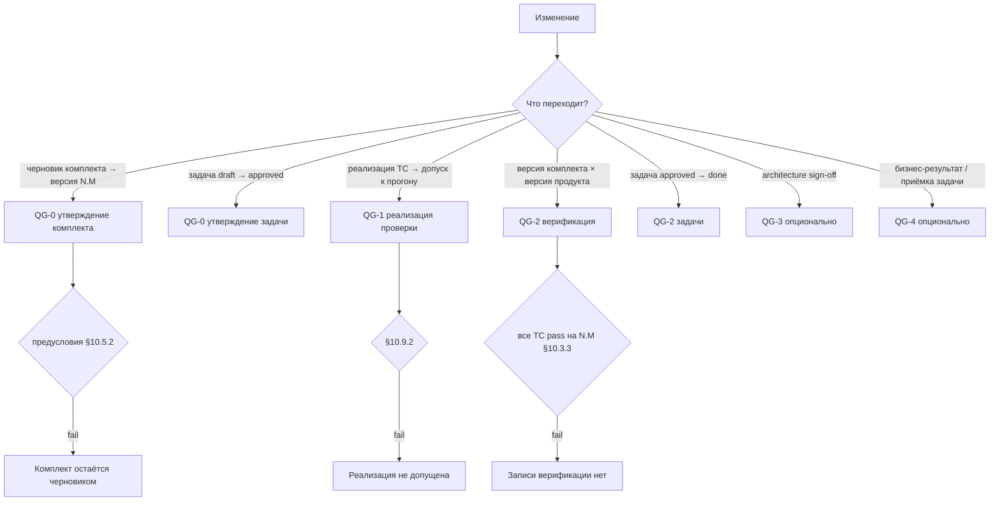

# 10. Жизненный цикл и Quality Gates

> **Часть RENAR Standard v1.1** · [← Оглавление](README.md)
>
> **Плотная глава:** читать после [§6](06-requirements-hierarchy.md)–[§9](09-test-cases.md); прохождение QG — [guide/00](../guide/00-quickstart.md); плотность — [reference/09](../reference/09-pedagogical-density.md).

## 10.1 Как движется описание: комплект, задачи, гейты

Описание системы — BR, SR, SPEC и нормативные части TC — движется **комплектом**, а не поартефактно. Комплект описания ([§4.8.6](04-terms.md#4.8.6)) — полное описание системы на момент утверждения; у него есть один черновик и последовательность утверждённых версий `N.M`. Отдельный BR, SR, SPEC или TC-норма собственного состояния не имеет: он «утверждён», если входит в утверждённую версию комплекта, и «черновик», если существует только в черновике ([§10.7](#10.7)). Каждое утверждённое изменение содержимого порождает минорную версию немедленно; мажорная версия — предъявляемая, утверждается по решению Архитектора после полного аудита ([§10.5](#10.5)).

Собственный жизненный цикл, помимо комплекта, имеют три объекта: **задача** (TR, [§10.6](#10.6)) — производная комплекта, не его часть; **ADAPT** ([§10.8](#10.8)) — контрактный контур; **реализация TC** ([§10.9](#10.9)) — код проверки, живущий в носителе кода и допускаемый к прогону отдельно от нормы.

Двигаться как попало нельзя: каждый переход стережёт **контрольная точка качества** (Quality Gate) — условие, которое обязано выполниться, иначе переход не происходит. Версия комплекта не утверждается, пока хотя бы одно нормативное утверждение не покрыто парой TC-норм; ADAPT не станет `approved`, пока каждая находка не закрыта подписанным протоколом уточнения; продукт не предъявляется к приёмке, пока все TC версии не прошли на ней. Gate — это не «галочка успеха», а проверка, которая вправе сказать «нет» и оставить объект на месте.

Эта глава сводит воедино машины состояний четырёх объектов и нормирует гейты: что проверяется перед каждым переходом, кто и когда обязан проверить. Глава фиксирует **только** состояния, переходы и гейты; frontmatter артефактов определяют главы 6–9, запись версии комплекта — [§10.5.4](#10.5.4).

### 10.1.1 Дерево решений: какой гейт сейчас (informative)



---

## 10.2 Нормативное определение Quality Gate

### 10.2.1 Quality Gate

**Quality Gate (gate)** — нормативное условие, проверка которого обязана быть выполнена для разрешённого перехода **объекта гейта** — комплекта описания, задачи (TR), ADAPT или реализации TC — из одного состояния жизненного цикла в другое. Каждый gate состоит из:

1. **Идентификатор** — `QG-N` (закрытый список §10.3, §10.4). Один идентификатор применяется к нескольким объектам с разными предусловиями.
2. **Предусловие** — набор проверяемых утверждений об объекте и связанных артефактах, которые обязаны быть истинны на момент запуска gate.
3. **Постусловие** — состояние, в которое переходит объект после успешного прохождения gate, и наблюдаемые эффекты (например, появление записи в лог переходов §10.13).
4. **Триггер** — кто или что инициирует проверку gate (участник: AI-агент / архитектор / автоматический runner; событие: одобрение / завершение прогона / поступление delta-ТЗ).
5. **Точка контроля** — место в носителе, где проверка обязана быть автоматизирована (§10.11).

Gate не является событием успеха — это условие, которое **обязано быть проверено**. Прохождение gate может быть отрицательным (предусловие не выполнено) — в этом случае переход запрещён и объект остаётся в текущем состоянии.

### 10.2.2 Кто обязан проверять gate

| Тип gate | Обязательный участник | Обеспечение соблюдения носителя |
|---|---|---|
| Утверждение (QG-0) | Архитектор или авторизованный носитель роли | Атомарная фиксация авторства и времени (V6, [§3.3.6](03-substrate-versioning.md#3.3.6)); для комплекта — атомарный выпуск версии (V2, [§3.3.2](03-substrate-versioning.md#3.3.2)) |
| Реализация проверки (QG-1) | Автоматический runner (CI, eval-runner) | Атомарная фиксация результата прогона, привязанного к версии комплекта (V5, [§3.3.5](03-substrate-versioning.md#3.3.5)) |
| Верификация (QG-2) | Автоматический runner с подтверждением `set-version` | V5 + V6 |
| Архитектура (QG-3, опционально) | Подпись архитектора (ADAPT / архитектурная часть версии комплекта) | V3 + V6 |
| Подписание ACTZ | Двусторонняя подпись (клиент + исполнитель) | V3 + V6 |
| Приёмка (QG-4, опционально) | Заинтересованная сторона с полномочиями; для задачи — лицо, не совпадающее с исполнителем | V6 |

### 10.2.3 Связь с SENAR

SENAR §8 описывает Quality Gates как абстрактную концепцию для AI-управляемой разработки. RENAR **расширяет** SENAR в области инженерии требований:

- Сохраняет идентификаторы QG-0 / QG-1 / QG-2 как обязательные.
- Нормирует **формальные машины состояний** для комплекта описания, задачи, ADAPT и реализации TC (SENAR этого не делает).
- Привязывает каждый переход в машине состояний к конкретному gate с предусловиями и постусловиями.
- Добавляет опциональные QG-3 / QG-4 для отраслей с расширенными требованиями к аудиту.

RENAR не противоречит SENAR; реализация SENAR-совместима с RENAR если выполнены требования §10.3 + §10.11.

---

## 10.3 Канонические RENAR gates (обязательные)

Закрытый список из трёх обязательных gates. Расширения вне этого списка — только опциональные §10.4 или через формальную процедуру изменения стандарта §10.10. У каждого гейта свой объект перехода; полные перечни предусловий по объектам — в разделах машин состояний (§10.5, §10.6, §10.8, §10.9).

### 10.3.1 QG-0 — гейт утверждения

**Назначение**: разрешает переход объекта из черновика в утверждённое состояние: черновика комплекта — в версию `N.M`; задачи — в `approved`; ADAPT — в `approved` ([§10.8](#10.8)).

**Предусловие для комплекта** (полный перечень — [§10.5.2](#10.5.2)):

- Frontmatter каждого артефакта комплекта валиден по схеме своей главы; идентификаторы уникальны в носителе (V1, [§3.3.1](03-substrate-versioning.md#3.3.1)).
- Дерево полно: у каждого SR — `parent`, у каждого SPEC — источник. `source.adapt`, если присутствует, указывает на ADAPT в состоянии не ниже `approved`; иначе присутствует `source.adversarial-review-ref`.
- Состязательный обзор произведён по каждому артефакту, изменённому относительно предыдущей версии; отсутствие применимости допустимо **только** для тривиальных изменений (по критериям, объявленным в манифесте соответствия, [§13](13-conformance.md)) с записью причины в лог переходов (§10.13).
- Обязательные тела заполнены ([§6.5.3](06-requirements-hierarchy.md#6.5.3), [§6.6.3](06-requirements-hierarchy.md#6.6.3), [§8.4.1](08-specifications.md#8.4.1)); для комплекта уровня системы SPEC-ARCH и SPEC-SEC присутствуют и непусты.
- На каждое нормативное утверждение, описывающее наблюдаемое поведение, существует пара positive + negative TC-норм ([§9.7](09-test-cases.md#9.7), [§13.3.5](13-conformance.md#13.3.5)).
- Подпись Архитектора (V6).

**Предусловие для задачи** — [§10.6.2](#10.6.2); **для ADAPT** — [§10.8.3](#10.8.3).

**Постусловие**:

- Комплект: выпущена запись версии `N.M` ([§10.5.4](#10.5.4)); предыдущая утверждённая версия переходит в `superseded`; разрешаются постановка задач и реализация TC против `N.M`.
- Задача: `approved`, разрешён старт исполнителя. ADAPT: `approved` (§10.8).
- Запись в лог переходов (§10.13).

**Триггер**: явное утверждение архитектором / носителем роли в нативном для носителя механизме (V3 diff & review, [§3.3.3](03-substrate-versioning.md#3.3.3)).

**Применимые объекты**: комплект описания, TR, ADAPT.

### 10.3.2 QG-1 — гейт реализации проверки (только TC)

**Назначение**: подтверждает, что для TC-нормы утверждённой версии комплекта существует валидная реализация — код, конфигурация, инфраструктурный артефакт — пригодная для прогона.

**Предусловие**:

- `automation.set-version` указывает на утверждённую версию комплекта, содержащую эту TC-норму (V5, [§3.3.5](03-substrate-versioning.md#3.3.5)).
- `automation.status: automated` (с валидным `automation.location`) или `automation.status: manual-pending` (с указанными `manual-pending-until` и `manual-pending-reason`).
- Все статические проверки реализации агента носителя (типы, lint, схема) — пройдены; сухой прогон runner прошёл.
- Фиксирующий красный прогон записан в `red-history` ([§9.18.2](09-test-cases.md#9.18)) — это запись о прогоне до допуска, не переход состояния реализации ([§10.9.3](#10.9.3)); либо задан `not-applicable-reason` с `mutation-check`.
- Все обязательные секции body TC ([глава 9 §9.4](09-test-cases.md#9.4)) заполнены.

**Постусловие**:

- Реализация допущена к production-прогону ([§10.9](#10.9)).
- Запись в лог переходов.

**Триггер**: одобряющий участник при подтверждении автоматического runner о прохождении сухого прогона.

**Применимые объекты**: реализация TC.

**Примечание**: TR не проходит отдельно гейт QG-1: условия валидности реализации задачи входят в предусловия QG-2 ([§10.6.2](#10.6.2)). Для BR / SR / SPEC промежуточного гейта нет — они утверждаются в составе комплекта и верифицируются его версией.

### 10.3.3 QG-2 — гейт верификации

**Назначение**: подтверждает, что наблюдаемое поведение продукта соответствует **версии комплекта**: все TC версии `N.M` прошли на ней. Для задачи — что её AC подтверждены.

**Предусловие для версии комплекта**:

- Каждая TC-норма версии `N.M` имеет допущенную реализацию (QG-1) с `last-run.result = pass` и `last-run.set-version = N.M`.
- Pos/neg парность — свойство утверждённой версии (QG-0); QG-2 проверяет, что прошли **обе** TC каждой пары.
- **Красная история** ([§9.18.2](09-test-cases.md#9.18)): каждый TC имеет записанный переход «красный → зелёный». TC, ни разу не наблюдавшийся красным, доказательством не является и QG-2 не закрывает. Исключение — TC класса `implementation-originated` ([§6.13](06-requirements-hierarchy.md#6.13)): для него обязателен **убитый мутант**.
- Все обязательные spec-specific виды TC для каждого типа SPEC версии присутствуют и прошли ([глава 9 §9.8](09-test-cases.md#9.8)); для SPEC-UI / SPEC-AI — с соблюдённой `judge-isolation` ([глава 9 §9.13.4](09-test-cases.md#9.13.4)); для SPEC-SEC — TC `tc-type: security` присутствует и прошёл.

**Предусловие для задачи** — [§10.6.2](#10.6.2).

**Постусловие**:

- В записи версии комплекта появляется запись верификации ([§10.5.4](#10.5.4)): версия продукта, дата, runner, ссылки на прогоны. Её заполняет только runner, как `last-run`. Состояние комплекта не меняется: верификация — свидетельство о паре (версия комплекта, версия продукта), а не состояние описания.
- Задача переходит в `done`.
- Запись в лог переходов с evidence-refs (список ID прогонов).

**Триггер**: автоматический runner по завершении прогона всех TC версии; для задачи — по запросу исполнителя при прохождении её TC.

**Применимые объекты**: версия комплекта (в паре с версией продукта), TR.

---

## 10.4 Gates за пределами обязательного ядра

Раздел описывает две разные вещи, и их нельзя смешивать.

**Опциональные QG-3 и QG-4** ([§10.4.1](#10.4.1), [§10.4.2](#10.4.2)) — нормативно описаны, но **не обязательны** для соответствия ([глава 13](13-conformance.md)). Реализация может объявить в манифесте соответствия либо поддержку QG-3 / QG-4, либо их отсутствие. Соответствие без QG-3 / QG-4 остаётся валидным.

**Релизный гейт приёмки AT** ([§10.4.3](#10.4.3)) — **обязателен** и опциональным не является. Он **не входит** в закрытый список Quality Gates ([§10.10.1](#10.10.1)) и не расширяет его: QG нормируют переход **комплекта, задачи, ADAPT и реализации TC** между состояниями, тогда как релизный гейт AT нормирует предъявление **продукта** к испытаниям и собственного `QG-N` не имеет.

### 10.4.1 QG-3 — гейт архитектуры (опционально)

**Назначение**: разрешает переход ADAPT из `answered` в `approved` (§10.8). Также применим к архитектурной части версии комплекта (SPEC-ARCH) в проектах с регулируемой архитектурной приёмкой.

**Предусловие**:

- Все обратные находки в ADAPT в статусе `resolved` ([глава 7 §7.4.5](07-adapt.md#7.4.5)).
- Каждая обратная находка несёт `decided-in` на пункт **подписанного** ACTZ ([глава 7 §7.13](07-adapt.md#7.13)).
- Подпись архитектора готова ([глава 7 §7.5](07-adapt.md#7.5)). Подпись клиента на ADAPT **не требуется**: клиентские обязательства несёт ACTZ.
- Для версии комплекта (если QG-3 применяется): декомпозиционное решение зафиксировано в носителе как ADR-like артефакт со ссылкой из SPEC-ARCH (форма ADR специфична для носителя — выносится в `guide/`).

**Постусловие**:

- ADAPT переходит в `approved` (immutable наравне с ТЗ).
- Для версии комплекта: подпись архитектора под архитектурной частью зафиксирована в записи версии ([§10.5.4](#10.5.4)).
- Запись в лог переходов с подписью архитектора (V6 author + timestamp).

**Триггер**: подпись архитектора на ADAPT ([§7.5](07-adapt.md#7.5)). Двусторонняя подпись стоит на ACTZ ([§7.13](07-adapt.md#7.13)) и фиксируется атомарно (V2 atomic change unit, [§3.3.2](03-substrate-versioning.md#3.3.2)).

**Когда применять**:

- ADAPT — всегда (но реализация может объявить QG-3 как локальный псевдоним для утверждения ADAPT, не выделяя его в отдельный gate).
- Архитектурная часть версии комплекта — в проектах с регуляторными требованиями к архитектурной приёмке.

### 10.4.2 QG-4 — гейт приёмки (опционально)

**Назначение**: фиксирует приёмку заинтересованной стороной бизнес-результата после релиза — по каждому BR предъявленной версии комплекта. В реализациях, где задача принимается отдельно от исполнения, QG-4 применяется и к задаче: `done` → принята лицом, не совпадающим с исполнителем.

**Предусловие**:

- Версия комплекта верифицирована (QG-2 для сдаваемой версии продукта) и предъявлена (мажорная, [§10.5.1](#10.5.1)).
- Измеримый бизнес-результат (`business-outcome` в frontmatter BR) измерен тем методом, что объявлен в `measurement-method`; измеренное значение фиксируется в записи версии (`accepted-outcomes[].measured-value`, [§10.5.4](#10.5.4)), не в BR — BR утверждённой версии неизменяем.
- `achievement = (measured − baseline) / (target − baseline)` ≥ project-configurable порога (по умолчанию 80 %, фиксируется в манифесте соответствия).
- Формальная подпись заинтересованной стороны; для задачи — подпись принимающего, отличного от исполнителя.

**Постусловие**:

- В записи версии комплекта фиксируется приёмка BR (`accepted-outcomes[]`, [§10.5.4](#10.5.4)); обратный отзыв приёмки требует delta-ТЗ.
- Запись в лог переходов с подписью заинтересованной стороны.

**Триггер**: формальная приёмка заинтересованной стороной по факту релиза.

**Когда применять**:

- Проекты с явной фиксацией post-release outcomes (продуктовые SaaS, регулируемые отрасли).
- При отсутствии QG-4 — приёмка бизнес-результата в записи версии не фиксируется; соответствие продукта контракту доказывает релизный гейт AT.

### 10.4.3 Релизный гейт приёмки (AT)

**Назначение**: продукт не предъявляется к сдаче-приёмке, пока не доказано его соответствие **контракту**. В виде подтверждения первой стороной ([§1.4.4](01-scope.md#1.4.4)) контракта нет и гейт не применяется: готовность предъявляется записью верификации версии (QG-2, [§10.5.4](#10.5.4)).

**Предусловие**:

- Все AT ([§9.19](09-test-cases.md#9.19)) в статусе `passing`.
- AT выведены из **действующей** редакции итогового ТЗ ([§7.14](07-adapt.md#7.14)): `tz-version` каждого AT совпадает с текущей редакцией. Устаревшая программа испытаний к испытаниям **не допускается** ([§9.19.4](09-test-cases.md#9.19)).
- Провенанс генератора AT подтверждает изоляцию: модель отлична от модели основного агента, доступ к внутреннему контуру отсутствовал ([§9.19.2](09-test-cases.md#9.19)).
- Предъявляемая версия комплекта верифицирована (QG-2) для сдаваемой версии продукта.

**Постусловие**: продукт может быть предъявлен к испытаниям; отчёт `ACCEPTANCE.md` актуален.

**Триггер**: изолированный агент-генератор AT + автоматический runner.

Гейт **обязателен** и не смешивается с QG-4 ([§10.4.2](#10.4.2)): QG-4 опционален и меряет бизнес-результат, релизный гейт AT — соответствие контракту. Бизнес-цель может быть достигнута при несоответствии контракту, и наоборот.

### 10.4.4 Соответствие стандарту с опциональными гейтами

Манифест соответствия ([глава 13](13-conformance.md)) обязан явно объявлять:

```yaml
quality-gates:
  qg-0: required          # всегда required
  qg-1: required
  qg-2: required
  qg-3: declared          # required | declared | absent
  qg-4: declared
```

`declared` означает: реализация поддерживает gate; объекты могут проходить его, но соответствие не требует прохождения для всех. `absent` — gate не применяется в реализации; приёмка бизнес-результата в записи версии не фиксируется.

---

## 10.5 Машина состояний комплекта описания

### 10.5.1 Состояния и переходы

```text
draft (черновик)  ──[QG-0]──▶  approved N.M  ──[QG-0 версии N.M+1]──▶  superseded
       ▲                              │
       └──── новый черновик ◀─────────┘   (любое изменение содержимого утверждённой версии)
```

| Состояние | Семантика | Gate перехода |
|---|---|---|
| `draft` | Единственный черновик комплекта; отделён от утверждённой истины средствами носителя (V4, [§3.3.4](03-substrate-versioning.md#3.3.4)). Содержит все артефакты текущей версии плюс предлагаемые изменения | — (создание при первом изменении после утверждения) |
| `approved` | Утверждённая версия `N.M`; содержимое неизменяемо; против неё ставятся задачи, пишутся реализации TC и ведётся верификация | QG-0 (§10.3.1) с предусловиями §10.5.2 |
| `superseded` | Версия, за которой выпущена следующая; хранится вместе с записью верификации (V1) | Автоматически при утверждении следующей версии |

Признак `major` отличает **мажорную** (предъявляемую) версию от **минорной**:

- **Минорная версия** `N.M` выпускается при **всяком** утверждённом изменении содержимого — добавлении, изменении или исключении артефакта — немедленно. Решение «крупное это изменение или мелкое» не принимается: любое изменение даёт версию.
- **Мажорная версия** `N+1.0` выпускается по решению Архитектора на рубеже (окончание этапа, поставка) и только после **полного аудита** комплекта (§10.5.2). Против мажорной версии выполняется QG-2 для сдаваемого продукта и релизный гейт AT ([§10.4.3](#10.4.3)); заинтересованной стороне достаточно следить за мажорными версиями.

**История линейна**: у каждой версии ровно один предшественник (`supersedes`) и не более одного преемника; черновик комплекта ровно один. Параллельные незавершённые версии не допускаются — параллельная работа над независимыми частями описания ведётся в одном черновике и утверждается одной версией. Ветвится реализация, не описание.

Каждое изменение содержимого утверждённой версии — в том числе внесение delta-ADAPT ([глава 7 §7.6](07-adapt.md#7.6)) или принятого концепта на изменение — создаёт черновик и завершается очередной минорной версией. Отдельного пути «правка на месте» у утверждённой версии нет.

### 10.5.2 Предусловия утверждения версии (QG-0 комплекта)

Общая часть — [§10.3.1](#10.3.1). Полный перечень для версии `N.M`:

| Группа | Предусловие |
|---|---|
| Структура | frontmatter каждого артефакта валиден; идентификаторы уникальны (V1); обязательные тела заполнены ([§6.5.3](06-requirements-hierarchy.md#6.5.3), [§6.6.3](06-requirements-hierarchy.md#6.6.3), [§8.4.1](08-specifications.md#8.4.1), type-specific [§8.5](08-specifications.md#8.5)); для комплекта уровня системы SPEC-ARCH и SPEC-SEC присутствуют и непусты |
| Дерево | У каждого SR — `parent` в этой же версии; у каждого SPEC — источник; граф `depends-on[]` ацикличен ([§8.6.3](08-specifications.md#8.6.3)), все SPEC из `depends-on[]` входят в эту версию; `implements[]` BR подсистемы валиден ([§13.3.8](13-conformance.md#13.3.8)) |
| Происхождение | `source.adapt`, если присутствует, указывает на ADAPT в состоянии не ниже `approved`; иначе присутствует `source.adversarial-review-ref`; каждый `approved` ADAPT отражён в комплекте ([§7.4.1](07-adapt.md#7.4.1)) |
| Обзор | Состязательный обзор произведён по каждому артефакту, изменённому относительно `N.M−1` (для первой версии — по всем) |
| Покрытие | На каждое нормативное утверждение, описывающее наблюдаемое поведение, существует пара positive + negative TC-норм ([§9.7](09-test-cases.md#9.7), [§13.3.5](13-conformance.md#13.3.5)); обязательные виды TC для каждого типа SPEC присутствуют ([§9.8](09-test-cases.md#9.8)) |
| Исключения | Для каждого исключаемого артефакта выполнены условия [§10.5.3](#10.5.3) |
| Подпись | Подпись Архитектора (V6); в виде подтверждения первой стороной ([§1.4.4](01-scope.md#1.4.4)) — Архитектора и ответственного лица |

**Полный аудит** (обязателен для мажорной версии, для минорной — по решению Архитектора): предусловия таблицы проверяются по **всему** комплекту, а не только по изменённым артефактам; дополнительно — согласованность формулировок ([§6.6.3.1](06-requirements-hierarchy.md#6.6.3.1)), отсутствие противоречащих утверждений между артефактами, актуальность нумерации и перекрёстных ссылок, отсутствие в комплекте артефактов с источником в `superseded` ADAPT. Итог аудита фиксируется в записи версии (`audit`, [§10.5.4](#10.5.4)).

**Постусловие**: запись версии `N.M` выпущена; `N.M−1` → `superseded`; черновик не содержит изменений относительно `N.M` до следующего изменения.

**Триггер**: явное утверждение Архитектором в нативном для носителя механизме (V3 + V6).

### 10.5.3 Исключение артефакта из комплекта

Артефакт не «переходит в `deprecated`» — он **исключается** из очередной версии, оставаясь в истории (V1). Исключение оформляется в записи версии (`changes[].removed`) и утверждается вместе с версией.

**Предусловие**:

- `replaced-by` (если есть замена) указывает на артефакт, входящий в эту же версию.
- Нет активных задач (TR в `approved`) по исключаемому артефакту: задачи переадресованы на замену или переведены в `obsolete` ([§10.6.3](#10.6.3)) атомарно с утверждением версии (V2).
- TC-нормы, верифицировавшие **только** исключаемый артефакт, исключаются в той же версии; их реализации выводятся из прогона ([§10.9.4](#10.9.4)).
- У дочерних артефактов (SR исключаемого BR, SPEC исключаемого SR) есть новый родитель либо они исключаются вместе.

**Постусловие**: артефакт отсутствует в `N.M`; запись версии несёт `removed: [{ id, replaced-by }]`; история артефакта и его прежние версии остаются восстановимы (V1).

**Триггер**: Архитектор или Владелец продукта — в составе утверждения версии.

### 10.5.4 Запись версии комплекта

Утверждение версии выпускает **запись версии** — артефакт носителя с полями:

```yaml
set-version: "N.M"                  # идентификатор; неизменяем после выпуска
major: boolean                      # true — предъявляемая версия (§10.5.1)
approved-by: "<участник>"           # Архитектор (V6)
approved-at: "<ISO-8601>"
supersedes: "N.M-1"                 # ровно один предшественник; отсутствует у первой версии
resolves-to: "<указатель>"          # нативный для носителя способ разрешить версию в содержимое:
                                    # снимок, тег, перечень пар (artifact-id, version-id) по V5
changes:
  added:   [BR-NN, SR-NN, SPEC-<TYPE>-NN, TC-NN]
  changed: [SR-NN]
  removed: [{ id: SPEC-<TYPE>-NN, replaced-by: SPEC-<TYPE>-MM }]
audit:                              # обязателен при major: true
  full: boolean
  findings-ref: "<указатель>"
architecture-signoff:               # если QG-3 объявлен и применён к версии
  signed-by: "<участник>"
  signed-at: "<ISO-8601>"
verification:                       # bot-managed; только runner (§10.3.3)
  - product-version: "<нативный для носителя указатель>"
    date: "<ISO-8601>"
    result: pass | fail
    runner-id: "<runner-name@version>"
    evidence-refs: [<ID прогонов>]
accepted-outcomes:                  # QG-4, если объявлен (§10.4.2)
  - br: BR-NN
    measured-value: number           # значение KPI по measurement-method BR
    measured-at: "<ISO-8601>"
    achievement: 0.87                # (measured − baseline) / (target − baseline)
    accepted-by: "<участник>"
    accepted-at: "<ISO-8601>"
```

Нормативные правила записи:

1. Идентификатор `set-version` и разделы `changes`, `resolves-to`, `audit`, `approved-*` **неизменяемы** после выпуска (V1). Разделы `verification`, `accepted-outcomes` и `architecture-signoff` — дополняемые свидетельства: `verification` пишет только runner ([§9.12](09-test-cases.md#9.12) mutatis mutandis), `accepted-outcomes` — заинтересованная сторона с подписью (V6).
2. `resolves-to` обязан разрешаться в содержимое каждого артефакта версии однозначно и воспроизводимо; форма указателя специфична для носителя и нормируется в `guide/`. Перечень пар `(artifact-id, version-id)` обязателен только там, где носитель не даёт атомарного адресуемого снимка группы (V2 без идентификатора транзакции).
3. Все ссылки на версию описания — `automation.set-version` и `last-run.set-version` реализации TC ([§9.3](09-test-cases.md#9.3)), базовая точка delta-ADAPT ([§7.6](07-adapt.md#7.6)), манифест соответствия ([§13.4.2](13-conformance.md#13.4.2)) — указывают на `set-version`, а не на версии отдельных артефактов.

---

## 10.6 Машина состояний TR

### 10.6.1 Состояния и переходы

```text
draft  ──[QG-0]──▶  approved  ──[QG-2 (per TR)]──▶  done
  │                     │                            │
  │                     │                            │
  └─────────────────────┴───[обесценивание]─────────▶ obsolete
```

| Статус | Семантика | Gate |
|---|---|---|
| `draft` | TR создан; AC ещё не финализированы | — |
| `approved` | AC утверждены; разрешён старт работы исполнителя | QG-0 (§10.3.1) с предусловиями TR из §10.6.2 |
| `done` | AC верифицированы; все привязанные TC прошли на версии комплекта, против которой поставлена задача | QG-2 (§10.3.3) с предусловиями TR из §10.6.2 |
| `obsolete` | TR утратил актуальность до завершения (родительский SR изменился) | Обесценивание (архитектор) |

### 10.6.2 Предусловия для TR

**QG-0 для TR (`draft → approved`)** — дополнительно к общей части:

- Цель сформулирована (`goal`).
- AC верифицируемы и независимы (каждый AC — отдельная проверка).
- Хотя бы один негативный сценарий присутствует.
- Установлена ссылка на parent SR (или BR для простых конфигураций) через `implements`; родительский артефакт входит в утверждённую версию комплекта, против которой ставится задача.
- Если TR реализует SPEC — обязательное поле `implements-spec[]` ([глава 8 §8.6.2](08-specifications.md#8.6.2)).
- Если задача затрагивает безопасность — `threat-surface` задекларирован ([глава 8 §8.5.8](08-specifications.md#8.5.8)).

**QG-2 для TR (`approved → done`)**:

- Все AC TR подтверждены прохождением соответствующих TC (`last-run.result = pass` при `last-run.set-version`, равной версии комплекта задачи).
- Pos/neg парность по каждому AC.
- Для TR реализующего SPEC: TC соответствующего spec-specific вида существует и `passing` ([глава 9 §9.8](09-test-cases.md#9.8)).

### 10.6.3 Обесценивание TR

Если родительский SR исключён из очередной версии комплекта ([§10.5.3](#10.5.3)) или изменён в ней так, что AC TR более не актуальны — TR переходит в `obsolete`. Это **не** деградация — это альтернативный терминальный путь. TR в `obsolete` не удаляется.

---

## 10.7 Артефакты комплекта: производное состояние

### 10.7.1 Состояние выводится из принадлежности версии

BR, SR, SPEC и нормативные части TC собственных полей `status` и `version` **не имеют**. Их состояние выводится из принадлежности версиям комплекта ([§10.5](#10.5)) и вычисляется носителем, а не хранится:

| Производное состояние | Условие |
|---|---|
| черновик | Артефакт (или его изменение) присутствует в черновике комплекта и отсутствует в текущей утверждённой версии |
| утверждён | Входит в текущую утверждённую версию `N.M` |
| исключён | Входил в прежнюю версию и отсутствует в текущей; `changes[].removed` несёт `replaced-by` при наличии замены ([§10.5.3](#10.5.3)) |

Следствия:

- Ссылка на артефакт (`parent`, `constrained-by[]`, `implements-spec[]`, `verifies[]`, `depends-on[]`) разрешается **в контексте версии комплекта**: «ссылаемый артефакт утверждён» означает «входит в ту же версию». Ссылка на исключённый артефакт из утверждённой версии — нарушение предусловий [§10.5.2](#10.5.2).
- «Верифицирован» — не состояние артефакта, а свойство пары (версия комплекта, версия продукта) ([§10.3.3](#10.3.3)): один и тот же SR верифицирован на одной версии продукта и не верифицирован на другой.
- История изменений артефакта — свойство носителя (V1), а не поле frontmatter; сравнение двух состояний артефакта — diff между версиями комплекта (V3).

### 10.7.2 Структурная полнота

Проверка структурной полноты — прежний переход SPEC в `review` — является **предусловием утверждения версии**, а не самостоятельным состоянием. Носитель обязан до утверждения проверить по каждому артефакту черновика:

- все обязательные frontmatter-поля своей главы заполнены ([§6.5.2](06-requirements-hierarchy.md#6.5.2), [§6.6.2](06-requirements-hierarchy.md#6.6.2), [§8.4](08-specifications.md#8.4), [§9.3](09-test-cases.md#9.3));
- все обязательные body-разделы присутствуют ([§6.5.3](06-requirements-hierarchy.md#6.5.3), [§6.6.3](06-requirements-hierarchy.md#6.6.3), [§8.4.1](08-specifications.md#8.4.1), [§9.4](09-test-cases.md#9.4));
- type-specific разделы SPEC ([§8.5](08-specifications.md#8.5)) присутствуют для соответствующего `spec-type`;
- перечень экранов SPEC-ARCH покрыт SPEC-UI той же версии, и `screens[]` каждого SPEC-UI не выходит за перечень ([§8.5.6.1](08-specifications.md#8.5.6.1));
- с уровня `RENAR-2` — нормативные разделы артефактов соблюдают правила языка описания ([§15.2](15-description-language.md#15.2)–[§15.5](15-description-language.md#15.5)); нарушение возвращается как замечание к формулировке ([§15.7](15-description-language.md#15.7)).

При нарушении носитель обязан вернуть список отсутствующих полей и секций (V3 diff & review поддерживает структурный фидбек); версия не утверждается.

### 10.7.3 Предусловия по типам SPEC

Дополнительно к [§10.5.2](#10.5.2), при утверждении версии, содержащей SPEC:

- Версия уровня `system` содержит непустые `SPEC-ARCH` и `SPEC-SEC` ([глава 8 §8.3](08-specifications.md#8.3)).
- `depends-on[]` граф ацикличен ([глава 8 §8.6.3](08-specifications.md#8.6.3)); все SPEC из `depends-on[]` входят в ту же версию.
- Если SPEC ссылается на ADAPT через `source.adapt` — ADAPT в состоянии `approved`.
- Обязательные виды TC-норм по типу SPEC присутствуют ([глава 9 §9.8](09-test-cases.md#9.8)): для SPEC-AI — `evaluation-criteria` покрыты парами полностью; для SPEC-SEC — `tc-type: security`; для SPEC-DATA — `tc-type: contract` для опубликованных interface-полей; для SPEC-UI — `tc-type: ux`.

Прохождение этих TC — предмет QG-2 версии ([§10.3.3](#10.3.3)), их наличие — предмет QG-0.

---

## 10.8 Машина состояний ADAPT

### 10.8.1 Macro-состояния

```text
draft  ──[review-transition]──▶  review  ──[backward-ready]──▶  asked
                                                                       │
                                                                       │ [client returns answers]
                                                                       ▼
                                                                  answered
                                                                       │
                                                                       │ [QG-3]
                                                                       ▼
                                                                  approved
                                                                       │
                                                                       │ [неизменяемо; только delta-ADAPT / errata / дезавуирование]
                                                                       ▼
                                                                  frozen ──[дезавуирование: §10.8.5]──▶ superseded
                                                                                                        (терминальное)
```

Состояния ADAPT (`draft → review → asked → answered → approved → frozen`, и терминальное `superseded` при дезавуировании) определены в [главе 7 §7.4](07-adapt.md#7.4) и [§7.6.4](07-adapt.md#7.6). Состояние `client-ready` изъято: вынесение вопросов клиенту — предмет ACTZ ([§7.13](07-adapt.md#7.13)), а не состояние ADAPT. Этот раздел нормирует gates.

| Переход | Gate | Предусловие |
|---|---|---|
| `draft → review` | Review-transition | Прямая интерпретация охватывает все разделы ТЗ; первичные обратные находки зафиксированы в `open` |
| `review → asked` | Backward-ready | Все обратные находки переведены в `asked-to-client`; вопросы вынесены клиенту в составе ACTZ (`status: sent`) |
| `asked → answered` | Client-return | Все обратные находки в `answered`; решения зафиксированы пунктами **подписанного** ACTZ (`status: signed`, двусторонняя подпись V6) |
| `answered → approved` | **QG-3** (§10.4.1) | Все обратные находки в `resolved` и несут `decided-in` на пункт подписанного ACTZ; подпись архитектора готова |
| `approved → frozen` | Freeze-transition | Автоматический после approve; ADAPT immutable; разрешается генерация BR / SR / SPEC с `source.adapt = approved` |
| `frozen → superseded` | **QG-3 дезавуирующего ADAPT** (§10.8.5) | Дезавуирующий ADAPT (`supersedes: ADAPT-MMM`) достиг `approved`; производные BR / SR / SPEC перенаправлены или пере-выведены |

### 10.8.2 Вложенная машина состояний для записи об обратной находке

Каждая запись об обратной находке внутри ADAPT имеет собственную подчинённую машину состояний ([глава 7 §7.4.5](07-adapt.md#7.4.5)):

```text
open  ──▶  asked-to-client  ──▶  answered  ──▶  resolved  ──[approve ADAPT]──▶  frozen
                  ▲                  │
                  └──── revised ─────┘  (если ответ требует уточнения)
```

| Sub-state | Семантика |
|---|---|
| `open` | Записан инженером; не отправлено клиенту |
| `asked-to-client` | Отправлен клиенту; зафиксирована дата вопроса |
| `answered` | Клиент ответил; ответ записан (V6 author + timestamp) |
| `resolved` | Инженер интегрировал ответ в прямую интерпретацию |
| `revised` | Ответ расплывчатый; повторный вопрос (возврат к `asked-to-client`) |
| `frozen` | После approval ADAPT; изменения невозможны |

**Нормативное правило**: QG-3 (approve ADAPT) **запрещён**, если хотя бы одна запись об обратной находке в `open` / `asked-to-client` / `answered` / `revised`. Все такие записи обязаны быть в `resolved` ([глава 7 §7.4.5](07-adapt.md#7.4.5)).

### 10.8.3 QG-3 для ADAPT — детализация

**Предусловие** (полная):

- Все разделы прямой интерпретации заполнены (критерий forward complete).
- Все записи об обратных находках в `resolved`.
- Каждая обратная находка несёт `decided-in` на пункт ACTZ в статусе `signed` ([глава 7 §7.13](07-adapt.md#7.13)).
- Подпись архитектора получена и зафиксирована нативным для носителя механизмом (V3 + V6).
- Если ADAPT — delta-ADAPT: parent-ADAPT в `frozen` ([глава 7 §7.6](07-adapt.md#7.6)).

**Постусловие**:

- ADAPT переходит в `approved`.
- Запись в лог переходов с подписью архитектора.
- ADAPT, у которого хотя бы одна находка не закрыта подписанным ACTZ, **не** переводится в `approved`: интерпретация не может опираться на решение, которого клиент не принимал.

**Триггер**: явное одобрение архитектором.

### 10.8.4 Errata для frozen ADAPT

`frozen` — терминальное состояние по линии деривации. Изменения возможны только добавлением нового артефакта по одному из трёх путей:

1. **Delta-ADAPT** (если ТЗ содержит ambiguity, обнаруженную поздно) — новый артефакт с явной связью `parent-adapt`.
2. **Errata-ADAPT** (если ошибка интерпретации инженера) — отдельный артефакт. Если правка затрагивает решение из подписанного ACTZ (меняет обязательство) — требуется **новый ACTZ** с двусторонней подписью; если не затрагивает — достаточно подписи архитектора.
3. **Дезавуирование** (если прежнее решение было верным, но позже опровергнуто) — дезавуирующий ADAPT переводит дезавуируемый в `superseded` (§10.8.5, [глава 7 §7.6.4](07-adapt.md#7.6)).

Во всех трёх случаях frozen ADAPT **не редактируется**. Это требование V1 (immutable history) для контрактных артефактов ([глава 7 §7.6.3](07-adapt.md#7.6.3)).

### 10.8.5 Переход frozen → superseded (дезавуирование)

Дезавуирование approved/frozen ADAPT нормировано в [главе 7 §7.6.4](07-adapt.md#7.6). Переход жизненного цикла:

```text
frozen ──[дезавуирующий ADAPT достиг approved через QG-3]──▶ superseded (терминальное, неизменяемое)
```

**Отдельный QG не вводится.** Дезавуирование проходит через тот же **QG-3** (§10.8.3), что и обычный ADAPT — дополнительной контрольной точки не создаётся.

**Предусловие** перехода `ADAPT-MMM → superseded`:

- Создан дезавуирующий `ADAPT-NNN` с полем `supersedes: ADAPT-MMM` и непустым `supersession-rationale` ([глава 7 §7.6.4](07-adapt.md#7.6)).
- Дезавуирующий ADAPT прошёл QG-3 и достиг `approved`. Если дезавуируемое решение имело контрактный итог (было пунктом подписанного ACTZ) — отмена **обязана** быть оформлена **новым ACTZ с двусторонней подписью**, проставляющим `superseded-by` на прежнем; подпись только архитектора допустима лишь для правки, не затрагивающей ни одного подписанного решения.
- Все производные `BR` / `SR` / `SPEC` с `source.adapt: ADAPT-MMM` перенаправлены на дезавуирующий ADAPT либо пере-выведены (нет висячих ссылок).

**Постусловие**:

- `ADAPT-MMM` переходит в терминальное **`superseded`** — отдельное от `frozen` и от `obsolete`, которым устаревает TR; неизменяемо и **сохраняется** для аудита (V1), не удаляется.
- Поле `superseded-by: ADAPT-NNN` на `ADAPT-MMM` фиксируется автоматически.
- Запись в лог переходов с подписями дезавуирующего ADAPT (V6).

**Триггер**: утверждение дезавуирующего ADAPT через QG-3.

**Hook-обязательство**: после перехода висячая ссылка `source.adapt` на ADAPT в статусе `superseded` — **fatal**; обеспечение соблюдения — `adapt-supersession` validation (§10.11.1), гейт `check-adapt-supersession.js`.

---

## 10.9 Реализация TC: допуск и состояния прогона

Нормативная часть TC — пункт комплекта и собственного состояния не имеет ([§10.7](#10.7)). Собственный цикл есть у **реализации** TC — кода проверки, адресуемого `automation.location` и живущего в носителе кода ([глава 9 §9.17](09-test-cases.md#9.17)).

### 10.9.1 Состояния и переходы

```text
не допущена  ──[QG-1]──▶  допущена  ──[runner pass]──▶  pass
                              │                           │
                              │ [runner fail]             │ [норма изменена в версии N.M+1]
                              └───────────▶ fail          ▼
                                              │       устарела  (норма изменена позже set-version)
                                              └──────────┘
```

| Состояние | Семантика | Как фиксируется |
|---|---|---|
| не допущена | Реализация отсутствует или не прошла QG-1 | `automation.status` не подтверждён сухим прогоном |
| допущена | Сухой прогон прошёл; красная история записана; разрешён production-прогон | QG-1 ([§10.3.2](#10.3.2)) с предусловиями §10.9.2; `automation.set-version` = версия нормы |
| `pass` / `fail` | Результат последнего прогона на версии `last-run.set-version` | runner; bot-managed ([§9.12](09-test-cases.md#9.12)) |
| устарела | TC-норма изменена в более поздней версии комплекта; прогон реализации против прежней нормы доказательством не является | Существует утверждённая версия позже `automation.set-version`, в `changes[].changed` которой есть эта TC-норма (§10.9.4) |

Frontmatter TC и pos/neg pairing определяются в [главе 9](09-test-cases.md). Исключение TC-нормы из комплекта — [§10.5.3](#10.5.3): реализация выводится из прогона, история сохраняется.

### 10.9.2 Предусловия для реализации TC

**QG-1 (допуск к прогону)** — дополнительно к общей части [§10.3.2](#10.3.2):

- `automation.set-version` указывает на утверждённую версию комплекта, содержащую эту TC-норму, и ни одна более поздняя утверждённая версия не изменяла эту норму (`changes[].changed`).
- `automation.status: automated` (с валидным `automation.location`) **либо** `automation.status: manual-pending` (с `manual-pending-until` ≤ +1 sprint и заполненным `manual-pending-reason`).
- Сухой прогон runner прошёл (только структурная валидность; не путать с production-прогоном).
- Фиксирующий красный прогон записан ([§9.18.2](09-test-cases.md#9.18)); автор реализации не совпадает с автором реализации проверяемого поведения (P8).
- Все обязательные секции body TC ([§9.4](09-test-cases.md#9.4)) заполнены.

**Постусловие**:

- Реализация допущена; runner разрешён к production-прогону.
- Запись в лог переходов.

### 10.9.3 Переходы под управлением runner (не Quality Gates)

`допущена → pass`, `допущена → fail`, `pass → fail`, `fail → pass` — переходы, происходящие **только** по факту прогона runner ([глава 9 §9.12 `last-run` bot-managed](09-test-cases.md#9.12)). Эти переходы **не являются** Quality Gates в смысле §10.2.1: они — нормативные следствия результатов прогона, а не прохождение гейта с предусловиями и постусловиями. В частности, проверка совпадения `last-run.set-version` с версией комплекта, для которой ведётся верификация ([§10.3.3](#10.3.3)), — это проверка согласованности под управлением runner, а не отдельный gate.

**Постусловие каждого runner-перехода**:

- `last-run` обновлён: `result`, `date`, `set-version`, `run-ref`, `evidence-refs`.
- Носитель обязан запретить ручную модификацию `last-run` (только runner-actor).

### 10.9.4 Устаревание реализации

Реализация устаревает, не переходя в терминальное состояние, в двух случаях:

1. **TC-норма изменена** в версии комплекта `N.M+1` (`changes[].changed` содержит её идентификатор): реализация с `automation.set-version = N.M` помечается устаревшей; её прогон в счёт верификации `N.M+1` не идёт. Новая реализация создаётся **против новой нормы**, а не правкой старой; прежняя сохраняется в истории (V1). Delta-ТЗ, инвалидирующее тестовое поведение, — тот же путь ([глава 9 §9.16](09-test-cases.md#9.16)).
2. **TC-норма исключена** из версии ([§10.5.3](#10.5.3)): реализация выводится из прогона; удаление не производится.

Носитель обязан детектировать первый случай автоматически по наличию утверждённой версии позже `automation.set-version`, в `changes[].changed` которой есть идентификатор TC-нормы (V5), — точка контроля «устаревание реализации TC» ([§10.11.1](#10.11.1)).

### 10.9.5 Change-of-criteria — отдельный нормативный путь

Изменение `## Pass-критерий` или `## Fail-критерий` в TC-норме — **не обычное изменение содержимого комплекта**; это специальный путь, требующий отдельного approval workflow ([глава 9 §9.13](09-test-cases.md#9.13)) до утверждения версии, в которую изменение входит. Подробности обеспечения соблюдения — §10.11.3.

---

## 10.10 Политика закрытого списка

### 10.10.1 Нормативное правило

Закрытый список Quality Gates RENAR — обязательные {QG-0, QG-1, QG-2} и опциональные {QG-3, QG-4}. Изменение списка возможно **только** через формальную процедуру изменения стандарта RENAR ([глава 13](13-conformance.md)).

Список закрывает **Quality Gates** — проверки перехода **комплекта описания, задачи (TR) и ADAPT** между состояниями и **допуска реализации TC** к прогону. Обязательный релизный гейт приёмки AT ([§10.4.3](#10.4.3)) в него не входит и его не расширяет: он нормирует предъявление продукта к испытаниям, а не переход одного из четырёх объектов. По той же причине вне списка остаются переходные события носителя (`freeze`, исключение артефакта, `runner-pass` / `runner-fail`, `change-of-criteria`), фиксируемые в журнале ([§10.13.1](#10.13.1)).

Настоящая политика является специализацией [§1.7](01-scope.md#1.7) Политика закрытого списка для квалити-гейтов; общее правило для всех закрытых списков RENAR и master-индекс — [§1.7.5](01-scope.md#1.7.5).

### 10.10.2 Что запрещено

| Действие | Запрещено? | Почему |
|---|---|---|
| Локальное создание нового gate-типа `QG-N` на уровне проекта | Запрещено | Нарушает закрытый список; делает соответствие не-портируемым |
| Локальное переопределение предусловий канонического гейта | Запрещено | Делает соответствие несравнимым между реализациями |
| Дополнительное ужесточение предусловий локального гейта | Разрешено | Манифест соответствия может объявить более строгие пороги (например, `qg-2.required-negative-tc: true`) |
| Локальное ослабление предусловий канонического гейта | Запрещено | Нарушает контракт стандарта |
| Объявление QG-3 / QG-4 как `absent` в манифесте соответствия | Разрешено | Опциональные gates — §10.4 |
| Объявление QG-0 / QG-1 / QG-2 как `absent` | Запрещено | Нарушает соответствие §10.4.4 |

### 10.10.3 Расширение списка

Добавление нового gate-типа возможно через:

1. Запрос на изменение стандарта с обоснованием — исследовательский черновик с типологией и сравнением с каноническими gates.
2. Публичное обсуждение (срок и форум фиксируется политикой стандарта, [глава 13](13-conformance.md)).
3. Включение в следующую minor-версию стандарта (`v1.X` или `v2.0`).
4. Руководство по миграции для существующих соответствующих проектов ([§1.7.4](01-scope.md#1.7.4), [§13.9.3](13-conformance.md#13.9.3)): изменения в контрольном списке самооценки, новые поля манифеста.

Локальные для проекта расширения остаются за пределами соответствия — они допустимы как internal-практики, но **не** влияют на манифест соответствия.

---

## 10.11 Независимое от носителя обеспечение соблюдения

### 10.11.1 Нормативные требования

Носитель, реализующий RENAR, обязан обеспечить автоматическую проверку предусловий гейтов на следующих точках:

| Точка контроля | Что обязано быть проверено | Опирается на capabilities |
|---|---|---|
| **Promote-transition** (утверждение версии комплекта; переход задачи в `approved` / `done`; переходы ADAPT; допуск реализации TC) | Предусловия соответствующего gate (§10.3, §10.4, §10.5, §10.6, §10.8, §10.9) | V3 (diff & review) для блокировки перехода до approve; V4 (branching) для отделения WIP от утверждённой правды |
| **Approve-transition** (любое действие утверждения) | Авторство зафиксировано (actor) и временная метка | V6 (author + timestamp) |
| **`coverage-presence` validation** ([§13.3.5](13-conformance.md#13.3.5)) | При утверждении версии комплекта: на каждое нормативное утверждение BR / SR / SPEC, описывающее наблюдаемое поведение, в той же версии существует пара positive + negative TC-норм, адресующих его через `verifies[].statement` ([§15.1.1](15-description-language.md#15.1.1)). Проверяется **наличие** покрытия, а не только валидность существующих `verifies[]`; утверждение без пары — fatal, версия не утверждается | V3 (block approve); V1 (перечень утверждений версии стабилен) |
| **Reference-validation** (любое создание/изменение артефакта с ссылкой на другой) | Referenced артефакт существует: для артефактов комплекта — в той же версии ([§10.7.1](#10.7.1)); для ADAPT / ACTZ / AR — в требуемом состоянии | V1 (immutable history) для stable identifier; V5 (version pin) для межносительных ссылок |
| **Change-of-criteria для TC** (§10.11.3) | Применён отдельный процесс утверждения | V3 + V6 |
| **Runner-transitions реализации TC** (`допущена → pass` / `fail`, §10.9.3) | Только runner-actor может писать `last-run` | V6 (authorship); нативный для носителя ACL или role-based restrictions |
| **Устаревание реализации TC** (TC-норма изменена в версии `N.M+1`, §10.9.4) | Реализация с `automation.set-version = N.M` помечена устаревшей; её прогон не засчитывается в верификацию `N.M+1` | V5 (`set-version`) для детекции |
| **`implements`-edge validation** (BR подсистемы со ссылкой на BR системы, [§6.5.2](06-requirements-hierarchy.md#6.5.2), [§6.8.2](06-requirements-hierarchy.md#6.8.2)) | (1) target BR существует по `id + scope.system`; (2) target входит в утверждённую версию комплекта своей системы при утверждении версии, содержащей данный BR (исключённый target — warning, не fatal; cascade-warning по `implemented-by[]`); (3) цепочка `implements` не образует циклов; (4) `implements[]` не присутствует при `level: system` | V1 (stable identifier для target lookup); V3 (block approve до пройденной валидации); V5 (cross-substrate ID разрешение когда target в другом носителе) |
| **`uses`-edge validation** (BR-потребитель с ребром на компонент, [§6.14.4](06-requirements-hierarchy.md#6.14.4)) | (1) компонент существует по `system-id`, `set-version` — утверждённая версия его комплекта; (2) каждое `A-NN` версии компонента подтверждено в `assumptions-confirmed[]` (V6) — неподтверждённое — fatal; (3) граф `uses` ацикличен; (4) цели в чужом дереве в `constrained-by[]` — fatal; (5) исключение артефакта компонента в новой версии — warning потребителю, не fatal. Правило остановки при несовместимости `consumer`-утверждений (§6.14.4, п. 7) носителем не вычисляется — это обязанность потребителя и предмет состязательного обзора | V1 (стабильные идентификаторы компонента и предположений); V5 (`set-version` компонента); V3 (block approve); V6 (подтверждение) |
| **`actz-integrity` validation** ([§7.13](07-adapt.md#7.13)) | (1) ACTZ в статусе `signed` несёт обе подписи (клиент + исполнитель), подписанты — разные лица. (2) Каждая находка в статусе `resolved` несёт `decided-in` на ACTZ в статусе `signed`; ссылка на `draft` / `sent` / несуществующий ACTZ — fatal. (3) Каждый подписанный ACTZ отражён хотя бы в одном ADAPT: подписанное решение без отражения в интерпретации — fatal (обязательство вне требований). (4) `superseded` требует `superseded-by`. | V3 (block approve); V6 (двусторонняя подпись); V1 (подписанный ACTZ immutable) |
| **`at-isolation` validation** ([§9.19](09-test-cases.md#9.19)) | (1) `generator` каждого AT подтверждает изоляцию: модель отлична от модели основного агента, доступ к внутреннему контуру отсутствовал — **fatal** при нарушении (иначе AT подтверждает собственную интерпретацию вместо контракта). (2) `verifies[]` ссылается только на `TZ §N` / `ACTZ-NNN §M`; ссылка на BR / SR / SPEC / TC / ADAPT — fatal. (3) `tz-version` каждого AT совпадает с действующей редакцией итогового ТЗ — иначе испытания блокируются ([§10.4.3](#10.4)). | V5 (pin к редакции итогового ТЗ); V6 (провенанс генератора) |
| **`red-history` validation** ([§9.18.2](09-test-cases.md#9.18)) | (1) TC, засчитываемый как доказательство при QG-2, имеет записанный переход «красный → зелёный» либо унаследованную красную историю (задача без изменения поведения). (2) TC класса `implementation-originated` — красной истории не имеет по построению; обязателен `mutation-check.mutants-killed ≥ 1` ([§6.13.3](06-requirements-hierarchy.md#6.13)). (3) Автор TC не совпадает с автором реализации (P8, [§9.18.1](09-test-cases.md#9.18)). | V1 (история прогонов immutable); V6 (провенанс авторства) |
| **`adapt-applicability` validation** ([§7.4.1](07-adapt.md#7.4.1), [§7.4.6](07-adapt.md#7.4.6)) | (1) Для каждого ТЗ вердикт состязательного обзора выпущен как AR в статусе `issued` (V6 author + timestamp). (2) Если `verdict: findings-present` — `produces-adapt[]` непуст, каждый указанный ADAPT существует в `approved`+ с подписью архитектора, и каждая его находка несёт `decided-in` на подписанный ACTZ; BR/SR/SPEC производные имеют `source.adapt`. (3) Если `verdict: no-findings` — ADAPT отсутствует, BR/SR/SPEC имеют `source.tz-section` + `source.adversarial-review-ref` на эту AR. (4) Целостность AR: модель `reviewer` отлична от модели основного агента ([§7.10.2](07-adapt.md#7.10.2)); ссылка на AR в статусе `draft` либо `superseded` — fatal; висячая ссылка — fatal. (5) Запрет смешения: артефакт с опущенным `source.adapt` и без `source.adversarial-review-ref` — fatal. | V3 (block approve до прохождения validation); V6 (вердикт + signature attribution); V1 (AR immutable после `issued`) |
| **`adapt-supersession` validation** ([§7.6.4](07-adapt.md#7.6), §10.8.5) | (1) `supersedes: ADAPT-MMM` ссылается на существующий ADAPT; обратная связь `superseded-by` симметрична. (2) `supersession-rationale` непустой и ссылается на конкретное противоречащее `BR` / `SR` / `SPEC`. (3) При контрактном итоге дезавуируемого решения (решение было пунктом подписанного ACTZ) — отмена оформлена новым ACTZ с двусторонней подписью, проставляющим `superseded-by` на прежнем. (4) Висячая ссылка `source.adapt` на ADAPT в статусе `superseded` — **fatal**. | V1 (stable identifier + immutable superseded history); V3 (block approve до пройденной валидации); V6 (signature attribution) |

### 10.11.2 Носитель без V3 / V4 / V6 — не соответствующий

Носитель, не обеспечивающий V3 (diff & review), не может реализовать gates: нет способа отделить «предложенное изменение» от «утверждённой правды» ([глава 3 §3.3.3](03-substrate-versioning.md#3.3.3)). Аналогично V4 (branching, [§3.3.4](03-substrate-versioning.md#3.3.4)) и V6 (author + timestamp, [§3.3.6](03-substrate-versioning.md#3.3.6)) — без них механика утверждения невозможна. Носитель, не удовлетворяющий V3 / V4 / V6, **не реализует RENAR** независимо от других свойств.

### 10.11.3 Change-of-criteria для TC — особое обеспечение соблюдения

Изменение Pass / Fail критерия TC — высокорисковая операция (защита от test-fitting, [глава 9 §9.13](09-test-cases.md#9.13)). Носитель обязан:

1. **Детектировать**: любое изменение секций `## Pass-критерий` / `## Fail-критерий` в TC-артефакте.
2. **Принудительно изолировать**: change-of-criteria обязано быть отдельным набором изменений (V4 ветвление / набор изменений, [§3.3.4](03-substrate-versioning.md#3.3.4)), регистрируемым атомарной единицей изменения (V2, [§3.3.2](03-substrate-versioning.md#3.3.2)), помеченным признаком, отличающим его от обычных правок (нативный для носителя механизм — частный случай V3 diff & review; форма признака специфична для носителя, выносится в guide/).
3. **Запретить совмещение**: одно и то же лицо не имеет права одобрить change-of-criteria и одобрить исправление кода, которое тестируется этим же TC. Носитель обязан проверять это правило при approve-transition.
4. **Регистрировать**: change-of-criteria записывается в audit-trail (§10.13) с явной типизацией события.

### 10.11.4 Формы нативной для носителя реализации

Конкретные нативные для носителя механизмы (как именно реализуется hook в данном носителе) — выносятся в `guide/` и манифест соответствия. Стандарт не нормирует **форму** hook (это специфичное для носителя решение). Стандарт нормирует **что hook обязан проверять и в какой точке**.

Раздел `guide/` обязан содержать для каждого поддерживаемого носителя:

- Mapping точек обеспечения соблюдения §10.11.1 на нативные для носителя механизмы.
- Примеры реализаций.
- Известные ограничения носителя относительно автоматизации каждой проверки.

---

## 10.12 Запрещённые переходы

Закрытый список переходов, нарушающих жизненный цикл. Носитель обязан их блокировать.

| Из | В | Объект | Почему запрещено |
|---|---|---|---|
| `draft` | `superseded` | Комплект | Пропускает QG-0; версия, которой не было, не может быть заменена |
| `approved` | `draft` | Комплект | Утверждённая версия неизменяема (V1); правка содержимого — новый черновик и версия `N.M+1` (§10.5.1) |
| `superseded` | `approved` | Комплект | Линейность истории; возврат к прежнему содержимому — только новой версией с тем же содержимым и `supersedes` на текущую |
| `approved N.M` | `approved N.M+2` | Комплект | Пропуск версии; каждая версия имеет ровно одного предшественника |
| `draft` | `done` | TR | Пропускает QG-0 |
| `obsolete` | * | TR | Терминальный статус; «реанимация» запрещена — нужна новая задача |
| не допущена | `pass` / `fail` | Реализация TC | Пропускает QG-1 (нет сухого прогона); фиксирующий красный прогон до допуска пишется в `red-history`, не в `last-run` |
| допущена / `pass` / `fail` | не допущена | Реализация TC | Деградация теряет историю прогонов; ослабление проверки — только через change-of-criteria ([глава 9 §9.13](09-test-cases.md#9.13)), устаревание — §10.9.4 |
| `frozen` | * | ADAPT | Терминальное по линии деривации; изменения только через delta-ADAPT или errata (§10.8.4) |
| `superseded` | * | ADAPT | Терминальное; неизменяемо (§10.8.5) |
| утверждён | черновик | BR / SR / SPEC / TC-норма | Артефакт не имеет собственного перехода: изменение — через черновик комплекта и очередную версию (§10.7) |

### 10.12.1 Реакция носителя

При попытке запрещённого перехода носитель обязан:

1. Заблокировать transition (V3 diff & review).
2. Вернуть вызывающему участнику код ошибки с указанием конкретного нарушенного правила (по идентификатору строки этой таблицы).
3. Не создавать запись в лог переходов (§10.13).

---

## 10.13 Логирование событий прохождения gate

### 10.13.1 Нормативное требование

Каждое успешное прохождение gate (любого типа: QG-0, QG-1, QG-2, QG-3, QG-4, runner-transition, исключение артефакта, freeze-transition) обязано быть зафиксировано в носителе как неизменяемое событие со следующими полями:

| Поле | Семантика | Обязательность |
|---|---|---|
| `timestamp` | UTC ISO-8601 момент успешного прохождения | Обязательно |
| `artifact-id` | Идентификатор объекта (immutable, V1): `set-version` для комплекта, ID задачи, ADAPT, TC | Обязательно |
| `artifact-type` | `SET` (версия комплекта) / `TR` / `ADAPT` / `ACTZ` / `AR` / `TC` (реализация) / `AT`; для события `removal` — тип исключаемого артефакта (`BR` / `SR` / `SPEC` / `TC-NORM`) | Обязательно |
| `set-version` | Версия комплекта, к которой относится событие: для комплекта — выпускаемая; для задачи и реализации TC — против которой они ведутся (V5) | Обязательно |
| `from-status` | Исходное состояние | Обязательно |
| `to-status` | Целевое состояние | Обязательно |
| `gate-id` | `QG-0` / `QG-1` / `QG-2` / `QG-3` / `QG-4` / `at-release` ([§10.4.3](#10.4.3)) / `removal` / `freeze` / `runner-pass` / `runner-fail` / `change-of-criteria` | Обязательно |
| `actor` | Идентификатор инициатора (V6); для двусторонней подписи ACTZ — список участников | Обязательно |
| `evidence-refs` | Ссылки на доказательства: ID прогонов runner, ID артефактов состязательного обзора, ID подписей, указатель на итог полного аудита | Обязательно для QG-2 / QG-3 / QG-4 и для мажорной версии |
| `notes` | Свободный текст | Опционально |

Для события QG-0 комплекта `evidence-refs` дополнительно несёт перечень артефактов `changes[]` записи версии ([§10.5.4](#10.5.4)) — по одному событию на версию, а не на артефакт.

### 10.13.2 Независимый от носителя формат

Формат хранения событий — специфичен для носителя (отдельный лог-стрим / append-only collection / иные формы). Стандарт нормирует только обязательные поля §10.13.1, не их сериализацию.

Манифест соответствия обязан указать механизм хранения событий и формат экспорта (для аудита, [глава 13](13-conformance.md)).

### 10.13.3 Retention

События **не удаляются** в течение всего жизненного цикла объекта и после его перехода в `superseded` / `obsolete` / `frozen`, равно как после исключения артефакта из комплекта. Этого требует V1 (immutable history) и нормативные положения compliance ([глава 13](13-conformance.md)).

---

## 10.14 Связь с другими главами

| Глава | Связь |
|---|---|
| [02](02-methodology-positioning.md) | SENAR QG-0..QG-2 — концептуальная основа; RENAR расширяет (§10.2.3) |
| [04](04-terms.md) | Термины «комплект описания» и «версия комплекта» ([§4.8.6](04-terms.md#4.8.6)); термины гейтов ([§4.7](04-terms.md#4.7)) |
| [06](06-requirements-hierarchy.md) | frontmatter и body BR / SR / TR ([§6.5](06-requirements-hierarchy.md#6.5)–[§6.7](06-requirements-hierarchy.md#6.7)); производное состояние BR / SR — §10.7; машина состояний TR — §10.6 |
| [07](07-adapt.md) | frontmatter ADAPT ([§7.8](07-adapt.md#7.8)); backward sub-states ([§7.4.5](07-adapt.md#7.4.5)); подпись архитектора ([§7.5](07-adapt.md#7.5)); ACTZ и двусторонняя подпись ([§7.13](07-adapt.md#7.13)); delta-ADAPT порождает версию комплекта ([§7.6](07-adapt.md#7.6)) — машина состояний здесь (§10.8) |
| [08](08-specifications.md) | frontmatter SPEC ([§8.4](08-specifications.md#8.4)); type-specific QG ([§8.8](08-specifications.md#8.8)); производное состояние и структурная полнота — §10.7 |
| [09](09-test-cases.md) | frontmatter TC ([§9.3](09-test-cases.md#9.3)); pos/neg pairing ([§9.7](09-test-cases.md#9.7)); change-of-criteria ([§9.13](09-test-cases.md#9.13)); реализация TC — §10.9 |
| [03](03-substrate-versioning.md) | V1–V6 — фундамент обеспечения соблюдения (§10.11); опорное состояние ([§3.3.3](03-substrate-versioning.md#3.3.3)) = утверждённая версия комплекта; без V3 / V4 / V6 — нет реализации gates |
| [11](11-maturity-model.md) | Уровни зрелости определяют объём применимых gates (например, RENAR-1 — QG-0 / QG-1 / QG-2 обязательны; на более высоких уровнях усиливаются предусловия QG-0 комплекта: pos/neg парность, spec-specific TC) |
| [13](13-conformance.md) | Манифест соответствия объявляет gate support (§10.4.4) и версию комплекта ([§13.4.2](13-conformance.md#13.4.2)); хранит retention policy событий (§10.13.3) |

