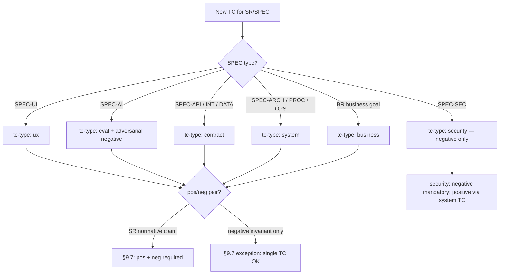

# 09. Test Cases

> **Part of the RENAR Standard v1.1** · [← Table of contents](README.md)

## 9.1 A test case is a first-class artifact

In RENAR a test is not a postscript at the end of the code, but a full-fledged document: it has its own version, status, and place in the trace chain, just like the requirement it verifies. The reason is simple: tests are written by an AI agent, and an AI happily covers the "happy path" ("entered the right password — let in") and quietly skips the unpleasant parts ("entered someone else's — MUST NOT let in, MUST NOT hint which field is wrong, MUST NOT write the password to the log"). It is precisely in the unhandled negative cases that defects live.

For this reason RENAR makes two requirements normative. **Pos/neg pairing**: for every verifiable statement — at least one positive test case and one negative one (what MUST happen and what MUST NOT happen). **Judge isolation**: if the result is assessed by another AI model (for the `ux`, `eval` types), it MUST differ from the one that produced the artifact under assessment — a model does not check itself. The TC ([Test Case](04-terms.md#451-tc--test-case)) closes the trace chain TZ → [ADAPT](07-adapt.md) → BR / SR / [SPEC](08-specifications.md) → TR → TC (see [§2.3](02-methodology-positioning.md#2.3)): from a test failure one can trace back to the TZ section it ultimately verifies.

The chapter builds on ISO/IEC/IEEE 29119 "Software testing" for the concepts of test design, test execution, test result reporting, and pos/neg coverage, but fixes a closed list of TC types, mandatory pos/neg pairing, and judge ≠ production isolation as normative requirements of v1.0 that are not present in formalized form in ISO 29119.

From the practices of Specification by Example (Adzic) and BDD / Gherkin — where executable examples also serve as a specification — RENAR differs in that it moves pos/neg pairing ([§9.7](#97-posneg-pairing--normative-requirement)), judge ≠ production isolation ([§9.13](#913-protection-against-test-gaming)), and version-pinning a TC to the requirement version (V5, [§3.3.5](03-substrate-versioning.md#3.3.5)) from a recommendation to blocking normative clauses ([§14.5.2](14-normative-refs.md#14.5.2)).

The clauses of this chapter are normative. The closed lists (principles, TC types, mandatory TC kinds per SPEC type) are RENAR mandatory clauses ([chapter 13](13-conformance.md)); extension is only through the formal change procedure of the standard.

> **Dense chapter:** [reference/09](../../reference/en/09-pedagogical-density.md) · the decision tree below is informative routing.

### 9.1.1 Decision tree: choosing `tc-type` (informative)



The adversarial-review procedure for TC — [guide/07 §3.5](../../guide/en/07-failure-modes.md); the agent panel (informative) — same place, §4.5.

---

## 9.2 Closed list of normative TC principles

| # | Principle | Normative formulation |
|---|---|---|
| P1 | First-class artifact (TC) | A TC is a standalone artifact of the standard, equal to a requirement in lifecycle and versioning. It is stored as a separate file in the `tests/` subfolder of the requirements substrate ([§9.17](#917-storage-layout)). |
| P2 | Document ≠ implementation | A TC describes **what is verified and how** (decoupled from the implementation). The implementation (code) is addressed by the `automation.location` field and stored in the code substrate. One TC — one implementation. |
| P3 | AI-generated | TC are created and edited by an AI agent on the engineer's assignment; the engineer does not write TC by hand (see [chapter 11 §11.N](11-maturity-model.md)). |
| P4 | AI-executed | All admitted TC implementations (QG-1) are automated. The run is performed by an automated runner (CI / AI-runner / specialized executor). Results in `last-run` are recorded only by the runner (a bot-managed actor) upon the run. |
| P5 | Pos/neg pairing | For every statement of a requirement (BR / SR / SPEC), at least one positive + negative TC pair is created ([§9.7](#97-posneg-pairing--normative-requirement)). |
| P6 | `last-run` — bot-managed | The `last-run` field (date / result / runner-id / set-version / judge-report) is filled in only by the automated runner. Manual editing of `last-run` by any actor is prohibited by the standard ([§9.12](#912-last-run--bot-managed-only)). |
| P7 | Judge ≠ production isolation | For TC types that use LLM-as-judge (ux, eval), the judge model **MUST NOT coincide** with the production model that generates the artifact under assessment. A coincidence is blocked by a substrate hook ([§9.6.2](#962-tc-type-eval--eval-tests-based-on-spec-ai)). |
| P8 | Test authorship isolation | A test is separated from the implementation along three axes: **time** — the TC norm is approved in a version and the implementation admitted (QG-1) before the implementation it verifies is started; **author** — the agent writing the test is not the agent writing the implementation ([§9.18](#918-test-authorship-isolation-and-red-history)); **change** — an edit to the criteria of a frozen test is made only through `[test-spec-change]` with an engineer's approval ([§9.13](#913-protection-against-test-gaming)). |
| P9 | Red history | A test that has never been observed red **is not evidence**. The fixing run is performed before the implementation: the test MUST be red; the "red → green" transition is recorded ([§9.18](#918-test-authorship-isolation-and-red-history)). |

The list is closed. New principles are added only through the formal change procedure of the standard ([chapter 13](13-conformance.md)).

**Why P9 is needed when P8 exists.** Authorship isolation guarantees that the test was written **before** the code and **not by** whoever writes the code. It does not guarantee that the test **verifies anything**: an empty test, honestly written by an isolated agent by mistake, is formally impeccable and green from birth — it passes all three axes of P8. Red history closes exactly this residue, and nothing else closes it.

---

## 9.3 General TC schema (frontmatter)

All TC types share a common set of frontmatter fields. Type-specific fields are added as extensions on top (§9.6). The full machine-readable schema — in [reference/02-schemas.md](../../reference/en/02-schemas.md).

```yaml
---
# === Identity (mandatory) ===
id: TC-NN                            # immutable; NN sequential within scope
title: "<short, descriptive>"
type: TC
slug: "<kebab-case>"                 # auto-derived

# === Classification (mandatory) ===
tc-type: business | ux | system | contract | eval | security
negative: boolean                    # true for the paired negative TC

# === Scope (mandatory) ===
level: system | subsystem | module
scope:
  system: "<system-id>"
  subsystem: "<subsystem-id>"        # null if level=system
  module: "<module-id>"              # null if level ≠ module

# A TC norm has no status of its own: it is an item of the description set ([§10.7](10-lifecycle-qg.md#10.7)).
# Implementation and run states — automation.* and last-run.* ([§10.9](10-lifecycle-qg.md#10.9)).

# === Verification target (mandatory; at least one) ===
verifies:
  - id: SR-NN | BR-NN | SPEC-<TYPE>-NN   # the description version is stated once — automation.set-version
    statement: 5                    # the statement address <id>#n (§15.1.1); mandatory when the artifact has more than one statement
  - id: ...

# === Pair link (mandatory if negative=false and a pair exists) ===
paired-with:                         # ID of the paired TC (positive ↔ negative)
  - TC-NN

# === Task binding (optional; §9.19.7) ===
verifies-tr: TR-NN                   # the task to whose scope the test is narrowed
verifies-claims: []                  # subset of the parent SR's statements covered within the TR scope

# === Red history (mandatory for a TC to count as evidence; §9.18.2) ===
red-history:
  fixing-run: { date: "<ISO-8601>", result: fail }     # the fixing run BEFORE implementation MUST be red
  green-transition: "<ISO-8601>"                        # the red → green transition (runner-managed)
  inherited-from: TC-NN                                 # conditional: task with no behavior change (refactoring)
  not-applicable-reason: implementation-originated      # conditional: class §6.13; REQUIRES mutation-check below
mutation-check:                                         # mandatory if not-applicable-reason is set (§6.13.3)
  mutants-killed: integer                               # MUST be ≥ 1

# === Bench and data (conditional; §8.5.10) ===
environment-ref: SPEC-TEST-NN        # mandatory if automation.kind: dynamic — the bench and dataset
                                     # the TC is valid against. Does not apply to static (the doc lint
                                     # §9.8, a structural TC §9.8.1): the analyzer works over the
                                     # artifacts, not against a bench

# === Automation (mandatory) ===
automation:
  status: automated | manual-pending
  set-version: "N.M"                 # the set version the implementation was written against (QG-1, §10.9.2; V5)
  kind: dynamic | static             # mandatory; static — the runner is a static analyzer (§9.8.1)
  location: "<substrate-native pointer to implementation>"  # mandatory if automated
  manual-pending-until: "<ISO date>"                        # mandatory if manual-pending
  manual-pending-reason: "<text>"                            # mandatory if manual-pending

# === Execution (mandatory if type=ux | eval) ===
judge:
  vendor: "<provider>"               # mandatory; see P7 isolation
  model: "<model-id>"
  prompt-template: "<template-path>@<version>"

baseline:                            # mandatory for ux | eval
  artifact: "<substrate-native pointer>"
  perceptual-diff-threshold: float   # for ux
  metric-thresholds: {}              # for eval

# === Last run (auto-managed; bot-only) ===
last-run:
  date: "<ISO-datetime>"
  result: pass | fail | skipped | n/a
  runner-id: "<runner-name@version>"
  run-ref: "<substrate-native reference>"
  set-version: "N.M"                 # the set version the run was performed on
  judge-report: "<inline or pointer>"

# === AI provenance (mandatory at RENAR-4+; canonical schema — §4.10.1) ===
ai-provenance:
  generated-by: "<vendor>-<model>-<version>@<date>"
  generated-at: "<ISO-8601>"
  prompt-template: "<template-path>@<version>"
  context-tokens: integer
  output-tokens: integer
  human-edits: boolean
  # optional at RENAR-4, mandatory at RENAR-5 (see §4.10.1):
  # cost-budget, cost-actual, generation-time-ms

# === Replacement (mandatory if applicable) ===
replaces: "<old-id>"                 # removal of the former TC norm and replaced-by — in the set version record (§10.5.3)
---
```

`verifies[]` is a closed list of references to verifiable artifacts (BR / SR / SPEC). TR is not stated directly in `verifies` — a TR is verified through its parent SR (see [§6.7](06-requirements-hierarchy.md#6.7)). The description version is stated once per implementation — `automation.set-version`: the set version the implementation was written against (V5, [chapter 3 §3.3.5](03-substrate-versioning.md#3.3.5); [§10.5.4](10-lifecycle-qg.md#10.5.4)). QG-2 of the version ([§9.10](#910-quality-gates-for-tc)) requires `last-run.set-version` equal to the set version being verified.

`automation.status` takes exactly two values. `manual-pending` is a temporary placeholder: the mandatory `manual-pending-until` / `manual-pending-reason` and the deadline ceiling ([§10.9.2](10-lifecycle-qg.md#10.9.2)) apply to it alone; a permanently manual run as a third status is not provided for. How the evidence of a run — automated or manual — is recorded is not governed by the standard: specific test runners are excluded from the normative scope ([§1.3](01-scope.md#1.3), item 5); only the mandatory presence of the `automation.location` and `last-run.run-ref` pointers is governed ([§9.12](#9.12)).

---

## 9.4 TC body sections

The body of any TC mandatorily contains the following sections (regardless of substrate):

| Section | Obligation | Content |
|---|---|---|
| Context | mandatory | Which clause of the verifiable artifact the TC references; a quotation or paraphrase of the statement. |
| Preconditions | mandatory | The state of the system and data required for the run; provided by a seed mechanism. |
| Steps | mandatory | Runner actions; for `tc-type: ux` — intents, not selectors (see [§9.6.1](#961-tc-type-ux--ux-tests-based-on-spec-ui)). |
| Pass criterion | mandatory | Binary, observable, reproducible (see [§9.11](#911-pass--fail--out-of-scope--normative-criteria)). |
| Fail criterion | mandatory | A list of observable signs of a violation (not the negation of Pass); includes leaks, side-effects, race conditions. |
| Postconditions | mandatory | What state is expected after the run; cleanup mechanism. |
| Out of scope | mandatory | What is **intentionally** not verified, with a reference to the paired TC where it is covered. |
| Related TC | optional | References to semantically related TC. |

The "Out of scope" section is normatively mandatory: it guards against a false sense of coverage. The absence of the section is a violation of structural completeness: the set version is not approved ([§10.7.2](10-lifecycle-qg.md#10.7.2)).

The body section names are machine-detectable `##`-level headings. The canonical section identifiers for the criteria sections are `## Pass criterion` and `## Fail criterion`; it is precisely these that the change-of-criteria control hook detects ([§10.11.3](10-lifecycle-qg.md#10.11.3)), so the names of these sections are fixed and not subject to local substitution.

The triple "Given — When — Then" is a reading of three of the seven sections (preconditions, steps, Pass criterion), not their replacement; the language of criteria and steps — [chapter 15](15-description-language.md), the correspondence — [§15.6.3](15-description-language.md#15.6.3).

---

## 9.5 Closed list of TC types

```text
tc-type ∈ { business, ux, system, contract, eval, security }
```

| Type | What it verifies | Applied to | runner family |
|---|---|---|---|
| `business` | Is the business goal achieved? | BR | E2E + AI validator |
| `ux` | Does the UX match the stated experience? | SPEC-UI | AI-driver + VLM-judge |
| `system` | Does the system behave as described? | SR, SPEC-PROC, SPEC-ARCH | xUnit family |
| `contract` | Is the contract honored? | SPEC-API, SPEC-INT, SPEC-DATA | Contract-testing framework |
| `eval` | Is the AI component quality achieved? | SPEC-AI | Eval-runner with a reference dataset |
| `security` | Are the security invariants honored? | SPEC-SEC | Authz/threat-test framework |

The list is closed. New types are added only through the formal change procedure of the standard ([chapter 13](13-conformance.md)). Specific runner technologies are substrate-specific and fixed in the implementation conformance manifest.

**Why `business` and not `acceptance`.** RENAR has two acceptances, on opposite sides of the contour decoupling: a `business` TC verifies that the business goal of a BR is achieved (the internal contour), while an **AT** ([§9.19](#919-at--the-acceptance-test-of-the-contractual-contour)) verifies conformance to the contract, that is, to the effective TZ. One name for two different subjects is a direct source of confusion; the names are kept apart.

---

## 9.6 Type-specific extensions

### 9.6.1 `tc-type: ux` — UX tests based on SPEC-UI

A UX test is normatively built as a two-layer structure:

| Layer | Content | Executor |
|---|---|---|
| Scenario (intent) | "<actor> wants <result> after <condition>" | AI-driver: translates the intent into actions, finds elements by semantics (without hard selectors) |
| Perceptual check | "On the rendered state, <criterion> is visible" | Perceptual judge (VLM): takes the render + criterion, returns pass/fail with a rationale |

**Mandatory frontmatter extension:** `judge.vendor`, `judge.model`, `baseline.artifact`, `baseline.perceptual-diff-threshold`.

**Mandatory body sections in addition to §9.4:** Scenario (intent, not selectors); Perceptual criterion (what the judge MUST see); Paired negative (empty state / error / lack of permissions).

**Visual regression.** In addition to the VLM-judge — a perceptual diff against `baseline.artifact` with the threshold `perceptual-diff-threshold`. Exceeding the threshold blocks the TC's transition into `passing`.

**Baseline update.** Changing `baseline.artifact` REQUIRES a substrate-native approval mechanism with the tag `[baseline-update]` (see [§9.13](#913-protection-against-test-gaming)); automatic update is prohibited.

### 9.6.2 `tc-type: eval` — Eval tests based on SPEC-AI

An eval test normatively verifies the quality of an AI component through a dataset with metrics and thresholds.

**Mandatory frontmatter extension:** `judge.vendor`, `judge.model`, `baseline.artifact` (versionable dataset), `baseline.metric-thresholds`.

**Mandatory body sections:** dataset provenance (how it was assembled, what labeling was applied); metric cluster (one eval-TC = one semantically coherent group of metrics; different families — different TC); regression rule (what counts as a failure — going outside the threshold or a regression of ≥ N% against the baseline).

**Judge ≠ production isolation (normative).** The `judge.vendor` + `judge.model` field MUST differ from the `production-model` of the SPEC-AI specification that normalizes the behavior under assessment. A substrate-native hook ([chapter 3 §3.3.3](03-substrate-versioning.md#3.3.3)) MUST block the merge of a change unit on a coincidence.

**Dataset versioning.** The eval dataset is a substrate-managed versionable artifact: every change is recorded as an atomic change unit with a description (what was added / removed / re-labeled) and authorship (generator agent / critic agent / human spot-check).

**Cost gating.** Eval is not run on every implementation change (cost): the runner is triggered on a change to SPEC-AI, the production model, or the dataset, or on a schedule. The triggers are fixed in the substrate-native runner configuration.

**Two-stage dataset labeling.** The generator agent creates candidates; the critic agent checks them against a checklist; the engineer performs a spot-check of ≥ 10% of random examples before merging the dataset.

### 9.6.3 `tc-type: contract` — Contract tests based on SPEC-API / SPEC-INT / SPEC-DATA

**Mandatory body sections:** machine-readable contract (a reference to OpenAPI / GraphQL SDL / Protobuf / JSON Schema from the SPEC); producer side / consumer side; mocked counterparty (for SPEC-INT — sandbox / real environment as a separate TC).

**Mandatory extension for SPEC-INT.** Contract TC MUST be combined with an integration TC (`tc-type: contract`, `level: subsystem | system`) against a real or sandbox counterparty — a mocked contract is not sufficient to verify SPEC-INT.

### 9.6.4 `tc-type: security` — Security tests based on SPEC-SEC

**Mandatory body sections:** threat-model attributes (STRIDE category or equivalent); subject under test (authn / authz / data classification / secrets / audit / encryption); negative scenarios (bypass attempt, unauthorized access, leakage); expected system behavior on a violation.

A security TC normatively contains **only negative scenarios** (an attempt to bypass protection). The positive "grant correct access to the correct actor" is covered by `tc-type: system` with coverage scope SPEC-SEC.

---

## 9.7 Pos/neg pairing — normative requirement

**For every statement of a requirement (BR / SR / SPEC) that describes observable behavior, at least one positive + negative TC pair is created.**

| Positive TC | Paired negative TC |
|---|---|
| `negative: false` | `negative: true` |
| Describes the happy path / success behavior | Describes boundary conditions, violations, bypasses |
| `paired-with: [TC-<neg-id>]` | `paired-with: [TC-<pos-id>]` |

A negative TC normatively describes the observable signs of a violation (what MUST NOT happen), not the negation of the positive TC's Pass criterion. Examples:

| Statement | Pos TC | Neg TC |
|---|---|---|
| "Authentication by email + password" | Correct credentials → 200 + JWT | Wrong password → 401 without disclosing which field is wrong; no record in the session-store; rate-limit after N attempts |
| "Order creation" | Valid payload → 201 + order-id | Invalid price < 0 → 422 with an explicit error; no record in the DB; no side-effect (notification, accrual) |

QG-0 of the set ([§10.5.2](10-lifecycle-qg.md#10.5.2)) MUST block the approval of a version in which at least one normative statement is not covered at all or is covered only by a positive TC norm; the presence of coverage is checked by the `coverage-presence` enforcement point ([§10.11.1](10-lifecycle-qg.md#10.11.1)) — mandatory clause [§13.3.5](13-conformance.md#13.3.5).

Single-TC coverage is permitted **only** in one case: the artifact describes a prohibition / negative invariant on its own (for example, a security TC by STRIDE category — it is negative by nature).

---

## 9.8 Spec-specific TC — mandatory kinds per SPEC type

A closed normative table: each SPEC type MUST have at least one TC norm of each "mandatory kind" — presence is checked at the approval of the set version (QG-0, [§10.5.2](10-lifecycle-qg.md#10.5.2)), passing — at the verification of the version (QG-2, [chapter 8 §8.8](08-specifications.md#8.8)).

| SPEC type | Mandatory TC kinds | Additional TC kinds |
|---|---|---|
| SPEC-ARCH | Conformance (zoning / dependency rules) | Reference quality-attribute values (latency / throughput / availability) |
| SPEC-API | Contract (against the contract from `contract-file`) | Auth negative; rate-limit; versioning compatibility |
| SPEC-DATA | Constraint (FK / NOT NULL / unique); Migration (forward pass + rollback) | PII handling; retention; index regression |
| SPEC-INT | Contract (mocked counterparty); contract TC `tc-type: contract` (real / sandbox counterparty) | Failure injection; idempotency; observability (correlation IDs) |
| SPEC-PROC | Happy path E2E; Alternative paths E2E | Compensation (for saga); SLA end-to-end |
| SPEC-UI | VLM-judge against a baseline (judge ≠ production); Accessibility (WCAG-AA minimum) | i18n (string overflow / RTL); Journey E2E |
| SPEC-AI | Eval against a reference dataset (judge isolated) | Adversarial (prompt injection as a negative TC); Cost regression; Hallucination tests |
| SPEC-SEC | Authz / RBAC matrix; Threat-test per STRIDE category | Audit log; Secrets leakage; Encryption invariants |
| SPEC-OPS | Smoke after deploy; SLO regression (load test) | Failover / DR drill; Observability (alert firing correctness) |
| SPEC-TEST | Reproducibility (a repeat run on the same bench yields the same result); Counterparty validity (the sandbox answers as the real system does); Dataset integrity (the data conform to the declared schema and volume) | Bench drift (the configuration has not diverged from the declared one); Completeness of anonymization |
| SPEC-DOC | **Doc lint** (`automation.kind: static`): the presence of the mandatory sections; coverage of all roles and scenarios from the linked BR / SR; the match of the document version to the system version; the language and format | Substantive conformance to the implemented behavior — by a judge agent through P7 / `eval` |
| SPEC-UC | `role: human` — a `ux` TC per step + end-to-end journey E2E; `role: agent` — `system` / `contract` per step by channel | Negative branches as separate TCs (mandatory, §9.7); SLA of the end-to-end path |

The enforcement point of set version approval ([§10.11.1](10-lifecycle-qg.md#10.11.1), `coverage-presence`) MUST check for the presence of at least one TC norm of each mandatory kind and block the approval in their absence; passing these TCs is the subject of QG-2 of the version ([§10.3.3](10-lifecycle-qg.md#10.3.3)).

**Self-reference of SPEC-TEST.** The TC that verify the `SPEC-TEST` itself (reproducibility, counterparty validity, dataset integrity) are run **on the very bench** they describe, and therefore carry an `environment-ref` to that same bench. The circle is admissible and is the norm: the bench proves its own fitness in the only way available — by working. Invalidation remains correct even so: a change of bench increments its version and devalues its own TC among the rest — which is exactly what is required.

The table is closed; the SPEC-UC row was added in v1.1 under the procedure of [§13.9](13-conformance.md#13.9). Extension is only through the formal change procedure of the standard ([chapter 13](13-conformance.md)).

**Type of the covering TC for the interface (mandatory).** Every SPEC-UI statement describing an action available through the interface (a screen, an element, a user-journey step) and every SPEC-UC step with `role: human` MUST be covered by at least one TC of type `ux` ([§9.6.1](#961-tc-type-ux--ux-tests-based-on-spec-ui)). A `system` TC checking the same behaviour while bypassing the interface **does not** close such a statement: a green run that bypasses the interface while the interface is broken is the observed failure for which the rule was introduced. For a SPEC-UC step with `role: agent` the covering TC is `system` or `contract` by the channel of the step. The rule does not extend §13.3 ([§13.3.5](13-conformance.md#13.3.5) governs the presence and pairing of coverage, not its type) and introduces no new TC kind.

**SPEC-DOC — the doc lint (mandatory).** The checkable statements of the delivered documentation ([§8.5.11](08-specifications.md#8.5)): the presence of the mandatory sections; coverage of all roles and scenarios declared in the linked BR / SR; the match of the document version to the system version; the language and format of the delivery. The runner is a static analyzer (`automation.kind: static`). Substantive conformance to the implemented behavior is checked optionally by a judge agent through P7 / `eval` — no separate mechanism is introduced.

Without the doc lint a SPEC-DOC is non-verifiable: QG-2 requires coverage of every normative statement ([§9.7](#97-posneg-pairing--normative-requirement)), and such a SPEC would either block the delivery or force a weakening of MVR-5 for the sake of a single type.

**SPEC-TEST — reproducibility, counterparty validity, dataset integrity** ([§8.5.10](08-specifications.md#8.5)). Counterparty validity is no formality: a sandbox that answers unlike the real system turns the proof into a fiction.

### 9.8.1 A structural TC — the degenerate normative part

For SPEC-ARCH and SPEC-DATA the mandatory TC kind is structural conformance (zoning and dependency rules, schema conformance). Its runner is a **static analyzer**, not a run of the system; this is recorded by the field `automation.kind: static` ([§9.3](#93-general-tc-schema-frontmatter)). No separate TC type for structural checks **is introduced**: the check is already mandatory — all that was missing was the acknowledgement of the nature of its runner.

> In a structural TC the normative part is **degenerate**: the statement is already written in the SPEC-ARCH / SPEC-DATA; the normative part of the test merely points at which clause of the specification is subject to automated checking.

Degeneracy dictates the **failure-triage route** — otherwise the argument "what do we fix: the code, the test, or the specification?" is unavoidable:

| Cause of failure | What changes |
|---|---|
| The code violates a rule written in the SPEC | The **code** |
| The rule is judged wrong or in need of tightening | The **SPEC** — a new version (not an edit to the test!) |
| The analyzer yields a false result | The **tool**; the baseline is untouched |

Editing a structural TC in order to turn a failure green is test-gaming in its purest form: the baseline lives in the SPEC, and it is the SPEC that must change.

---

## 9.9 TC lifecycle

### 9.9.1 Norm and implementation — two different objects

The normative part of a TC (frontmatter and body per [§9.4](#94-tc-body-sections)) is an item of the description set: it has no status of its own, is approved as part of a set version and is removed from it per [§10.5.3](10-lifecycle-qg.md#10.5.3). A lifecycle of its own belongs to the **implementation** — the check code ([§10.9](10-lifecycle-qg.md#10.9)):

```text
not admitted  ──[QG-1]──▶  admitted  ──[runner pass]──▶  pass
                                │                           │
                                │ [runner fail]             │ [norm changed in version N.M+1]
                                └───────────▶ fail          ▼
                                                │        stale  (norm changed after set-version)
                                                └──────────┘
```

| Implementation state | Meaning | How it is recorded |
|---|---|---|
| not admitted | The implementation is absent or has not passed QG-1 | `automation.status` not confirmed by a dry-run |
| admitted | The dry-run passed; the red history is recorded; `automation.set-version` points to the approved version of the norm | QG-1 ([§9.10](#910-quality-gates-for-tc)) |
| `pass` / `fail` | Result of the last run on `last-run.set-version` | Bot-managed upon the run ([§9.12](#912-last-run--bot-managed-only)) |
| stale | The norm was changed in a later set version; a run against the previous norm is not evidence | The norm was changed in a version later than `automation.set-version` ([§10.9.4](10-lifecycle-qg.md#10.9.4)) |

A removed TC norm is preserved in the substrate history as a trace (V1): the substrate implementation **MUST** keep the TC identifier immutable and **MUST NOT** allow its reuse for a new TC norm ([chapter 3 §3.3.1](03-substrate-versioning.md#3.3.1)).

### 9.9.2 Relation to the verification of the set version

"Verified" is a property not of a BR / SR / SPEC but of the pair (set version, product version) ([§10.3.3](10-lifecycle-qg.md#10.3.3)): all TC norms of version `N.M` have an admitted implementation with `last-run.result = pass` and `last-run.set-version = N.M`. The runner keeps the verification record in the set version record ([§10.5.4](10-lifecycle-qg.md#10.5.4)).

---

## 9.10 Quality Gates for TC

The canonical definitions of the Quality Gates — in [chapter 10 §10.3](10-lifecycle-qg.md#10.3). This section is a TC-local summary of the gates applicable to TC directly (QG-0, QG-1) or using TC as evidence (QG-2). The numbering and semantics MUST match the canonical §10.3; a project-level local override is prohibited ([§10.10.2](10-lifecycle-qg.md#10.10.2)).

| Gate (canonical) | Role of TC | Precondition (brief; full formulation — ch. 10) | Postcondition |
|---|---|---|---|
| QG-0 — approval ([§10.3.1](10-lifecycle-qg.md#10.3.1)) | TC norm — an item of the set version being approved | For every normative statement of the version — a pair of TC norms ([§9.7](#97-posneg-pairing--normative-requirement)); `verifies[]` points to artifacts of the same version; mandatory body sections ([§9.4](#94-tc-body-sections)) filled; the approver's decision recorded substrate-natively (V3 + V6) | The TC norm belongs to version `N.M`; implementation against it is permitted |
| QG-1 — verification implementation ([§10.3.2](10-lifecycle-qg.md#10.3.2)) | TC implementation — admission to runs | `automation.set-version` = the approved set version containing the norm; `automation.status = automated` (or `manual-pending` with a deadline and reason); the runner dry-run passed; red history ([§9.18.2](#918-test-authorship-isolation-and-red-history)) | The implementation is admitted; production runs are permitted |
| QG-2 — verification ([§10.3.3](10-lifecycle-qg.md#10.3.3)) | TC implementations — the evidence base of the set version | All TC norms of the version have an admitted implementation with `last-run.result = pass` and `last-run.set-version = N.M`; both TCs of every pair passed; the mandatory TC kinds per SPEC type ([§9.8](#98-spec-specific-tc--mandatory-kinds-per-spec-type)) passed | Verification record in the version record ([§10.5.4](10-lifecycle-qg.md#10.5.4)); for a task — TR `done` |

Checking that `last-run.set-version` matches the set version being verified on every subsequent run is a runner-managed consistency check ([§10.9.3](10-lifecycle-qg.md#10.9.3)), **not** a separate Quality Gate.

The substrate-native hooks ([chapter 3 §3.3](03-substrate-versioning.md#3.3)) MUST block gate transitions that violate a precondition.

---

## 9.11 Pass / Fail / Out of scope — normative criteria

### 9.11.1 Pass criterion

The Pass criterion MUST be:

- **Binary** — yes or no, without interpretation.
- **Observable** — recorded without access to the system's internal structures.
- **Reproducible** — a repeated run under the same conditions yields the same result.

| Bad | Good |
|---|---|
| "Login works correctly" | "`POST /auth/login` with valid credentials returns 200 and a JWT with `exp = now + 24h ± 1m`" |
| "Performance is acceptable" | "p95 latency < 200 ms at 100 RPS on `/search` over 5 minutes" |
| "The error is handled" | "On an invalid email, 422 is returned with body `{"field":"email","code":"invalid_format"}`" |

### 9.11.2 Fail criterion

The Fail criterion is **not the negation** of Pass. It enumerates observable signs of a violation, including those the Pass criterion does not explicitly cover:

- Which response / state / event is recognized as a failure.
- Information leaks (for example, a 401 MUST NOT indicate exactly which credentials field is wrong).
- Side-effects that MUST NOT occur — a log record, an email being sent, mutation of other records.
- Race conditions: concurrent requests do not lead to a violation of invariants.

### 9.11.3 Out of scope

Every TC mandatorily contains an "Out of scope" section with an explicit enumeration of:

- What is intentionally not verified by this TC;
- Where it is covered (a reference to the paired TC or another TC).

The section guards against a false sense of coverage (see also [chapter 11](11-maturity-model.md) — coverage matrix). The absence of an explicit "Out of scope" normatively blocks QG-0 ([§9.10](#910-quality-gates-for-tc)).

---

## 9.12 `last-run` — bot-managed only

The `last-run` field (date / result / runner-id / run-ref / set-version / judge-report) is filled in **only** by the automated runner (CI-bot / AI-runner / specialized executor). Manual editing of `last-run` by any human is a violation of the standard; the substrate hook ([chapter 3 §3.3.6](03-substrate-versioning.md#3.3.6)) MUST block a change unit that alters `last-run` from an author who is not a bot.

Composition of `last-run`:

| Field | Mandatory | Content |
|---|---|---|
| `date` | yes | ISO-datetime of the run |
| `result` | yes | `pass \| fail \| skipped \| n/a` |
| `runner-id` | yes | Runner identifier + version |
| `run-ref` | yes | substrate-native pointer to the full run log |
| `set-version` | yes | Version of the verifiable artifact at the time of the run (V5 pinning) |
| `judge-report` | yes for `ux \| eval` | Inline or a pointer to the VLM/eval-judge report |

---

## 9.13 Protection against test gaming

### 9.13.1 Normative rule

**An AI agent MUST NOT simultaneously change the implementation code and the Pass / Fail criteria of an existing TC in a single change unit such that a `failing` TC becomes `passing`, without an explicit approval by the engineer of the TC change.**

Without this rule, the AI agent has a trivial path to a green run — to weaken the criterion instead of fixing the code.

### 9.13.2 The `[test-spec-change]` mechanism

| Change class | Tag | Approval |
|---|---|---|
| Change to the Pass / Fail criteria of an existing TC | `[test-spec-change]` | Mandatory: an explicit engineer approval of the change unit, separate from any implementation-code change |
| Change to `automation.location` (relocating the implementation without changing the verified behavior) | — | Without a separate approval |
| Change to the implementation code without TC edits | — | Standard workflow |
| Update of `baseline.artifact` / dataset / `mockup-baseline` | `[baseline-update]` | Mandatory: an explicit engineer approval |
| Creation of a new TC | — | QG-0 ([§9.10](#910-quality-gates-for-tc)) |

The substrate-native implementation of the tags is substrate-specific (see [guide/03](../../guide/en/03-tool-guide-git.md), [guide/04](../../guide/en/04-document-store-substrate.md)); the normative requirement is the atomicity of the change unit, an explicit designation of the change class, and the optional (but recommended) isolation of such changes into a separate change unit from implementation-code changes.

### 9.13.3 Audit

All change units with the `[test-spec-change]` tag are aggregated into a substrate-native audit-feed for the architect. The aim is to track a pattern: if the AI agent frequently requests a criteria change, this is a signal of a problem with the formulation of the source requirement ([chapter 7 ADAPT](07-adapt.md), the backward-findings categories `terminology` or `gap`).

### 9.13.4 Judge isolation (P7) — a special case of protection

`judge.vendor` + `judge.model` mandatorily differs from the production model of the verifiable SPEC-AI ([§9.6.2](#962-tc-type-eval--eval-tests-based-on-spec-ai)). A coincidence is blocked by a substrate hook.

---

## 9.14 Engineer's spot-check

### 9.14.1 Normative procedure

Once per iteration (by default — the regular implementation cycle; the specific interval is fixed in the project conformance manifest) the engineer performs a spot-check of 5 random TC in status `passing`. The aim is to catch the situation where the AI agent generated a "green" TC that verifies nothing meaningful (an `assert True` equivalent; a VLM-prompt that passes on a blank screen; an eval criterion that always returns pass on the baseline).

### 9.14.2 Sampling

The sample is **directed by machine signals** rather than drawn at random. Once red history is in place ([§9.18.2](#9182-red-history-p9)), blind sampling is redundant: the substrate knows which tests are suspect.

| Parameter | Normative requirement |
|---|---|
| Sample size | 5 TC (by default); MAY be increased in the project conformance manifest |
| **Selection priority** | 1) TC **without red history** (the fixing run was never observed red); 2) TC that **survived a mutant** (mutation checking killed no mutant), where the substrate performs it; 3) TC of the `implementation-originated` class ([§9.18.2](#9182-red-history-p9)); 4) the rest — topped up at random to the sample size |
| Distribution across types | Uniform across `tc-type` within the random top-up |
| Status | Only `passing` |
| Who selects | The AI agent, by the priority above; the random top-up uses substrate-native randomness (the seed is fixed in the audit-feed) |

Random sampling catches a weak test with a probability inversely proportional to the size of the set; directed sampling puts in front of the engineer exactly those tests for which **the machine has already found a sign of toothlessness**. Cheaper and more precise.

### 9.14.3 What the engineer checks

1. Does the Pass / Fail criterion match the stated behavior in the verifiable artifact?
2. Is the VLM-judge or eval-judge criterion too lenient?
3. Are the preconditions real (not substituted via a seed that masks a bug)?
4. Does the Out-of-scope cover exactly what the paired TC is supposed to cover?

### 9.14.4 Recording the result

The spot-check result is recorded substrate-natively:

```yaml
last-spot-check:
  date: "<ISO-date>"
  by: "<engineer-id>"
  sampled-tests: [TC-NN, TC-NN, ...]
  issues-found: integer
  issues:
    - test: "TC-NN"
      issue: "<short description>"
```

### 9.14.5 Reaction to findings

On `issues-found > 0`:

- The architect registers a change unit to fix the found TC.
- The AI agent MUST account for the identified pattern in subsequent TC generations; the pattern is added to the agent's system prompt or to the meta-style guide.
- On a repeated occurrence of the same pattern — escalation to a review of the TC generation template.

---

## 9.15 Coverage matrix (auto-generated)

### 9.15.1 COVERAGE artifact

`COVERAGE.md` (the substrate-native artifact name) is an auto-generated summary report of requirements and specifications coverage by test cases at the level of the requirements substrate. It is marked with a substrate-native auto-generated flag.

### 9.15.2 Mandatory metrics

| Metric | Goal | Action on violation |
|---|---|---|
| `coverage-percent` (TC norms of the version with an implementation `pass` on `set-version` / all TC norms of the version) | The target threshold is fixed in the conformance manifest | A substrate-native gate blocks promotion |
| TC norms of the version without an admitted implementation | 0 before verification of the version | AI-agent backlog for the next iteration |
| Coverage by a paired negative TC | 100% of statements | The AI agent creates a change unit with a paired negative |
| `passing-tests / total-tests` | 100% before change-unit promotion | Blocks QG-2 ([§9.10](#910-quality-gates-for-tc)) |
| `manual-pending` overdue | 0 | Notification to the architect; blocking of the affected artifacts |
| Stale implementations (the norm changed in a version later than `automation.set-version`) | 0 | The AI agent re-creates the implementation against the new norm |

The two coverage metrics are counted in **different units**, and substituting one for the other is prohibited. `coverage-percent` measures **verification progress** (the share of the version's TC norms with an implementation `pass` on its `set-version`) — the unit of count is the TC norm. The pos/neg pairing rule ([§9.7](#9.7), MVR-5) measures **verification completeness** — the unit of count is the normative assertion, and the target here is always 100%, with no threshold in the manifest. An artifact with a green `coverage-percent` may still contain an assertion covered only by a positive TC; that is why QG-0 of the set blocks version approval per assertion (`coverage-presence`, [§10.5.2](10-lifecycle-qg.md#10.5.2)) rather than on the presence of a single negative TC per artifact.

### 9.15.3 Regeneration triggers

`COVERAGE.md` is regenerated automatically on:

- Completion of a change unit with a change to requirement / SPEC / TC artifacts;
- Promotion of a change unit into the substrate main line;
- Every successful runner run (an update to `last-run`);
- On a schedule (a substrate-native scheduler).

---

## 9.16 Delta-TZ and TC

### 9.16.1 Impact analysis over tests

On a delta-TZ ([chapter 7 §7.6](07-adapt.md#7.6)) the AI agent performs an impact analysis over TC simultaneously with the impact analysis over requirements — in the same set draft that will end as version `N.M+1` ([§10.5.1](10-lifecycle-qg.md#10.5.1)):

1. Finds all TC norms whose `verifies[]` point to the artifacts being changed in the draft.
2. Forms a table of affected TC in the frontmatter of the delta-ADAPT or the associated change unit:

   | TC | Verifies | Action in `N.M+1` |
   |---|---|---|
   | TC-NN | SR-NN | Norm changed (new step) — the implementation becomes stale ([§10.9.4](10-lifecycle-qg.md#10.9.4)) |
   | TC-NN | SR-NN | No change (still current) |
   | TC-NN | BR-NN | BR removed — the TC norm is removed with it ([§10.5.3](10-lifecycle-qg.md#10.5.3)) |

3. Puts the updated TC norms into the same draft as the artifacts derived from the delta-ADAPT; the version is approved by one QG-0 with coverage of every statement ([§9.7](#97-posneg-pairing--normative-requirement)).
4. After `N.M+1` is approved, implementations of the changed TC norms are created anew against the new norm (`automation.set-version = N.M+1`), pass QG-1 and the run; the former implementations stay in history.

### 9.16.2 Removal of a TC norm from the set

A TC norm is removed from the next version ([§10.5.3](10-lifecycle-qg.md#10.5.3)) if:

- The verifiable artifact (BR / SR / SPEC) was removed without a replacement;
- The verifiable artifact was replaced by a new one (`replaced-by`) for which a new set of TC norms was written, **and** the old set does not cover the behaviour of the new artifact;
- The behaviour covered by the TC no longer exists in the new version.

A removed TC norm and its implementation are immutable and are not deleted (V1; see [chapter 3 §3.3.1](03-substrate-versioning.md#3.3.1)).

---

## 9.17 Storage layout

Test cases are stored in the `tests/` subfolder of the requirements substrate. The substrate-native storage implementation is substrate-specific (see [guide/03](../../guide/en/03-tool-guide-git.md) for distributed VCS; [guide/04](../../guide/en/04-document-store-substrate.md) for a document-oriented store).

### 9.17.1 At the system / subsystem level

```text
[requirements-substrate]/      # system or subsystem scope (chapter 6 §6.11)
  br/   sr/   tr/                # chapter 6
  specs/                          # chapter 8
  adapt/                          # chapter 7
  tests/
    business/    TC-NN-*.md
    system/      TC-NN-*.md
    ux/          TC-NN-*.md
    contract/    TC-NN-*.md
    eval/        TC-NN-*.md
    security/    TC-NN-*.md
    baselines/                    # for ux / eval
      <baseline-artifact>.png
      <eval-dataset>.jsonl
  COVERAGE.md                     # auto-generated (see §9.15)
```

### 9.17.2 Implementation in the code substrate

The TC implementation (code) lives in the code substrate, separately from the requirements substrate; it is addressed by the `automation.location` field (a substrate-native pointer). The TC↔implementation relationship: 1:1.

---

## 9.18 Test authorship isolation and red history

### 9.18.1 The three axes of isolation (P8)

A test created in the course of writing the code will be tuned by the agent **to the code**, not to the requirement: it will honestly verify what was written — but not what was required. The existing protection ([§9.13](#913-protection-against-test-gaming)) forbids changing the code and the criteria of an **existing** TC within one atomic change unit, but it does not forbid writing a **new** TC after the code. Isolation closes this along three axes.

| Axis | Normative requirement | Check |
|---|---|---|
| **Time** | The TC norm is approved in a set version and the implementation is admitted to runs (QG-1) **before** the implementation of the behaviour it verifies is started. A TR MUST NOT enter work while the implementations of the TCs linked to it are not admitted | A substrate hook blocks the start of the TR |
| **Author** | The agent creating the TC **does not coincide** with the agent creating the implementation (different sessions or models). An extension of P7 from `ux` / `eval` to all TC types | The TC provenance (`ai-provenance.generated-by`) is cross-checked against the provenance of the implementation change unit |
| **Change** | An edit to the Pass/Fail criteria of a frozen test — only through `[test-spec-change]` with an engineer's approval ([§9.13.2](#9132-the-test-spec-change-mechanism)) | A substrate hook |

### 9.18.2 Red history (P9)

> **A test that has never been observed red is not evidence.**

The **fixing run** is performed **before** the implementation: the test MUST be **red** — the functionality under verification does not exist yet. The "red → green" transition is recorded by the substrate as part of the run history and is a **precondition** for the TC to count as evidence at QG-2.

A green result on the fixing run is a **signal to investigate**, not a success: either the test verifies nothing, or the functionality under verification already exists. Both cases require investigation by the engineer, and neither permits the test to be counted as evidence.

**Inheritance.** For tasks that do not change observable behavior (refactoring, rebuild, migration without a contract change), red history is **inherited** from the TC of the same statement: demanding a fresh red run there is pointless — the behavior has not changed.

**Exception — tests of the `implementation-originated` class** ([§6.13](06-requirements-hierarchy.md#6.13)). Such a test is written **after** the code and is born green: by construction it cannot have a red history. Compensation is mandatory: for this class of TC, **mutation checking is mandatory** — a test born green proves that it works by a **killed mutant**. Without a killed mutant such a TC is not evidence.

### 9.18.3 The machine signal of a weakened norm

> If, after an edit to a test, **a previously green system fails**, then the norm has changed **in fact**, however the edit was classified.

The signal is machine-verifiable and does not depend on whether the agent honestly tagged the change unit `[test-spec-change]`. Firing is blocking: the change unit does not pass until the edit is carried through as a change to the norm (with an engineer's approval) or reverted.

This is the paired protection to P8: isolation closes off tuning the test to the code; the machine signal closes off the silent weakening of a test to fit code that is already written.

---

## 9.19 AT — the acceptance test of the contractual contour

### 9.19.1 Purpose

TC traceability is closed through **interpretation**: `TC → SR → ADAPT → TZ`. Hence a class of defects that the TC level cannot catch **in principle**: if the interpretation of the TZ is wrong, all TC may be `passing` — the system conforms perfectly to the **wrong** interpretation — and still fail acceptance at the client.

**AT** (`AT-NN`) is an acceptance test derived **exclusively** from the **effective TZ** ([§7.14](07-adapt.md#7.14)): the initial TZ with its annexes plus every signed ACTZ. An AT verifies conformance to the **contract**, not to the interpretation.

### 9.19.2 Isolation as the generation mechanism

An AT is created by an **isolated agent**: the input is **only** the effective TZ. Access to ADAPT, BR / SR / SPEC, TC, and the code is **prohibited**. The model of the AT-generating agent MUST differ from the model of the main agent (mirroring P7).

Isolation here is not hygiene but the **essence of the mechanism**: an AT is a simulation of the client's view. An agent that has seen the ADAPT or the SR will reproduce **the same** interpretation — and the AT will start confirming that interpretation instead of the contract. The acceptance level would collapse into the verification level, and an error of construal would receive a **false confirmation of conformance**. A breach of isolation is **fatal** ([§10.11.1](10-lifecycle-qg.md#10.11.1)).

### 9.19.3 Mandatory fields and body

| Field | Obligation | Value |
|---|---|---|
| `id` | mandatory | `AT-NN`; immutable |
| `verifies[]` | mandatory | Only `TZ §N` and `ACTZ-NNN §M`. A reference to an internal artifact (BR / SR / SPEC / TC) is **fatal** |
| `tz-version` | mandatory | The revision of the effective TZ from which the AT was derived ([§9.19.4](#9194-regeneration-before-the-trials)) |
| `generator` | mandatory | The provenance of the isolated agent: vendor, model, confirmation that it had no access to the internal contour |
| `negative` | mandatory | Pos/neg pairing — as for a TC ([§9.7](#97-posneg-pairing--normative-requirement)) |
| `status` | mandatory | `draft → ready → passing / failing → obsolete` — the same state machine as a TC ([§9.9](#9.9)) |
| `environment-ref` | mandatory | The bench and dataset of the acceptance trials ([§8.5.10](08-specifications.md#8.5)). **The field is not filled in by the generator**: the isolated agent does not see the internal artifacts and MUST NOT see them ([§9.19.2](#9.19)). The binding to the bench is set by the architect or the runner **after** generation — so that the trials remain reproducible and the isolation is not broken |
| `automation` | mandatory | As for a TC, including the mandatory `automation.kind` ([§9.3](#9.3)): the run is performed only by an automated runner |
| `last-run` | runner-managed | As for a TC ([§9.12](#912-last-run--bot-managed-only)) |

**`tz_text`** — the verbatim quotation of the effective-TZ clause under verification, placed next to the verification steps — is a **mandatory** body section of an AT. The quotation settles the argument at acceptance: what is produced is not a paraphrase but the clause of the contract itself.

### 9.19.4 Regeneration before the trials

> **AT are regenerated before every round of trials** from the **current** revision of the effective TZ. The trials programme MUST correspond to the revision of the contract against which the system is presented; an outdated programme **MUST NOT be admitted** to the trials.

The effective TZ lives incrementally: each signed ACTZ yields a new revision. AT derived at planning time are stale by the time of the trials — and without regeneration, at the end of a long engagement the system is checked against a year-old contract. Regeneration is cheap: the same isolated agent performs it.

The freshness of the AT relative to the current revision of the effective TZ is checked by a gate; a divergence blocks the trials.

### 9.19.5 Failure routing

A divergence between the levels is **diagnostics**, not noise:

| AT | TC | Diagnosis | What gets fixed |
|---|---|---|---|
| ✗ | ✓ | **Interpretation error**: the system conforms to the ADAPT but not to the contract | The ADAPT / ACTZ, then the derived requirements |
| ✗ | ✗ | Implementation defect | The code |
| ✓ | ✗ | The requirement is stricter than the contract, or the TC is wrong | Investigation: a redundant requirement or a defective TC |
| ✓ | ✓ | Normal | — |

The first row is what the AT is introduced for: this defect is detectable by no TC.

### 9.19.6 The acceptance report

`ACCEPTANCE.md` is an auto-generated report (the analogue of `COVERAGE.md`, [§9.15](#915-coverage-matrix-auto-generated)): AT coverage across the sections of the effective TZ and the clauses of the signed ACTZ. The product is not presented for delivery until all AT are in status `passing` ([§10.4.3](10-lifecycle-qg.md#10.4)).

### 9.19.7 Binding a test to a task (TR)

The acceptance criteria of a TR are already normalized ([§6.7.2](06-requirements-hierarchy.md#6.7.2), [§6.7.3](06-requirements-hierarchy.md#6.7.3)) and are checked by QG-2 ([§10.6.2](10-lifecycle-qg.md#10.6)); a TR does not introduce an artifact class of its own. The gap lies elsewhere: the criteria of a TR are verified by the tests of the parent SR, **which are broader than the scope of the task**, and no local check of "has exactly this task been done" exists.

The following TC fields are introduced:

| Field | Value |
|---|---|
| `verifies-tr` | The task (TR) to whose scope the test is bound |
| `verifies-claims[]` | The **subset** of the parent SR's normative statements covered by the test within the scope of this task |

**The right to narrow is the essence of the mechanism.** A TR-bound test MUST be entitled to verify not the whole SR but exactly those of its statements that fall within the scope of the task. Without that entitlement the field is useless: the test again turns out broader than the task, and locality is not achieved.

The binding **does not weaken** coverage: completeness is still counted from the statements of the artifact ([§9.7](#97-posneg-pairing--normative-requirement)), not from the tasks. `verifies-tr` yields a *local* readiness criterion for a TR, not an alternative way to close an SR.

---

## 9.20 Manual walkthrough record

### 9.20.1 Purpose

Automated checking is structurally blind to undescribed behaviour: a TC compares the product with what is **written** and cannot detect behaviour absent from the description. A manual walkthrough of a scenario (SPEC-UC, a SPEC-UI user journey) with the description in hand is the second channel for detecting a divergence of the Source-of-truth drift class ([§4.11](04-terms.md#4.11), row 4.11.3), complementing reconciliation. Its outcome is recorded in a **manual walkthrough record** — an artifact of the evidence class ([§7.4.6](07-adapt.md#7.4.6)): the record has no parents or children, is not decomposed, is not verified by TCs and extends no closed list.

### 9.20.2 Mandatory fields and body

```yaml
id: MW-NN
type: MW
scenario: SPEC-UC-NN | SPEC-UI-NN          # the scenario walked
set-version: "N.M"                         # the set version the behaviour was checked against
product-version: "<pointer>"               # the product version walked
walked-by: "<actor>"                       # V6; a person other than the implementation author (P8)
walked-at: "<ISO-8601>"
findings:                                  # zero or more
  - step: 3
    observed: "<what was seen>"
    expected-ref: SR-NN | SPEC-<TYPE>-NN   # the statement it diverges from; absent if the behaviour is not described
    route: implementation-originated | contractual   # §6.13.2: not client-observable → §6.13; observable → ADAPT / ACTZ
evidence-refs: []                          # pointers to evidence (screenshots, recordings); the format is not governed (§1.3 item 5)
```

Body: the walk route (scenario steps marked "passed" / "deviation"), findings with a description of what was seen, the conclusion.

### 9.20.3 Normative rules

1. A manual walkthrough record **does not replace** any TC, **is not part** of the QG-2 evidence base and **is not** grounds for a verification entry of a version ([§10.3.3](10-lifecycle-qg.md#10.3.3)). Complementary manual checking is permitted, substitutive — prohibited ([§14.7](14-normative-refs.md#14.7)).
2. Every finding is routed per [§6.13.2](06-requirements-hierarchy.md#6.13): behaviour not observable by the client — a candidate `implementation-originated` ([§6.13](06-requirements-hierarchy.md#6.13)); observable — the contractual contour (a backward finding of ADAPT / ACTZ). A finding without a route is a violation.
3. The walkthrough is performed by a person other than the author of the implementation of the behaviour checked (P8, [§9.18](#918-test-authorship-isolation-and-red-history)).
4. A permanently manual run of `ux` TCs is not provided for ([§9.3](#93-general-tc-schema-frontmatter)): perceptual assessment by a person is recorded as a manual walkthrough record, while the TC stays automated.
5. The non-degeneracy measure ([§13.9.4](13-conformance.md#13.9.4)): records that systematically yield no finding are a sign of a formal walkthrough; accounted through [§12.3.11](12-metrics.md#12.3.11).

---

## 9.21 Relation to other chapters

| Chapter | Relation |
|---|---|
| [02 Positioning in the methodology typology](02-methodology-positioning.md) | TC — the bottom layer of the trace chain (Statement 1, Source-of-Truth inversion); pinning the description version through `automation.set-version` (Statement 3, substrate versioning) |
| [06 Requirements hierarchy](06-requirements-hierarchy.md) | TC verifies BR / SR; `verified-by[]` — an auto-derived inverse edge on the requirement side |
| [07 ADAPT](07-adapt.md) | TC → SR → ADAPT → TZ — the full trace chain; backward findings (`terminology`, `gap`) are fed by patterns from the `[test-spec-change]` audit ([§9.13.3](#9133-audit)) |
| [08 Specifications](08-specifications.md) | Spec-specific TC per the table in §9.8; SPEC → `verified-by[]` auto-derived; type-specific extensions §9.6 |
| [10 Lifecycle and QG](10-lifecycle-qg.md) | The TC norm lives in the set version (QG-0), the implementation is admitted to runs (QG-1, §10.9); the verification record of the version (QG-2) requires a run of all implementations; pairing and spec-specific kinds are preconditions of version approval (§10.5.2) |
| [03 Substrate versioning](03-substrate-versioning.md) | Immutable IDs (V1); atomic change unit and hooks (V2 + V3); diff & review for `[test-spec-change]` (V3); TC versioning without loss of history (V4); pinning `automation.set-version` / `last-run.set-version` (V5); author + timestamp for `last-run` (V6) |
| [11 Maturity model](11-maturity-model.md) | RENAR-1: TC mandatory; RENAR-3+: pos/neg pairing 100%, spec-specific TC table mandatory; RENAR-4+: AI-generated + AI-executed |
| [13 Conformance](13-conformance.md) | Closed list of TC types (§9.5) — a mandatory clause of v1.0; spec-specific TC table (§9.8) — a mandatory clause of v1.0; pos/neg pairing — a mandatory clause of v1.0; judge ≠ production isolation — a mandatory clause of v1.0 |
| [reference/02 — schemas](../../reference/en/02-schemas.md) | The full machine-readable schema of the TC frontmatter + type-specific extensions |
