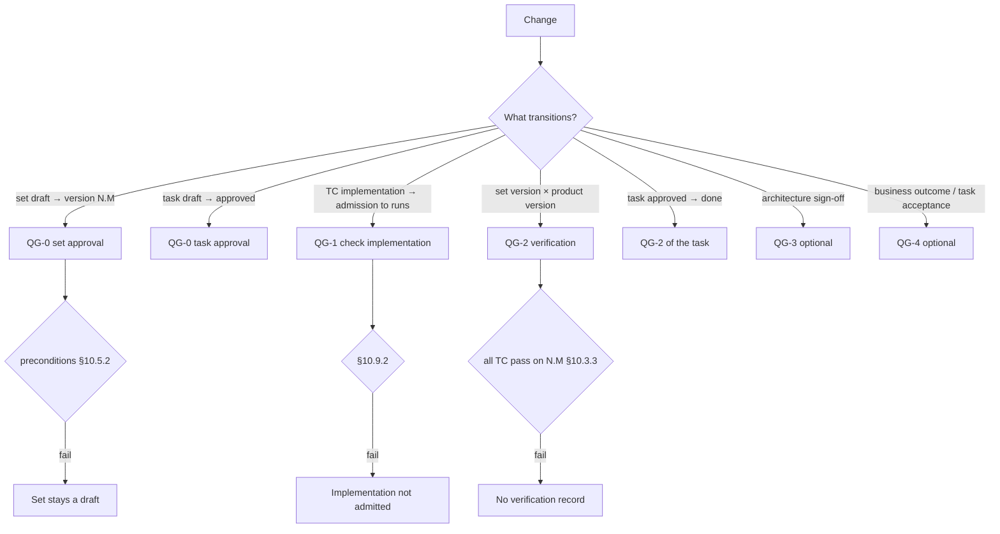

# 10. Lifecycle and Quality Gates

> **Part of the RENAR Standard v1.1** · [← Table of contents](README.md)
>
> **Dense chapter:** read after [§6](06-requirements-hierarchy.md)–[§9](09-test-cases.md); passing the QGs — [guide/00](../../guide/en/00-quickstart.md); density — [reference/09](../../reference/en/09-pedagogical-density.md).

## 10.1 How the description moves: the set, tasks, gates

The description of the system — BR, SR, SPEC and the normative parts of TC — moves **as a set**, not artifact by artifact. The description set ([§4.8.6](04-terms.md#4.8.6)) is the complete description of the system at the moment of approval; it has one draft and a sequence of approved versions `N.M`. An individual BR, SR, SPEC or TC norm has no state of its own: it is "approved" if it belongs to an approved version of the set, and a "draft" if it exists only in the draft ([§10.7](#10.7)). Every approved change of content produces a minor version immediately; a major version is the presented one, approved by the Architect's decision after a full audit ([§10.5](#10.5)).

Besides the set, three objects have a lifecycle of their own: the **task** (TR, [§10.6](#10.6)) — derived from the set, not part of it; **ADAPT** ([§10.8](#10.8)) — the contractual contour; the **TC implementation** ([§10.9](#10.9)) — the check code that lives in the code substrate and is admitted to runs separately from the norm.

Moving at will is not allowed: every transition is guarded by a **quality gate** — a condition that MUST hold, otherwise the transition does not happen. A set version is not approved while at least one normative assertion is not covered by a pair of TC norms; an ADAPT does not become `approved` while any finding is not closed by a signed clarification protocol; the product is not presented for acceptance while the TCs of the version have not passed on it. A gate is not a "success tick" but a check entitled to say "no" and leave the object where it is.

This chapter brings together the state machines of the four objects and governs the gates: what is checked before each transition, who is obliged to check and when. The chapter fixes **only** states, transitions and gates; artifact frontmatter is defined by chapters 6–9, the set version record — by [§10.5.4](#10.5.4).

### 10.1.1 Decision tree: which gate now (informative)



---

## 10.2 Normative definition of a Quality Gate

### 10.2.1 Quality Gate

**Quality Gate (gate)** — a normative condition whose check MUST be performed for a permitted transition of the **gate object** — the description set, a task (TR), an ADAPT or a TC implementation — from one lifecycle state into another. Every gate consists of:

1. **Identifier** — `QG-N` (closed list §10.3, §10.4). One identifier applies to several objects with different preconditions.
2. **Precondition** — a set of verifiable statements about the object and related artifacts that MUST be true at the moment the gate is invoked.
3. **Postcondition** — the state the object transitions into after passing the gate, and the observable effects (for example, a record in the transition log §10.13).
4. **Trigger** — who or what initiates the gate check (a participant: AI agent / Architect / automated runner; an event: approval / run completion / arrival of a delta-TZ).
5. **Enforcement point** — the place in the substrate where the check MUST be automated (§10.11).

A gate is not a success event — it is a condition that **MUST be checked**. Passing a gate MAY be negative (the precondition is not met) — in that case the transition is forbidden and the object stays in its current state.

### 10.2.2 Who is obliged to check a gate

| Gate type | Mandatory participant | Substrate enforcement |
|---|---|---|
| Approval (QG-0) | Architect or an authorized role-holder | Atomic recording of authorship and time (V6, [§3.3.6](03-substrate-versioning.md#3.3.6)); for the set — atomic release of the version (V2, [§3.3.2](03-substrate-versioning.md#3.3.2)) |
| Check implementation (QG-1) | Automated runner (CI, eval-runner) | Atomic recording of the run result pinned to the set version (V5, [§3.3.5](03-substrate-versioning.md#3.3.5)) |
| Verification (QG-2) | Automated runner confirming `set-version` | V5 + V6 |
| Architecture (QG-3, optional) | Architect's signature (ADAPT / architectural part of the set version) | V3 + V6 |
| ACTZ signing | Bilateral signature (client + vendor) | V3 + V6 |
| Acceptance (QG-4, optional) | Stakeholder with authority; for a task — a person other than the executor | V6 |

### 10.2.3 Relation to SENAR

SENAR §8 describes Quality Gates as an abstract concept for AI-driven development. RENAR **extends** SENAR in the requirements engineering domain:

- Keeps the identifiers QG-0 / QG-1 / QG-2 as mandatory.
- Governs **formal state machines** for the description set, the task, ADAPT and the TC implementation (SENAR does not).
- Binds every transition of a state machine to a specific gate with preconditions and postconditions.
- Adds the optional QG-3 / QG-4 for industries with extended audit requirements.

RENAR does not contradict SENAR; an implementation is SENAR-compatible with RENAR if the requirements of §10.3 + §10.11 are met.

---

## 10.3 Canonical RENAR gates (mandatory)

A closed list of three mandatory gates. Extensions outside this list — only the optional §10.4 or through the formal standard change procedure §10.10. Each gate has its own transition object; the full precondition lists per object are in the state machine sections (§10.5, §10.6, §10.8, §10.9).

### 10.3.1 QG-0 — approval gate

**Purpose**: permits an object to transition from draft into an approved state: the set draft — into version `N.M`; a task — into `approved`; an ADAPT — into `approved` ([§10.8](#10.8)).

**Precondition for the set** (full list — [§10.5.2](#10.5.2)):

- The frontmatter of every artifact of the set is valid against the schema of its chapter; identifiers are unique in the substrate (V1, [§3.3.1](03-substrate-versioning.md#3.3.1)).
- The tree is complete: every SR has a `parent`, every SPEC has a source. `source.adapt`, if present, points to an ADAPT in a state no lower than `approved`; otherwise `source.adversarial-review-ref` is present.
- An adversarial review has been performed on every artifact changed relative to the previous version; non-applicability is permitted **only** for trivial changes (by the criteria declared in the conformance manifest, [§13](13-conformance.md)) with the reason recorded in the transition log (§10.13).
- Mandatory bodies are filled ([§6.5.3](06-requirements-hierarchy.md#6.5.3), [§6.6.3](06-requirements-hierarchy.md#6.6.3), [§8.4.1](08-specifications.md#8.4.1)); for a system-level set SPEC-ARCH and SPEC-SEC are present and non-empty.
- For every normative assertion describing observable behaviour there is a positive + negative pair of TC norms ([§9.7](09-test-cases.md#9.7), [§13.3.5](13-conformance.md#13.3.5)).
- The Architect's signature (V6).

**Precondition for a task** — [§10.6.2](#10.6.2); **for an ADAPT** — [§10.8.3](#10.8.3).

**Postcondition**:

- Set: the version record `N.M` is released ([§10.5.4](#10.5.4)); the previous approved version transitions into `superseded`; task planning and TC implementation against `N.M` are permitted.
- Task: `approved`, the executor MAY start. ADAPT: `approved` (§10.8).
- A record in the transition log (§10.13).

**Trigger**: explicit approval by the Architect / role-holder through the substrate's native mechanism (V3 diff & review, [§3.3.3](03-substrate-versioning.md#3.3.3)).

**Applicable objects**: description set, TR, ADAPT.

### 10.3.2 QG-1 — check implementation gate (TC only)

**Purpose**: confirms that for a TC norm of an approved set version there is a valid implementation — code, configuration, an infrastructure artifact — fit for running.

**Precondition**:

- `automation.set-version` points to the approved set version containing this TC norm (V5, [§3.3.5](03-substrate-versioning.md#3.3.5)).
- `automation.status: automated` (with a valid `automation.location`) or `automation.status: manual-pending` (with `manual-pending-until` and `manual-pending-reason` stated).
- All static checks of the substrate agent's implementation (types, lint, schema) have passed; the runner dry-run has passed.
- The fixing red run is recorded in `red-history` ([§9.18.2](09-test-cases.md#9.18)) — a record of a run before admission, not a state transition of the implementation ([§10.9.3](#10.9.3)); or `not-applicable-reason` is set together with `mutation-check`.
- All mandatory TC body sections ([chapter 9 §9.4](09-test-cases.md#9.4)) are filled.

**Postcondition**:

- The implementation is admitted to production runs ([§10.9](#10.9)).
- A record in the transition log.

**Trigger**: the approving participant upon the automated runner's confirmation that the dry-run passed.

**Applicable objects**: TC implementation.

**Note**: a TR does not pass QG-1 separately: the validity conditions of the task's implementation are part of the QG-2 preconditions ([§10.6.2](#10.6.2)). For BR / SR / SPEC there is no intermediate gate — they are approved as part of the set and verified by its version.

### 10.3.3 QG-2 — verification gate

**Purpose**: confirms that the observable behaviour of the product corresponds to the **set version**: all TCs of version `N.M` have passed on it. For a task — that its ACs are confirmed.

**Precondition for a set version**:

- Every TC norm of version `N.M` has an admitted implementation (QG-1) with `last-run.result = pass` and `last-run.set-version = N.M`.
- Pos/neg pairing is a property of the approved version (QG-0); QG-2 checks that **both** TCs of every pair have passed.
- **Red history** ([§9.18.2](09-test-cases.md#9.18)): every TC has a recorded "red → green" transition. A TC never observed red is not evidence and does not close QG-2. Exception — a TC of the `implementation-originated` class ([§6.13](06-requirements-hierarchy.md#6.13)): for it a **killed mutant** is mandatory.
- All mandatory spec-specific TC kinds for every SPEC type of the version are present and have passed ([chapter 9 §9.8](09-test-cases.md#9.8)); for SPEC-UI / SPEC-AI — with `judge-isolation` observed ([chapter 9 §9.13.4](09-test-cases.md#9.13.4)); for SPEC-SEC — a TC `tc-type: security` is present and has passed.

**Precondition for a task** — [§10.6.2](#10.6.2).

**Postcondition**:

- A verification record appears in the set version record ([§10.5.4](#10.5.4)): product version, date, runner, run references. Only the runner writes it, like `last-run`. The state of the set does not change: verification is evidence about the pair (set version, product version), not a state of the description.
- The task transitions into `done`.
- A record in the transition log with evidence-refs (the list of run IDs).

**Trigger**: the automated runner upon completion of the run of all TCs of the version; for a task — at the executor's request when its TCs pass.

**Applicable objects**: set version (paired with a product version), TR.

---

## 10.4 Gates beyond the mandatory core

This section describes two different things, and they must not be confused.

**Optional QG-3 and QG-4** ([§10.4.1](#10.4.1), [§10.4.2](#10.4.2)) — normatively described but **not mandatory** for conformance ([chapter 13](13-conformance.md)). An implementation MAY declare in the conformance manifest either support of QG-3 / QG-4 or their absence. Conformance without QG-3 / QG-4 remains valid.

**The AT release gate** ([§10.4.3](#10.4.3)) — **mandatory**, not optional. It is **not part** of the closed list of Quality Gates ([§10.10.1](#10.10.1)) and does not extend it: QGs govern the transition of **the set, a task, an ADAPT and a TC implementation** between states, whereas the AT release gate governs the presentation of the **product** for trials and has no `QG-N` of its own.

### 10.4.1 QG-3 — architecture gate (optional)

**Purpose**: permits an ADAPT to transition from `answered` into `approved` (§10.8). Also applicable to the architectural part of a set version (SPEC-ARCH) in projects with regulated architectural acceptance.

**Precondition**:

- All backward findings in the ADAPT are in status `resolved` ([chapter 7 §7.4.5](07-adapt.md#7.4.5)).
- Every backward finding carries `decided-in` pointing to a clause of a **signed** ACTZ ([chapter 7 §7.13](07-adapt.md#7.13)).
- The Architect's signature is ready ([chapter 7 §7.5](07-adapt.md#7.5)). The client's signature on the ADAPT is **not required**: client obligations are carried by the ACTZ.
- For a set version (if QG-3 is applied): the decomposition decision is recorded in the substrate as an ADR-like artifact referenced from SPEC-ARCH (the ADR form is substrate-specific — moved to `guide/`).

**Postcondition**:

- The ADAPT transitions into `approved` (immutable on a par with the TZ).
- For a set version: the Architect's signature on the architectural part is recorded in the version record ([§10.5.4](#10.5.4)).
- A record in the transition log with the Architect's signature (V6 author + timestamp).

**Trigger**: the Architect's signature on the ADAPT ([§7.5](07-adapt.md#7.5)). The bilateral signature stands on the ACTZ ([§7.13](07-adapt.md#7.13)) and is recorded atomically (V2 atomic change unit, [§3.3.2](03-substrate-versioning.md#3.3.2)).

**When to apply**:

- ADAPT — always (but an implementation MAY declare QG-3 as a local alias for ADAPT approval without separating it into a distinct gate).
- The architectural part of a set version — in projects with regulatory requirements for architectural acceptance.

### 10.4.2 QG-4 — acceptance gate (optional)

**Purpose**: records the stakeholder's acceptance of the business outcome after release — per BR of the presented set version. In implementations where a task is accepted separately from its execution, QG-4 also applies to the task: `done` → accepted by a person other than the executor.

**Precondition**:

- The set version is verified (QG-2 for the delivered product version) and presented (major, [§10.5.1](#10.5.1)).
- The measurable business outcome (`business-outcome` in the BR frontmatter) is measured by the method declared in `measurement-method`; the measured value is recorded in the version record (`accepted-outcomes[].measured-value`, [§10.5.4](#10.5.4)), not in the BR — a BR of an approved version is immutable.
- `achievement = (measured − baseline) / (target − baseline)` ≥ the project-configurable threshold (80 % by default, fixed in the conformance manifest).
- Formal stakeholder signature; for a task — the signature of an acceptor other than the executor.

**Postcondition**:

- The acceptance of the BR is recorded in the set version record (`accepted-outcomes[]`, [§10.5.4](#10.5.4)); withdrawing an acceptance requires a delta-TZ.
- A record in the transition log with the stakeholder's signature.

**Trigger**: formal acceptance by the stakeholder upon release.

**When to apply**:

- Projects with explicit recording of post-release outcomes (product SaaS, regulated industries).
- Without QG-4 — acceptance of the business outcome is not recorded in the version record; the product's conformance to the contract is proven by the AT release gate.

### 10.4.3 AT release gate

**Purpose**: the product is not presented for delivery-acceptance until its conformance to the **contract** is proven. In the first-party confirmation kind ([§1.4.4](01-scope.md#1.4.4)) there is no contract and the gate does not apply: readiness is presented by the verification record of the version (QG-2, [§10.5.4](#10.5.4)).

**Precondition**:

- All ATs ([§9.19](09-test-cases.md#9.19)) are in status `passing`.
- The ATs are derived from the **effective** revision of the final TZ ([§7.14](07-adapt.md#7.14)): the `tz-version` of every AT matches the current revision. An outdated trial programme is **not admitted** to trials ([§9.19.4](09-test-cases.md#9.19)).
- The provenance of the AT generator confirms isolation: the model differs from the model of the main agent, there was no access to the internal contour ([§9.19.2](09-test-cases.md#9.19)).
- The presented set version is verified (QG-2) for the delivered product version.

**Postcondition**: the product MAY be presented for trials; the `ACCEPTANCE.md` report is up to date.

**Trigger**: the isolated AT generator agent + the automated runner.

The gate is **mandatory** and is not merged with QG-4 ([§10.4.2](#10.4.2)): QG-4 is optional and measures the business outcome, the AT release gate — conformance to the contract. A business goal can be achieved while the contract is violated, and vice versa.

### 10.4.4 Conformance with optional gates

The conformance manifest ([chapter 13](13-conformance.md)) MUST explicitly declare:

```yaml
quality-gates:
  qg-0: required          # always required
  qg-1: required
  qg-2: required
  qg-3: declared          # required | declared | absent
  qg-4: declared
```

`declared` means: the implementation supports the gate; objects MAY pass it, but conformance does not require passing it for all. `absent` — the gate is not applied in the implementation; acceptance of the business outcome is not recorded in the version record.

---

## 10.5 Description set state machine

### 10.5.1 States and transitions

```text
draft  ──[QG-0]──▶  approved N.M  ──[QG-0 of version N.M+1]──▶  superseded
  ▲                        │
  └──── new draft ◀────────┘   (any change of the content of an approved version)
```

| State | Semantics | Transition gate |
|---|---|---|
| `draft` | The single draft of the set; separated from the approved truth by substrate means (V4, [§3.3.4](03-substrate-versioning.md#3.3.4)). Contains all artifacts of the current version plus the proposed changes | — (created on the first change after approval) |
| `approved` | Approved version `N.M`; content is immutable; tasks are planned, TC implementations written and verification run against it | QG-0 (§10.3.1) with the preconditions of §10.5.2 |
| `superseded` | A version followed by a released successor; kept together with its verification record (V1) | Automatically upon approval of the next version |

The `major` flag distinguishes a **major** (presented) version from a **minor** one:

- A **minor version** `N.M` is released on **every** approved change of content — adding, changing or removing an artifact — immediately. No decision "is this change large or small" is taken: any change yields a version.
- A **major version** `N+1.0` is released by the Architect's decision at a milestone (end of a stage, delivery) and only after a **full audit** of the set (§10.5.2). QG-2 for the delivered product and the AT release gate ([§10.4.3](#10.4.3)) are performed against the major version; the stakeholder need only follow major versions.

**History is linear**: every version has exactly one predecessor (`supersedes`) and at most one successor; there is exactly one draft of the set. Parallel unfinished versions are not permitted — parallel work on independent parts of the description is done in the one draft and approved as one version. The implementation branches, the description does not.

Every change of the content of an approved version — including applying a delta-ADAPT ([chapter 7 §7.6](07-adapt.md#7.6)) or an accepted change concept — creates a draft and ends with the next minor version. An approved version has no separate "edit in place" path.

### 10.5.2 Version approval preconditions (QG-0 of the set)

Common part — [§10.3.1](#10.3.1). The full list for version `N.M`:

| Group | Precondition |
|---|---|
| Structure | The frontmatter of every artifact is valid; identifiers are unique (V1); mandatory bodies are filled ([§6.5.3](06-requirements-hierarchy.md#6.5.3), [§6.6.3](06-requirements-hierarchy.md#6.6.3), [§8.4.1](08-specifications.md#8.4.1), type-specific [§8.5](08-specifications.md#8.5)); for a system-level set SPEC-ARCH and SPEC-SEC are present and non-empty |
| Tree | Every SR has a `parent` in the same version; every SPEC has a source; the `depends-on[]` graph is acyclic ([§8.6.3](08-specifications.md#8.6.3)), all SPECs from `depends-on[]` belong to this version; the `implements[]` of a subsystem BR is valid ([§13.3.8](13-conformance.md#13.3.8)) |
| Provenance | `source.adapt`, if present, points to an ADAPT in a state no lower than `approved`; otherwise `source.adversarial-review-ref` is present; every `approved` ADAPT is reflected in the set ([§7.4.1](07-adapt.md#7.4.1)) |
| Review | An adversarial review has been performed on every artifact changed relative to `N.M−1` (for the first version — on all) |
| Coverage | For every normative assertion describing observable behaviour there is a positive + negative pair of TC norms ([§9.7](09-test-cases.md#9.7), [§13.3.5](13-conformance.md#13.3.5)); the mandatory TC kinds for every SPEC type are present ([§9.8](09-test-cases.md#9.8)) |
| Removals | For every removed artifact the conditions of [§10.5.3](#10.5.3) are met |
| Signature | The Architect's signature (V6); in the first-party confirmation kind ([§1.4.4](01-scope.md#1.4.4)) — the Architect's and the responsible person's |

**Full audit** (mandatory for a major version, for a minor one — by the Architect's decision): the preconditions of the table are checked over the **whole** set, not only over the changed artifacts; additionally — consistency of statement forms ([§6.6.3.1](06-requirements-hierarchy.md#6.6.3.1)), absence of contradicting assertions across artifacts, currency of numbering and cross-references, absence in the set of artifacts sourced from a `superseded` ADAPT. The audit outcome is recorded in the version record (`audit`, [§10.5.4](#10.5.4)).

**Postcondition**: the version record `N.M` is released; `N.M−1` → `superseded`; the draft holds no changes relative to `N.M` until the next change.

**Trigger**: explicit approval by the Architect through the substrate's native mechanism (V3 + V6).

### 10.5.3 Removing an artifact from the set

An artifact does not "transition into `deprecated`" — it is **removed** from the next version while staying in history (V1). The removal is recorded in the version record (`changes[].removed`) and approved together with the version.

**Precondition**:

- `replaced-by` (if there is a replacement) points to an artifact belonging to the same version.
- There are no active tasks (TR in `approved`) on the removed artifact: tasks are redirected to the replacement or moved into `obsolete` ([§10.6.3](#10.6.3)) atomically with the version approval (V2).
- TC norms that verified **only** the removed artifact are removed in the same version; their implementations are withdrawn from runs ([§10.9.4](#10.9.4)).
- Child artifacts (SRs of a removed BR, SPECs of a removed SR) have a new parent or are removed together with it.

**Postcondition**: the artifact is absent from `N.M`; the version record carries `removed: [{ id, replaced-by }]`; the artifact's history and earlier versions remain recoverable (V1).

**Trigger**: the Architect or the Product Owner — as part of the version approval.

### 10.5.4 Set version record

Approving a version releases a **version record** — a substrate artifact with the fields:

```yaml
set-version: "N.M"                  # identifier; immutable after release
major: boolean                      # true — the presented version (§10.5.1)
approved-by: "<actor>"              # Architect (V6)
approved-at: "<ISO-8601>"
supersedes: "N.M-1"                 # exactly one predecessor; absent on the first version
resolves-to: "<pointer>"            # substrate-native way to resolve the version into content:
                                    # a snapshot, a tag, a list of (artifact-id, version-id) pairs per V5
changes:
  added:   [BR-NN, SR-NN, SPEC-<TYPE>-NN, TC-NN]
  changed: [SR-NN]
  removed: [{ id: SPEC-<TYPE>-NN, replaced-by: SPEC-<TYPE>-MM }]
audit:                              # mandatory when major: true
  full: boolean
  findings-ref: "<pointer>"
architecture-signoff:               # if QG-3 is declared and applied to the version
  signed-by: "<actor>"
  signed-at: "<ISO-8601>"
verification:                       # bot-managed; runner only (§10.3.3)
  - product-version: "<substrate-native pointer>"
    date: "<ISO-8601>"
    result: pass | fail
    runner-id: "<runner-name@version>"
    evidence-refs: [<run IDs>]
accepted-outcomes:                  # QG-4, if declared (§10.4.2)
  - br: BR-NN
    measured-value: number           # the KPI value per the BR's measurement-method
    measured-at: "<ISO-8601>"
    achievement: 0.87                # (measured − baseline) / (target − baseline)
    accepted-by: "<actor>"
    accepted-at: "<ISO-8601>"
```

Normative rules of the record:

1. The `set-version` identifier and the sections `changes`, `resolves-to`, `audit`, `approved-*` MUST NOT change after release (V1). The sections `verification`, `accepted-outcomes` and `architecture-signoff` are append-only evidence: `verification` is written only by the runner ([§9.12](09-test-cases.md#9.12) mutatis mutandis), `accepted-outcomes` — by the stakeholder with a signature (V6).
2. `resolves-to` MUST resolve into the content of every artifact of the version unambiguously and reproducibly; the pointer form is substrate-specific and is governed in `guide/`. A list of `(artifact-id, version-id)` pairs is mandatory only where the substrate provides no atomic addressable snapshot of a group (V2 without a transaction identifier).
3. All references to a version of the description — `automation.set-version` and `last-run.set-version` of a TC implementation ([§9.3](09-test-cases.md#9.3)), the base point of a delta-ADAPT ([§7.6](07-adapt.md#7.6)), the conformance manifest ([§13.4.2](13-conformance.md#13.4.2)) — point to `set-version`, not to versions of individual artifacts.

---

## 10.6 TR state machine

### 10.6.1 States and transitions

```text
draft  ──[QG-0]──▶  approved  ──[QG-2 (per TR)]──▶  done
  │                     │                            │
  │                     │                            │
  └─────────────────────┴───[deprecation]───────────▶ obsolete
```

| Status | Semantics | Gate |
|---|---|---|
| `draft` | TR created; AC not yet finalized | — |
| `approved` | AC approved; implementer work may start | QG-0 (§10.3.1) with the TR preconditions from §10.6.2 |
| `done` | AC verified; all bound TCs passed on the set version the task was planned against | QG-2 (§10.3.3) with the TR preconditions from §10.6.2 |
| `obsolete` | TR has lost relevance before completion (the parent SR changed) | Deprecation (Architect) |

### 10.6.2 Preconditions for TR

**QG-0 for TR (`draft → approved`)** — in addition to the common part:

- A goal is stated (`goal`).
- AC are verifiable and independent (each AC is a separate check).
- At least one negative scenario is present.
- A reference to the parent SR (or BR for simple configurations) is established via `implements`; the parent artifact belongs to the approved set version the task is planned against.
- If the TR implements a SPEC — the mandatory field `implements-spec[]` ([chapter 8 §8.6.2](08-specifications.md#8.6.2)).
- If the task touches security — `threat-surface` is declared ([chapter 8 §8.5.8](08-specifications.md#8.5.8)).

**QG-2 for TR (`approved → done`)**:

- All TR AC are confirmed by the passing of corresponding TCs (`last-run.result = pass` with `last-run.set-version` equal to the task's set version).
- Pos/neg pairing for each AC.
- For a TR implementing a SPEC: a TC of the corresponding spec-specific kind exists and is `passing` ([chapter 9 §9.8](09-test-cases.md#9.8)).

### 10.6.3 TR deprecation

If the parent SR is removed from the next set version ([§10.5.3](#10.5.3)) or changed in it such that the TR's AC are no longer relevant — the TR transitions into `obsolete`. This is **not** degradation — it is an alternative terminal path. A TR in `obsolete` is not deleted.

---

## 10.7 Set artifacts: derived state

### 10.7.1 State is derived from version membership

BR, SR, SPEC and the normative parts of TC have **no** `status` and `version` fields of their own. Their state is derived from membership in set versions ([§10.5](#10.5)) and is computed by the substrate, not stored:

| Derived state | Condition |
|---|---|
| draft | The artifact (or its change) is present in the set draft and absent from the current approved version |
| approved | Belongs to the current approved version `N.M` |
| removed | Belonged to an earlier version and is absent from the current one; `changes[].removed` carries `replaced-by` if there is a replacement ([§10.5.3](#10.5.3)) |

Consequences:

- A reference to an artifact (`parent`, `constrained-by[]`, `implements-spec[]`, `verifies[]`, `depends-on[]`) resolves **in the context of a set version**: "the referenced artifact is approved" means "belongs to the same version". A reference from an approved version to a removed artifact violates the preconditions of [§10.5.2](#10.5.2).
- "Verified" is not a state of an artifact but a property of the pair (set version, product version) ([§10.3.3](#10.3.3)): the same SR is verified on one product version and not verified on another.
- The change history of an artifact is a property of the substrate (V1), not a frontmatter field; comparing two states of an artifact is a diff between set versions (V3).

### 10.7.2 Structural completeness

The structural completeness check — formerly the SPEC transition into `review` — is a **precondition of version approval**, not a state of its own. Before approval the substrate MUST check for every artifact of the draft that:

- all mandatory frontmatter fields of its chapter are filled ([§6.5.2](06-requirements-hierarchy.md#6.5.2), [§6.6.2](06-requirements-hierarchy.md#6.6.2), [§8.4](08-specifications.md#8.4), [§9.3](09-test-cases.md#9.3));
- all mandatory body sections are present ([§6.5.3](06-requirements-hierarchy.md#6.5.3), [§6.6.3](06-requirements-hierarchy.md#6.6.3), [§8.4.1](08-specifications.md#8.4.1), [§9.4](09-test-cases.md#9.4));
- the type-specific SPEC sections ([§8.5](08-specifications.md#8.5)) are present for the respective `spec-type`;
- the SPEC-ARCH screen list is covered by SPEC-UIs of the same version, and `screens[]` of every SPEC-UI stays within the list ([§8.5.6.1](08-specifications.md#8.5.6.1));
- from the `RENAR-2` level — the normative sections of artifacts observe the rules of the description language ([§15.2](15-description-language.md#15.2)–[§15.5](15-description-language.md#15.5)); a violation is returned as a remark on the wording ([§15.7](15-description-language.md#15.7)).

On violation the substrate MUST return the list of missing fields and sections (V3 diff & review supports structural feedback); the version is not approved.

### 10.7.3 Preconditions by SPEC type

In addition to [§10.5.2](#10.5.2), when approving a version that contains SPECs:

- A version of the `system` level contains non-empty `SPEC-ARCH` and `SPEC-SEC` ([chapter 8 §8.3](08-specifications.md#8.3)).
- The `depends-on[]` graph is acyclic ([chapter 8 §8.6.3](08-specifications.md#8.6.3)); all SPECs from `depends-on[]` belong to the same version.
- If a SPEC references an ADAPT via `source.adapt` — the ADAPT is in state `approved`.
- The mandatory TC-norm kinds per SPEC type are present ([chapter 9 §9.8](09-test-cases.md#9.8)): for SPEC-AI — `evaluation-criteria` fully covered by pairs; for SPEC-SEC — `tc-type: security`; for SPEC-DATA — `tc-type: contract` for published interface fields; for SPEC-UI — `tc-type: ux`.

Passing these TCs is the subject of QG-2 of the version ([§10.3.3](#10.3.3)); their presence — the subject of QG-0.

---


## 10.8 ADAPT state machine

### 10.8.1 Macro-states

```text
draft  ──[review-transition]──▶  review  ──[backward-ready]──▶  asked
                                                                       │
                                                                       │ [client returns answers]
                                                                       ▼
                                                                  answered
                                                                       │
                                                                       │ [QG-3]
                                                                       ▼
                                                                  approved
                                                                       │
                                                                       │ [immutable; only delta-ADAPT / errata / supersession]
                                                                       ▼
                                                                  frozen ──[supersession: §10.8.5]──▶ superseded
                                                                                                        (terminal)
```

The ADAPT states (`draft → review → asked → answered → approved → frozen`, and the terminal `superseded` upon supersession) are defined in [chapter 7 §7.4](07-adapt.md#7.4) and [§7.6.4](07-adapt.md#7.6). The state `client-ready` is withdrawn: putting questions to the client is the subject of an ACTZ ([§7.13](07-adapt.md#7.13)), not a state of the ADAPT. This section normalizes the gates.

| Transition | Gate | Precondition |
|---|---|---|
| `draft → review` | Review-transition | The Forward interpretation covers all TZ sections; the primary backward findings are recorded in `open` |
| `review → asked` | Backward-ready | All backward findings moved to `asked-to-client`; the questions are put to the client as part of an ACTZ (`status: sent`) |
| `asked → answered` | Client-return | All backward findings in `answered`; the decisions are recorded as clauses of a **signed** ACTZ (`status: signed`, dual signature V6) |
| `answered → approved` | **QG-3** (§10.4.1) | All backward findings in `resolved` and carry a `decided-in` pointing to a clause of the signed ACTZ; the Architect's signature is ready |
| `approved → frozen` | Freeze-transition | Automatic after approve; the ADAPT is immutable; generation of BR / SR / SPEC with `source.adapt = approved` is permitted |
| `frozen → superseded` | **QG-3 of the superseding ADAPT** (§10.8.5) | The superseding ADAPT (`supersedes: ADAPT-MMM`) has reached `approved`; derived BR / SR / SPEC are re-pointed or re-derived |

### 10.8.2 Nested state machine for a backward-finding record

Each backward-finding record inside an ADAPT has its own subordinate state machine ([chapter 7 §7.4.5](07-adapt.md#7.4.5)):

```text
open  ──▶  asked-to-client  ──▶  answered  ──▶  resolved  ──[approve ADAPT]──▶  frozen
                  ▲                  │
                  └──── revised ─────┘  (if the answer requires clarification)
```

| Sub-state | Semantics |
|---|---|
| `open` | Recorded by the Engineer; not sent to the client |
| `asked-to-client` | Sent to the client; the question date is recorded |
| `answered` | The client answered; the answer recorded (V6 author + timestamp) |
| `resolved` | The Engineer integrated the answer into the Forward interpretation |
| `revised` | The answer is vague; a repeat question (return to `asked-to-client`) |
| `frozen` | After ADAPT approval; changes are impossible |

**Normative rule**: QG-3 (approve ADAPT) is **prohibited** if at least one backward-finding record is in `open` / `asked-to-client` / `answered` / `revised`. All such records MUST be in `resolved` ([chapter 7 §7.4.5](07-adapt.md#7.4.5)).

### 10.8.3 QG-3 for ADAPT — detailed

**Precondition** (full):

- All Forward-interpretation sections are filled in (the forward-complete criterion).
- All backward-finding records in `resolved`.
- Every backward finding carries a `decided-in` pointing to a clause of an ACTZ in status `signed` ([chapter 7 §7.13](07-adapt.md#7.13)).
- The Architect's signature obtained and recorded by the substrate's native mechanism (V3 + V6).
- If the ADAPT is a delta-ADAPT: the parent-ADAPT in `frozen` ([chapter 7 §7.6](07-adapt.md#7.6)).

**Postcondition**:

- The ADAPT transitions into `approved`.
- A record in the transition log with the Architect's signature.
- An ADAPT with at least one finding not closed by a signed ACTZ is **not** transitioned into `approved`: an interpretation MUST NOT rest on a decision the client never took.

**Trigger**: explicit approval by the Architect.

### 10.8.4 Errata for a frozen ADAPT

`frozen` is a terminal state along the derivation line. Changes are possible only by adding a new artifact via one of three paths:

1. **Delta-ADAPT** (if the TZ contains an ambiguity discovered late) — a new artifact with an explicit `parent-adapt` link.
2. **Errata-ADAPT** (if there is an interpretation error by the engineer) — a separate artifact. If the correction touches a decision of a signed ACTZ (it changes an obligation), a **new ACTZ** with the dual signature is REQUIRED; if it does not, the Architect's signature suffices.
3. **Supersession** (if the prior decision was correct but later refuted) — a superseding ADAPT transitions the superseded one into `superseded` (§10.8.5, [chapter 7 §7.6.4](07-adapt.md#7.6)).

In all three cases the frozen ADAPT is **not edited**. This is a V1 requirement (immutable history) for contractual artifacts ([chapter 7 §7.6.3](07-adapt.md#7.6.3)).

### 10.8.5 The frozen → superseded transition (supersession)

Supersession of an approved/frozen ADAPT is normalized in [chapter 7 §7.6.4](07-adapt.md#7.6). The lifecycle transition:

```text
frozen ──[superseding ADAPT reached approved via QG-3]──▶ superseded (terminal, immutable)
```

**No separate QG is introduced.** Supersession goes through the same **QG-3** (§10.8.3) as an ordinary ADAPT — no additional control point is created.

**Precondition** of the `ADAPT-MMM → superseded` transition:

- A superseding `ADAPT-NNN` has been created with the field `supersedes: ADAPT-MMM` and a non-empty `supersession-rationale` ([chapter 7 §7.6.4](07-adapt.md#7.6)).
- The superseding ADAPT has passed QG-3 and reached `approved`. If the superseded decision had a contractual outcome (it was a clause of a signed ACTZ) — the cancellation MUST be formalized by a **new ACTZ with a dual signature**, which stamps `superseded-by` on the former one; the Architect signature alone is permitted only for a correction that touches no signed decision.
- All derived `BR` / `SR` / `SPEC` with `source.adapt: ADAPT-MMM` are re-pointed to the superseding ADAPT or re-derived (no dangling references).

**Postcondition**:

- `ADAPT-MMM` transitions into the terminal **`superseded`** — distinct from `frozen` and from `obsolete`, the state through which a TR becomes outdated; immutable and **retained** for audit (V1), not deleted.
- The field `superseded-by: ADAPT-NNN` on `ADAPT-MMM` is recorded automatically.
- A record in the transition log with the signatures of the superseding ADAPT (V6).

**Trigger**: approval of the superseding ADAPT via QG-3.

**Hook obligation**: after the transition, a dangling `source.adapt` reference to an ADAPT in status `superseded` is **fatal**; enforcement — the `adapt-supersession` validation (§10.11.1), the `check-adapt-supersession.js` gate.

---

## 10.9 TC implementation: admission and run states

The normative part of a TC is an item of the description set and has no state of its own ([§10.7](#10.7)). A lifecycle of its own belongs to the **implementation** of the TC — the check code addressed by `automation.location` and living in the code substrate ([chapter 9 §9.17](09-test-cases.md#9.17)).

### 10.9.1 States and transitions

```text
not admitted  ──[QG-1]──▶  admitted  ──[runner pass]──▶  pass
                                │                           │
                                │ [runner fail]             │ [norm changed in version N.M+1]
                                └───────────▶ fail          ▼
                                                │        stale  (norm changed after set-version)
                                                └──────────┘
```

| State | Semantics | How it is recorded |
|---|---|---|
| not admitted | The implementation is absent or has not passed QG-1 | `automation.status` not confirmed by a dry-run |
| admitted | The dry-run passed; the red history is recorded; production runs are permitted | QG-1 ([§10.3.2](#10.3.2)) with the preconditions of §10.9.2; `automation.set-version` = version of the norm |
| `pass` / `fail` | Result of the last run on version `last-run.set-version` | runner; bot-managed ([§9.12](09-test-cases.md#9.12)) |
| stale | The TC norm was changed in a later set version; a run of the implementation against the previous norm is not evidence | An approved version later than `automation.set-version` exists whose `changes[].changed` contains this TC norm (§10.9.4) |

TC frontmatter and pos/neg pairing are defined in [chapter 9](09-test-cases.md). Removing a TC norm from the set — [§10.5.3](#10.5.3): the implementation is withdrawn from runs, history is kept.

### 10.9.2 Preconditions for a TC implementation

**QG-1 (admission to runs)** — in addition to the common part [§10.3.2](#10.3.2):

- `automation.set-version` points to an approved set version containing this TC norm, and no later approved version changed that norm (`changes[].changed`).
- `automation.status: automated` (with a valid `automation.location`) **or** `automation.status: manual-pending` (with `manual-pending-until` ≤ +1 sprint and a filled `manual-pending-reason`).
- The runner dry-run passed (structural validity only; not to be confused with a production run).
- The fixing red run is recorded ([§9.18.2](09-test-cases.md#9.18)); the implementation author differs from the author of the implementation of the behaviour being checked (P8).
- All mandatory TC body sections ([§9.4](09-test-cases.md#9.4)) are filled.

**Postcondition**:

- The implementation is admitted; the runner is permitted to run in production.
- A record in the transition log.

### 10.9.3 Runner-managed transitions (not Quality Gates)

`admitted → pass`, `admitted → fail`, `pass → fail`, `fail → pass` — transitions that happen **only** upon a runner run ([chapter 9 §9.12 `last-run` bot-managed](09-test-cases.md#9.12)). These transitions **are not** Quality Gates in the sense of §10.2.1: they are normative consequences of run results, not passage of a gate with preconditions and postconditions. In particular, checking that `last-run.set-version` matches the set version being verified ([§10.3.3](#10.3.3)) is a runner-managed consistency check, not a separate gate.

**Postcondition of every runner transition**:

- `last-run` is updated: `result`, `date`, `set-version`, `run-ref`, `evidence-refs`.
- The substrate MUST forbid manual modification of `last-run` (runner-actor only).

### 10.9.4 Staleness of an implementation

An implementation becomes stale, without entering a terminal state, in two cases:

1. **The TC norm was changed** in set version `N.M+1` (`changes[].changed` contains its identifier): the implementation with `automation.set-version = N.M` is marked stale; its run does not count towards the verification of `N.M+1`. A new implementation is created **against the new norm**, not by editing the old one; the former one stays in history (V1). A delta-TZ invalidating the tested behaviour follows the same path ([chapter 9 §9.16](09-test-cases.md#9.16)).
2. **The TC norm was removed** from the version ([§10.5.3](#10.5.3)): the implementation is withdrawn from runs; nothing is deleted.

The substrate MUST detect the first case automatically by the existence of an approved version later than `automation.set-version` whose `changes[].changed` contains the TC norm's identifier (V5) — the enforcement point "TC implementation staleness" ([§10.11.1](#10.11.1)).

### 10.9.5 Change-of-criteria — a separate normative path

Changing `## Pass criterion` or `## Fail criterion` in a TC norm is **not an ordinary change of set content**; it is a special path requiring a separate approval workflow ([chapter 9 §9.13](09-test-cases.md#9.13)) before approval of the version the change belongs to. Enforcement details — §10.11.3.

---

## 10.10 Closed list policy

### 10.10.1 Normative rule

The closed list of RENAR Quality Gates — mandatory {QG-0, QG-1, QG-2} and optional {QG-3, QG-4}. The list MAY change **only** through the formal RENAR standard change procedure ([chapter 13](13-conformance.md)).

The list closes **Quality Gates** — checks of the transition of **the description set, a task (TR) and an ADAPT** between states and of the **admission of a TC implementation** to runs. The mandatory AT release gate ([§10.4.3](#10.4.3)) is not part of it and does not extend it: it governs the presentation of the product for trials, not a transition of one of the four objects. For the same reason the substrate's transitional events (`freeze`, artifact removal, `runner-pass` / `runner-fail`, `change-of-criteria`), recorded in the log ([§10.13.1](#10.13.1)), stay outside the list.

This policy is a specialization of [§1.7](01-scope.md#1.7) Closed list policy for quality gates; the general rule for all RENAR closed lists and the master index — [§1.7.5](01-scope.md#1.7.5).

### 10.10.2 What is prohibited

| Action | Prohibited? | Why |
|---|---|---|
| Locally creating a new gate type `QG-N` at the project level | Prohibited | Violates the closed list; makes conformance non-portable |
| Locally overriding the preconditions of a canonical gate | Prohibited | Makes conformance incomparable across implementations |
| Additionally tightening the preconditions of a local gate | Permitted | The conformance manifest MAY declare stricter thresholds (for example, `qg-2.required-negative-tc: true`) |
| Locally weakening the preconditions of a canonical gate | Prohibited | Violates the standard's contract |
| Declaring QG-3 / QG-4 as `absent` in the conformance manifest | Permitted | Optional gates — §10.4 |
| Declaring QG-0 / QG-1 / QG-2 as `absent` | Prohibited | Violates conformance §10.4.4 |

### 10.10.3 Extending the list

Adding a new gate type is possible through:

1. A standard change request with a rationale — a research draft with a typology and a comparison with the canonical gates.
2. Public review (the period and forum are fixed by the standard policy, [chapter 13](13-conformance.md)).
3. Inclusion in the next minor version of the standard (`v1.X` or `v2.0`).
4. A migration guide for existing conformant projects ([§1.7.4](01-scope.md#1.7.4), [§13.9.3](13-conformance.md#13.9.3)): changes to the self-assessment checklist, new manifest fields.

Project-local extensions remain outside conformance — they are permitted as internal practices but do **not** affect the conformance manifest.

---

## 10.11 Substrate-independent enforcement

### 10.11.1 Normative requirements

A substrate implementing RENAR MUST ensure an automatic check of gate preconditions at the following points:

| Control point | What MUST be checked | Relies on capabilities |
|---|---|---|
| **Promote-transition** (approval of a set version; a task transition into `approved` / `done`; ADAPT transitions; admission of a TC implementation) | The preconditions of the corresponding gate (§10.3, §10.4, §10.5, §10.6, §10.8, §10.9) | V3 (diff & review) to block the transition until approve; V4 (branching) to separate WIP from the approved truth |
| **Approve-transition** (any approval action) | Authorship recorded (actor) and timestamp | V6 (author + timestamp) |
| **`coverage-presence` validation** ([§13.3.5](13-conformance.md#13.3.5)) | At the approval of a set version: for every normative assertion of BR / SR / SPEC describing observable behaviour, a positive + negative pair of TC norms exists in the same version, addressing it through `verifies[].statement` ([§15.1.1](15-description-language.md#15.1.1)). The **presence** of coverage is checked, not only the validity of existing `verifies[]`; an assertion without a pair — fatal, the version is not approved | V3 (block approve); V1 (the list of assertions of the version is stable) |
| **Reference-validation** (any creation/change of an artifact with a reference to another) | The referenced artifact exists: for set artifacts — in the same version ([§10.7.1](#10.7.1)); for ADAPT / ACTZ / AR — in the required state | V1 (immutable history) for a stable identifier; V5 (version pin) for cross-substrate references |
| **Change-of-criteria for TC** (§10.11.3) | A separate approval process is applied | V3 + V6 |
| **Runner-transitions of a TC implementation** (`admitted → pass` / `fail`, §10.9.3) | Only the runner-actor may write `last-run` | V6 (authorship); the substrate's native ACL or role-based restrictions |
| **TC implementation staleness** (TC norm changed in version `N.M+1`, §10.9.4) | The implementation with `automation.set-version = N.M` is marked stale; its run does not count towards the verification of `N.M+1` | V5 (`set-version`) for detection |
| **`implements`-edge validation** (subsystem BR referencing a system BR, [§6.5.2](06-requirements-hierarchy.md#6.5.2), [§6.8.2](06-requirements-hierarchy.md#6.8.2)) | (1) the target BR exists by `id + scope.system`; (2) the target belongs to the approved set version of its system at the approval of the version containing this BR (a removed target — warning, not fatal; cascade-warning over `implemented-by[]`); (3) the `implements` chain forms no cycles; (4) `implements[]` is absent when `level: system` | V1 (stable identifier for target lookup); V3 (block approve until validation passes); V5 (cross-substrate ID resolution when the target is in another substrate) |
| **`uses`-edge validation** (a consumer BR with an edge to a component, [§6.14.4](06-requirements-hierarchy.md#6.14.4)) | (1) the component exists by `system-id`, `set-version` is an approved version of its set; (2) every `A-NN` of the component version is confirmed in `assumptions-confirmed[]` (V6) — unconfirmed — fatal; (3) the `uses` graph is acyclic; (4) targets in a foreign tree in `constrained-by[]` — fatal; (5) the removal of a component artifact in a new version — a warning to the consumer, not fatal. The stop rule for incompatible `consumer` statements (§6.14.4, rule 7) is not computed by the substrate — it is the consumer's obligation and a subject of the adversarial review | V1 (stable identifiers of the component and of assumptions); V5 (the component's `set-version`); V3 (block approve); V6 (confirmation) |
| **`actz-integrity` validation** ([§7.13](07-adapt.md#7.13)) | (1) An ACTZ in status `signed` carries both signatures (client + supplier), and the signatories are different persons. (2) Every finding in status `resolved` carries a `decided-in` pointing to an ACTZ in status `signed`; a reference to a `draft` / `sent` / non-existent ACTZ is fatal. (3) Every signed ACTZ is reflected in at least one ADAPT: a signed decision with no reflection in the interpretation is fatal (an obligation absent from the requirements). (4) `superseded` requires `superseded-by`. | V3 (block approve); V6 (dual signature); V1 (a signed ACTZ is immutable) |
| **`at-isolation` validation** ([§9.19](09-test-cases.md#9.19)) | (1) The `generator` of each AT attests isolation: the model differs from the model of the main agent, and there was no access to the internal contour — **fatal** on violation (otherwise the AT confirms its own interpretation instead of the contract). (2) `verifies[]` references only `TZ §N` / `ACTZ-NNN §M`; a reference to a BR / SR / SPEC / TC / ADAPT is fatal. (3) The `tz-version` of each AT matches the current revision of the effective TZ — otherwise the trials are blocked ([§10.4.3](#10.4)). | V5 (pin to the revision of the effective TZ); V6 (generator provenance) |
| **`red-history` validation** ([§9.18.2](09-test-cases.md#9.18)) | (1) A TC counted as evidence at QG-2 has a recorded "red → green" transition, or an inherited red history (a task that does not change behavior). (2) A TC of the `implementation-originated` class has no red history by construction; `mutation-check.mutants-killed ≥ 1` is mandatory for it ([§6.13.3](06-requirements-hierarchy.md#6.13)). (3) The author of the TC differs from the author of the implementation (P8, [§9.18.1](09-test-cases.md#9.18)). | V1 (the run history is immutable); V6 (authorship provenance) |
| **`adapt-applicability` validation** ([§7.4.1](07-adapt.md#7.4.1), [§7.4.6](07-adapt.md#7.4.6)) | (1) For each TZ, the adversarial-review verdict is issued as an AR in status `issued` (V6 author + timestamp). (2) If `verdict: findings-present` — `produces-adapt[]` is non-empty, each ADAPT it names exists in `approved`+ with the Architect's signature, and every finding of it carries a `decided-in` pointing to a signed ACTZ; the BR/SR/SPEC derivatives have `source.adapt`. (3) If `verdict: no-findings` — no ADAPT, and the BR/SR/SPEC have `source.tz-section` + `source.adversarial-review-ref` pointing at that AR. (4) AR integrity: the `reviewer` model differs from the primary agent's model ([§7.10.2](07-adapt.md#7.10.2)); a reference to an AR in status `draft` or `superseded` is fatal; a dangling reference is fatal. (5) No mixing: an artifact with `source.adapt` omitted and without `source.adversarial-review-ref` — fatal. | V3 (block approve until validation passes); V6 (verdict + signature attribution); V1 (AR immutable once `issued`) |
| **`adapt-supersession` validation** ([§7.6.4](07-adapt.md#7.6), §10.8.5) | (1) `supersedes: ADAPT-MMM` references an existing ADAPT; the back-reference `superseded-by` is symmetric. (2) `supersession-rationale` is non-empty and references a concrete contradicting `BR` / `SR` / `SPEC`. (3) When the superseded decision has a contractual outcome (it was a clause of a signed ACTZ) — the cancellation is formalized by a new ACTZ with the dual signature, which stamps `superseded-by` on the former one. (4) A dangling `source.adapt` reference to an ADAPT in status `superseded` — **fatal**. | V1 (stable identifier + immutable superseded history); V3 (block approve until validation passes); V6 (signature attribution) |

### 10.11.2 A substrate without V3 / V4 / V6 is non-conformant

A substrate that does not provide V3 (diff & review) cannot implement gates: there is no way to separate a "proposed change" from the "approved truth" ([chapter 3 §3.3.3](03-substrate-versioning.md#3.3.3)). The same holds for V4 (branching, [§3.3.4](03-substrate-versioning.md#3.3.4)) and V6 (author + timestamp, [§3.3.6](03-substrate-versioning.md#3.3.6)) — without them the approval mechanics are impossible. A substrate that does not satisfy V3 / V4 / V6 **does not implement RENAR** regardless of other properties.

### 10.11.3 Change-of-criteria for TC — special enforcement

Changing the Pass / Fail criterion of a TC is a high-risk operation (protection against test-fitting, [chapter 9 §9.13](09-test-cases.md#9.13)). The substrate MUST:

1. **Detect**: any change to the `## Pass criterion` / `## Fail criterion` sections in a TC artifact.
2. **Forcibly isolate**: a change-of-criteria MUST be a separate change-set (V4 branching / change-set, [§3.3.4](03-substrate-versioning.md#3.3.4)) recorded as an atomic change unit (V2, [§3.3.2](03-substrate-versioning.md#3.3.2)), marked with a flag distinguishing it from ordinary edits (the substrate's native mechanism — a special case of V3 diff & review; the form of the flag is substrate-specific, deferred to guide/).
3. **Prohibit combining**: the same person MUST NOT approve both a change-of-criteria and a code fix that is tested by this same TC. The substrate MUST check this rule at the approve-transition.
4. **Register**: a change-of-criteria is recorded in the audit trail (§10.13) with explicit event typing.

### 10.11.4 Forms of substrate-native implementation

The concrete substrate-native mechanisms (how exactly a hook is implemented in a given substrate) are deferred to `guide/` and the conformance manifest. The standard does not normalize the **form** of a hook (this is a substrate-specific decision). The standard normalizes **what a hook MUST check and at which point**.

The `guide/` section MUST contain, for each supported substrate:

- A mapping of the enforcement points of §10.11.1 onto the substrate-native mechanisms.
- Example implementations.
- The known limitations of the substrate regarding the automation of each check.

---

## 10.12 Prohibited transitions

A closed list of transitions that violate the lifecycle. The substrate MUST block them.

| From | To | Object | Why prohibited |
|---|---|---|---|
| `draft` | `superseded` | Set | Skips QG-0; a version that never existed cannot be superseded |
| `approved` | `draft` | Set | An approved version is immutable (V1); editing content — a new draft and version `N.M+1` (§10.5.1) |
| `superseded` | `approved` | Set | Linear history; returning to earlier content — only as a new version with the same content and `supersedes` pointing to the current one |
| `approved N.M` | `approved N.M+2` | Set | Skipped version; every version has exactly one predecessor |
| `draft` | `done` | TR | Skips QG-0 |
| `obsolete` | * | TR | Terminal status; "resurrection" is prohibited — a new task is needed |
| not admitted | `pass` / `fail` | TC implementation | Skips QG-1 (no dry-run); the fixing red run before admission is written to `red-history`, not to `last-run` |
| admitted / `pass` / `fail` | not admitted | TC implementation | Degradation loses run history; weakening a check — only through change-of-criteria ([chapter 9 §9.13](09-test-cases.md#9.13)), staleness — §10.9.4 |
| `frozen` | * | ADAPT | Terminal along the derivation line; changes only via delta-ADAPT or errata (§10.8.4) |
| `superseded` | * | ADAPT | Terminal; immutable (§10.8.5) |
| approved | draft | BR / SR / SPEC / TC norm | An artifact has no transition of its own: a change goes through the set draft and the next version (§10.7) |

### 10.12.1 Substrate reaction

On an attempted prohibited transition the substrate MUST:

1. Block the transition (V3 diff & review).
2. Return to the calling participant an error code naming the specific violated rule (by the row identifier of this table).
3. Not create a record in the transition log (§10.13).

---

## 10.13 Logging of gate-pass events

### 10.13.1 Normative requirement

Every successful gate pass (of any type: QG-0, QG-1, QG-2, QG-3, QG-4, runner-transition, artifact removal, freeze-transition) MUST be recorded in the substrate as an immutable event with the following fields:

| Field | Semantics | Mandatory |
|---|---|---|
| `timestamp` | UTC ISO-8601 moment of the successful pass | Mandatory |
| `artifact-id` | Identifier of the object (immutable, V1): `set-version` for the set, the ID of the task, ADAPT, TC | Mandatory |
| `artifact-type` | `SET` (set version) / `TR` / `ADAPT` / `ACTZ` / `AR` / `TC` (implementation) / `AT`; for the `removal` event — the type of the removed artifact (`BR` / `SR` / `SPEC` / `TC-NORM`) | Mandatory |
| `set-version` | The set version the event relates to: for the set — the released one; for a task and a TC implementation — the one they are conducted against (V5) | Mandatory |
| `from-status` | Source state | Mandatory |
| `to-status` | Target state | Mandatory |
| `gate-id` | `QG-0` / `QG-1` / `QG-2` / `QG-3` / `QG-4` / `at-release` ([§10.4.3](#10.4.3)) / `removal` / `freeze` / `runner-pass` / `runner-fail` / `change-of-criteria` | Mandatory |
| `actor` | Identifier of the initiator (V6); for the bilateral ACTZ signature — the list of participants | Mandatory |
| `evidence-refs` | References to evidence: runner run IDs, adversarial review artifact IDs, signature IDs, a pointer to the full audit outcome | Mandatory for QG-2 / QG-3 / QG-4 and for a major version |
| `notes` | Free text | Optional |

For a QG-0 event of the set, `evidence-refs` additionally carries the list of artifacts from `changes[]` of the version record ([§10.5.4](#10.5.4)) — one event per version, not per artifact.

### 10.13.2 Substrate-independent format

The storage format of events is substrate-specific (a separate log stream / an append-only collection / other forms). The standard governs only the mandatory fields of §10.13.1, not their serialization.

The conformance manifest MUST state the event storage mechanism and the export format (for audit, [chapter 13](13-conformance.md)).

### 10.13.3 Retention

Events **are not deleted** throughout the lifecycle of the object and after its transition into `superseded` / `obsolete` / `frozen`, likewise after the removal of an artifact from the set. This is required by V1 (immutable history) and the normative compliance clauses ([chapter 13](13-conformance.md)).

---

## 10.14 Relationship to other chapters

| Chapter | Relationship |
|---|---|
| [02](02-methodology-positioning.md) | SENAR QG-0..QG-2 — the conceptual basis; RENAR extends it (§10.2.3) |
| [04](04-terms.md) | The terms "description set" and "set version" ([§4.8.6](04-terms.md#4.8.6)); gate terms ([§4.7](04-terms.md#4.7)) |
| [06](06-requirements-hierarchy.md) | BR / SR / TR frontmatter and body ([§6.5](06-requirements-hierarchy.md#6.5)–[§6.7](06-requirements-hierarchy.md#6.7)); derived state of BR / SR — §10.7; TR state machine — §10.6 |
| [07](07-adapt.md) | ADAPT frontmatter ([§7.8](07-adapt.md#7.8)); backward sub-states ([§7.4.5](07-adapt.md#7.4.5)); Architect's signature ([§7.5](07-adapt.md#7.5)); ACTZ and the bilateral signature ([§7.13](07-adapt.md#7.13)); a delta-ADAPT produces a set version ([§7.6](07-adapt.md#7.6)) — state machine here (§10.8) |
| [08](08-specifications.md) | SPEC frontmatter ([§8.4](08-specifications.md#8.4)); type-specific QG ([§8.8](08-specifications.md#8.8)); derived state and structural completeness — §10.7 |
| [09](09-test-cases.md) | TC frontmatter ([§9.3](09-test-cases.md#9.3)); pos/neg pairing ([§9.7](09-test-cases.md#9.7)); change-of-criteria ([§9.13](09-test-cases.md#9.13)); TC implementation — §10.9 |
| [03](03-substrate-versioning.md) | V1–V6 — the foundation of enforcement (§10.11); the baseline state ([§3.3.3](03-substrate-versioning.md#3.3.3)) = the approved set version; without V3 / V4 / V6 — no gate implementation |
| [11](11-maturity-model.md) | Maturity levels define the scope of applicable gates (for example, RENAR-1 — QG-0 / QG-1 / QG-2 mandatory; higher levels strengthen the QG-0 preconditions of the set: pos/neg pairing, spec-specific TC) |
| [13](13-conformance.md) | The conformance manifest declares gate support (§10.4.4) and the set version ([§13.4.2](13-conformance.md#13.4.2)); holds the event retention policy (§10.13.3) |

